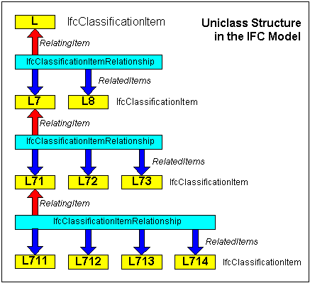

An _IfcClassificationItemRelationship_ is a relationship class that enables the hierarchical structure of a classification system to be exposed through its ability to contain related classification items and to be contained by a relating classification item.

> HISTORY: New entity in IFC
		2x.

### Use Definitions
_IfcClassificationItem_'s can be progressively decomposed using the _IfcClassificationItemRelationship_ such that the relationship always captures the information about the parent level (relating) item and the child level (related) items of which there can be many. The following example shows how this could be achieved for the Uniclass system.

The inverse relationships from _IfcClassificationItem_ to _IfcClassificationRelationship_ enable information about the relationship to be recovered by the items concerned so that they are also aware of the decomposition. The cardinality of the inverse relationship is that an _IfcClassificationItem_ can be the classifying item in only one relationship and can be a classified item in only one relationship. This implies that there is no overlap of _IfcClassificationItem's_. This reflects typical classification approaches which use strict hierarchical decomposition (or taxonomy) and do not have matrix relationships.