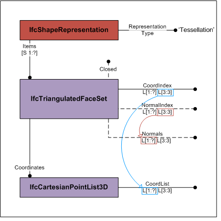
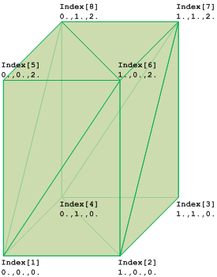

The _IfcTriangulatedFaceSet_ is a tessellated face set with all faces being bound by triangles. The faces are constructed by implicit polylines defined by three Cartesian points. The coordinates of each point are provided by a one-based index into an ordered list of Cartesian points provided by the two-dimensional list _CoordIndex_, where

* the first dimension of the two-dimensional list addresses the list of triangular faces;
* the second dimension of the two-dimensional list provides exactly three indices into the _IfcCartesianPointList_ referenced by _Coordinates_ defined at the supertype _IfcTessellatedFaceSet_. Each index points to a Cartesian point being a vertex of the triangle.

Optional the normals at each vertex can be provided by the two-dimensional list _NormalIndex_, where

* the first dimension of the two-dimensional list addresses the corresponding list of triangular faces; 
* the second dimension of the two-dimensional list provides exactly three indices into the two-dimensional list _Normals_ defined at the supertype _IfcTessellatedFaceSet_. Each index, corresponding to the index of vertices, points to a direction being the normal at this vertex of the triangle.

In case of corresponding lists of points and normals where the order of the points in the _CoordList_ is identical to the order of the normals in _Normals_, a single index list shall be used. The the list of _CoordIndex_ will be applied to both points and normals, and the list of _NormalIndex_ shall be empty. In other words, if the list of _Normals_ in not empty and the list of _NormalIndex_ is empty, then the list of _CoordIndex_ shall be used to point to the corresponding positions in the list of _CoordList_ and _Normals_.

> NOTE&nbsp; Using corresponding lists of points and normals allows to use only a single list of indices into both at the expense of having non-unique collections of points and vertices.

Figure 1 shows the use of _IfcTriangulatedFaceSet_ without annotation. The diagram of the _IfcTriangulatedFaceSet_ represents the indices and the ordered list into which the indices point. The index starts with 1 (indexed as 1 to N), if the greatest index in _CoordIndex_ in N, then the _IfcCartesianPointList_ shall have N lists of 3:3 coordinates.

<table summary="tessellation">
 <tr>
  <td style="width: 720px"></td>
  <td>
   
There are three possibilities to instantiate the <em>IfcTriangulatedFaceSet</em>, in addition to the mandatory attributes <em>CoordList</em> through <em>Coordinates</em> and <em>CoordIndex</em> the optional attributes have the following combination:

   <ul>
    <li><em>Normals</em> and <em>NormalIndex</em> are both provided, then the <em>NormalIndex</em> points into <em>Normals</em></li> 
    <li><em>Normals</em> provided and <em>NormalIndex</em> is not provided, then the <em>CoordIndex</em> also points into the <em>Normals</em></li> 
    <li><em>Normals</em> and <em>NormalIndex</em> are both not provided, then the normals have to be recalculated.</li> 
   </ul>
  </td>
 </tr>
 <tr>
  <td>
Figure 1 &mdash; Triangulated face set
</td>
  <td></td>
 </tr>
</table>

&nbsp;

<table summary="tessellation">
 <tr><td style="width: 280px">
 </td>
 <td>
  
Figure 2 shows an <em>IfcTriangulatedFaceSet</em> represented by  

<tt class="spf">
<em>CoordIndex</em>: ((1,6,5), (1,2,6), (6,2,7), (7,2,3), (7,8,6), (6,8,5), (5,8,1), (1,8,4), (4,2,1), (2,4,3), (4,8,7), (7,3,4)) 
<em>IfcCartesianPointList3D</em>: ((0.,0.,0.), (1.,0.,0.), (1.,1.,0.), (0.,1.,0.), (0.,0.,2.), (1.,0.,2.), (1.,1.,2.), (0.,1.,2.))
</tt>
  </td>
 </tr>
 <tr>
  <td>
Figure 2 &mdash; Triangulated face set geometry
</td>
  <td>&nbsp;</td>
 </tr>
</table>

> NOTE&nbsp; The definition of _IfcTriangulatedFaceSet_ is based on the **indexedFaceSet**, and **indexedTriangleSet** defined in ISO/IEC 19775-1

> HISTORY&nbsp; New entity in IFC4.