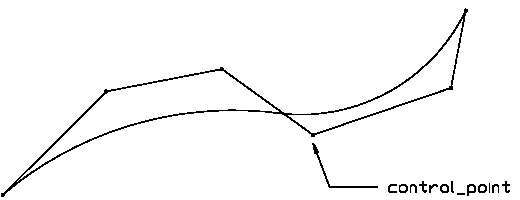

**Definition from ISO/CD 10303-42:1992**: A B-spline curve is a piecewise parametric polynomial or rational curve described in terms of control points and basis functions. The B-spline curve has been selected as the most stable format to represent all types of polynomial or rational parametric curves. With appropriate attribute values it is capable of representing single span or spline curves of explicit polynomial, rational, Bezier or B-spline type.

Interpretation of the data is as follows:

<ol> 
		<li> 
		  
All weights shall be positive and the curve is given by
 
		  <table> 
			 <tr> 
				<td align="RIGHT" width="100"><i>k</i>+1</td> 
				<td> = number of control points</td> 
			 </tr> 
			 <tr> 
				<td align="RIGHT" width="100">P<i>i</i></td> 
				<td>= control points</td> 
			 </tr> 
			 <tr> 
				<td align="RIGHT" width="100"><i>w</i><i>i</i></td> 
				<td>= weights</td> 
			 </tr> 
			 <tr> 
				<td align="RIGHT" width="100"><i>d</i></td> 
				<td>= degree</td> 
			 </tr> 
		  </table> 
		  
The knot array is an array of (<i>k</i>+<i>d</i>+2) real numbers
			 [<i>u</i>-<i>d</i> ... <i>u</i><i>k</i>+1], such that for
			 all indices j in [-<i>d</i>,<i>k</i>], <i>u</i>j &lt;=
			 <i>u</i>j+1. This array is obtained from the knot data list by
			 repeating each multiple knot according to the multiplicity. <i>N
			 di</i>, the <i>i</i>th normalized B-spline basis function
			 of degree <i>d</i>, is defined on the subset [<i>ui-d</i>, ... ,
			 <i>ui+1</i>] of this array.
</li> 
		<li> 
		  
Let <i>L</i> denote the number of distinct values among the
			 <i>d</i>+<i>k</i>+2 knots in the knot array; <i>L</i> will be referred to as
			 the 'upper index on knots'. Let <i>mj</i> denote the multiplicity
			 (i.e. number of repetitions) of the <i>j</i>th distinct knot. Then

		   
		  
All knot multiplicities except the first and the last shall be in
			 the range 1 ... degree; the first and last may have a maximum value of degree +
			 1. In evaluating the basis functions, a knot <i>u</i> of e.g. multiplicity 3 is
			 interpreted as a string <i>u, u, u,</i> in the knot array. The B-spline curve
			 has 3 special subtypes (<i>IAI note: only 1, Bezier curve, included in this IFC
			 release</i>) where the knots and knot multiplicities are derived to provide
			 simple default capabilities.
</li> 
		<li>Logical flag is provided to indicate whether the curve self
		  intersects or not.</li> 
	 </ol>
**Illustration from ISO 10303-42**:

> NOTE: Corresponding STEP entity:
		  b_spline_curve. Please refer to ISO/IS 10303-42:1994, p. 45 for the final
		  definition of the formal standard. 
> 
> HISTORY: New entity in Release IFC2x
		  Edition 2.
>
