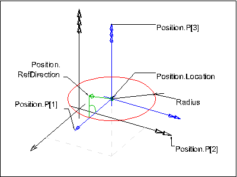

An _IfcCircle_ is a curve consisting of a set of points having equal distance from the center.

> NOTE&nbsp; A circular arc segment is defined by using the _IfcTrimmedCurve_ with _BasisCurve_ being an _IfcCircle_ or alternatively as a circular arc defined by three points within an _IfcIndexedPolyCurve_.

Figure 1 illustrates the definition of _IfcCircle_ within a three-dimensional position coordinate system placed within the object coordinate system of an element.



The _IfcCircle_ ia parameterized using numeric values in correspondence to the plane angle unit provided within the _IfcUnitAssignment_. If the plane angle unit is 'Degree' the parametric range of a circle is 0 &le; _u_ &le; 360, if the plane angle unit is radians, the parametric range is 0 &le; _u_ &le; 2&pi;.

&nbsp;

{ .extDef}
> NOTE Definition according to ISO/CD 10303-42:1992  
> A circle is defined by a radius and the location and orientation of the circle. Interpretation of data should be as follows: 
>> 
>> ```
>> C = SELF\IfcConic.Position.Location  
>> x = SELF\IfcConic.Position.P[1]  
>> y = SELF\IfcConic.Position.P[2]  
>> z = SELF\IfcConic.Position.P[3]  
>> R = Radius
>> ```
> and the circle is parameterized as
> 
>> 
>>> 
>> 
> The parameterization range is 0 &le; _u_ &le; 360 degree, _u_ is an angular parameter and when a numerical value is specified it shall use the current units for plane angle measure. In the placement coordinate system defined above, the circle is the equation _C_ = 0, where
> 
>> 
>>> 
>> 
> The positive sense of the circle at any point is in the tangent direction, **T**, to the curve at the point, where
> 
>> 
>>> 
>> 


> 
> NOTE&nbsp; Entity adapted from **circle** defined in ISO 10303-42

> HISTORY&nbsp; New entity in IFC1.0