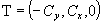

**Definition from ISO/CD 10303-42:1992**: An IfcCircle is defined by a radius and the location and orientation of the circle. Interpretation of data should be as follows:

> 
>> <pre> 
C = SELF\IfcConic.Position.Location</pre><pre>x = SELF\IfcConic.Position.P[1]</pre><pre>y = SELF\IfcConic.Position.P[2]</pre><pre>z = SELF\IfcConic.Position.P[3]</pre><pre>R = Radius</pre>

> 
and the circle is parameterized as

> 
>> 

> 
The parameterization range is 0 &pound;_u_&pound;2p (or 0 &pound;_u_&pound; 360 degree). In the placement coordinate system defined above, the circle is the equation _C_ = 0, where

> 
>> 

> 
The positive sense of the circle at any point is in the tangent direction, **T**, to the curve at the point, where

> 
>> 

> 
> NOTE A circular arc is defined by using the trimmed
		  curve (IfcTrimmedCurve) entity in conjunction with the circle (IfcCircle)
		  entity as the BasisCurve.
>

> NOTE Corresponding STEP entity:
		  circle, please refer to ISO/IS 10303-42:1994, p. 38 for the final definition of
		  the formal standard. 
> 
> HISTORY New class in IFC Release 1.0
		  
>

**Illustration**:

<table cellpadding="2" cellspacing="2"> 
		<tr> 
		  <td></td> 
		  <td valign="TOP" align="LEFT">Definition of the <i>IfcCircle</i> within
			 the (in this case three-dimensional) position coordinate system.</td> 
		</tr> 
	 </table>