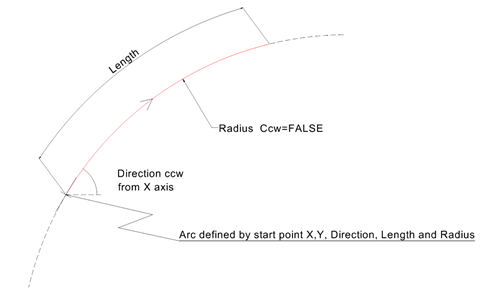
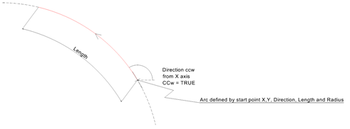

The circular arc segment uses the inherited attributes _StartPoint_ as the start of the circular arc, _StartDirection_ as the tangent at the start point and _SegmentLength_ as the arc length.

&nbsp;

<table>
<tr><td></td><td></td></tr>
<tr><td>
Figure 1 &mdash; Circular arc segment 2D
</td><td>
Figure 2 &mdash; Circular arc segment 2D CCW
</td></tr>
</table>
