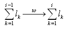

**Definition from ISO/CD 10303-42:1992**: A composite curve (IfcCompositeCurve) is a collection of curves joined end-to-end. The individual segments of the curve are themselves defined as composite curve segments. The parameterization of the composite curve is an accumulation of the parametric ranges of the referenced bounded curves. The first segment is parameterized from 0 to _l~1~_~, and, for _i_&sup3; 2, the _i^th^_^ segment is parameterized from

> 
>> 
>>

> 
where _l~k~_ is the parametric length (i.e., difference between maximum and minimum parameter values) of the curve underlying the _k^th^_ segment.

> NOTE Corresponding STEP entity:
		  composite_curve, please refer to ISO/IS 10303-42:1994, p. 56 for the final
		  definition of the formal standard. The WR2 is added to ensure consistent Dim at
		  all segments. 
> 
> HISTORY New class in IFC Release 1.0
		  
>

**Informal Propositions**:

1. The SameSense attribute of each segment correctly specifies the senses of the component curves. When traversed in the direction indicated by SameSense, the segments shall join end-to-end.
