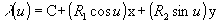
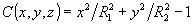
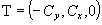

**Definition from ISO/CD 10303-42:1992**: An ellipse (IfcEllipse) is a conic section defined by the lengths of the semi-major and semi-minor diameters and the position (center or mid point of the line joining the foci) and orientation of the curve. Interpretation of the data shall be as follows:

> 
>> <pre>C  = SELF\IfcConic.Position.Location </pre><pre>x  = SELF\IfcConic.Position.P[1] </pre><pre>y  = SELF\IfcConic.Position.P[2] </pre><pre>z  = SELF\IfcConic.Position.P[3] </pre><pre>R1 = SemiAxis1 </pre><pre>R2 = SemiAxis2</pre>

> 
and the ellipse is parameterized as:

> 
>> 
>>

> 
The parameterization range is 0 &pound;_u_&pound; 2p (or 0 &pound;_u_&pound; 360 degree). In the placement coordinate system defined above, the ellipse is the equation _C_ = 0, where

> 
>> 
>>

> 
The positive sense of the ellipse at any point is in the tangent direction, T, to the curve at the point, where

> 
>> 
>>

> 
The inherited Position.Location from IfcConic is the center of the IfcEllipse, and the inherited Position.P[1] from IfcConic the direction of the SemiAxis1.

> NOTE Corresponding STEP entity:
		  ellipse. Please refer to ISO/IS 10303-42:1994, p. 39 for the final definition
		  of the formal standard. 
> 
> HISTORY New class in IFC Release 1.0
		  
>

**Illustration**:

<table cellpadding="2" cellspacing="2"> 
		<tr> 
		  <td></td> 
		  <td valign="TOP" align="LEFT">Definition of the
			 IfcEllipse within the (in this case three-dimensional) position coordinate
			 system.</td> 
		</tr> 
	 </table>
