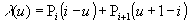

**Definition from ISO/CD 10303-42:1992**: An IfcPolyline is a bounded curve of n -1 linear segments, defined by a list of n points, P1, P2 ... Pn. The curve is parameterized as follows:

> 
>> 
>>

> 
_for_1_&pound;_i_&pound;_n -_ 1_,_where _i_-1 &pound;_u_&pound;_i_ and with parametric range of 0 &pound;_u_&pound;_n_- 1.__

> NOTE Corresponding STEP entity:
		  polyline. Please refer to ISO/IS 10303-42:1994, p. 45 for the final definition
		  of the formal standard. 
> 
> HISTORY New class in IFC Release 1.0
		  
>
