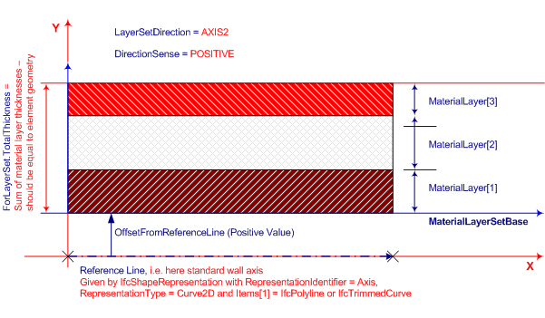
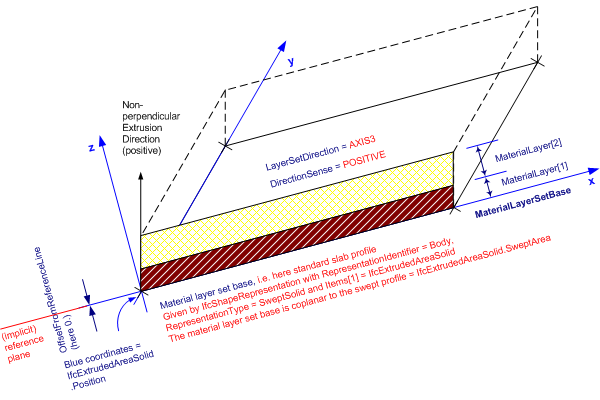

**Definition
from IAI**: Determines the usage of _IfcMaterialLayerSet_ in terms of its location and orientation relative to the associated element geometry. The location of material layer set shall be compatible with the building element geometry (i.e. material layers shall fit inside the element geometry). The rules to ensure the compatibility depend on the type of the building element.

> <small>EXAMPLE &nbsp;For a
cavity brick wall with shape representation SweptSolid, the <i>IfcMaterialLayerSet.TotalThickness</i>
shall be equal to the wall thickness. Also the <i>OffsetFromReferenceLine</i>
shall match the exact positions between the two shape representations
of <i>IfcWallStandardCase</i>,
i.e. the <i>IfcShapeRepresentation</i>'s
with <i>RepresentationIdentifier</i>="Axis"
and <i>RepresentationIdentifier</i>="Body".</small>  
>   
> <small>NOTE
&nbsp;Refer to
the implementation guide and agreements for more information on
matching between building element geometry and material layer set usage.</small>

The _IfcMaterialLayerSetUsage_ is always assigned to an individual occurrence object only (i.e. to relevant subtypes of _IfcElement_). The _IfcMaterialLayerSet_, referenced by _ForLayerSet_ can however be shared among several occurrence objects. If the element type is available (i.e. the relevant subtype of _IfcElementType_, then the _IfcMaterialLayerSet_ can be assigned to the type object. The assignment between a&nbsp;subtype of _IfcElement_ and the _IfcMaterialLayerSetUsage_is handled by _IfcRelAssociatesMaterial_.

**Use
Definition**

The _IfcMaterialLayerSetUsage_ is primarily intended to be associated with planar building elements having a constant thickness. With further agreements on the interpretation of _LayerSetDirection_, the usage can be extended also to other cases, e.g. to curved building elements, provided that the material layer thicknesses are constant.

Generally, an element may be layered in any of its primary directions, denoted by its x, y or z axis. The geometry use definitions at each&nbsp;specific types of building element will determine the applicable&nbsp;_LayerSetDirection_.

> <small>EXAMPLE &nbsp;For a standard
wall with extruded
geometric representation (vertical extrusion), the layer set direction
shall be perpendicular to extrusion direction, and&nbsp;</small><small>can
be
derived from the direction of the wall axis. With the <i>DirectionSense</i></small><small><i>
</i>(positive or negative) the individual <i>IfcMaterialLayer</i>
are assigned&nbsp;consecutively right-to-left or left-to-right.
For a curved wall, "direction denoting the wall thickness" can be
derived from the direction of the wall axis, and it will remain
perpendicular to the
wall path. </small><small>The <i>DirectionSense</i></small><small><i>&nbsp;</i>applies
as well.  NOTE &nbsp;The <i>LayerSetDirection</i>
for <i>IfcWallStandardCase</i> is always AXIS2 (i.e. along
the y-axis).</small>

  
<small>Fig
1: shows an example of the use of <i>IfcMaterialLayerSetUsage</i>
aligned to the axis of a wall.</small>

> <small>EXAMPLE &nbsp;For a slab with
perpendicular
extruded geometric representation, the <i>LayerSetDirection</i>
shall
coincide with the extrusion direction (in positive or negative sense).
The material layer set base is the extruded profile and should be
consistent with the <i>IfcExtrudedAreaSolid.Position</i>.&nbsp;</small><small>With
the <i>DirectionSense</i></small><small><i>
</i>(positive or negative) the individual <i>IfcMaterialLayer</i>
are assigned&nbsp;consecutively right-to-left or left-to-right to
the base.  NOTE &nbsp;T</small><small>he
<i>LayerSetDirection</i>
for standard&nbsp;<i>IfcSlab</i> is always AXIS3 (i.e.
along
the z-axis).</small>

  
<small>Fig
2: shows an example of the use of <i>IfcMaterialLayerSetUsage</i>
aligned to a slab.</small>

> <small>EXAMPLE &nbsp;For a slab with
non-perpendicular
extruded geometric representation, the guidelines above apply as well</small><small>.
The material layer thickness and the <i>OffsetFromReferenceLine</i>
is always measured perpendicularly, even if the extrusion direction is
not perpendicular. Therefore the total material layer thickness is not
equal to the extrusion depth of the geometry.
</small>

  
<small>Fig
3: shows an example of the use of <i>IfcMaterialLayerSetUsage</i>
aligned to a roof slab with non-perpendicular extrusion.</small>
