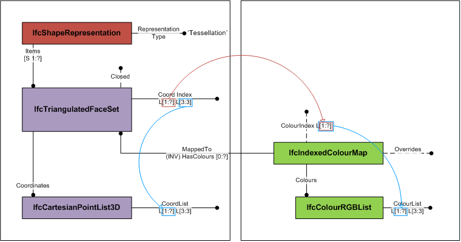
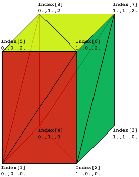

The _IfcIndexedColourMap_ provides the assignment of colour information to individual faces. It is used for colouring faces of tessellated face sets.

The _IfcIndexedColourMap_ defines an index into an indexed list of colour information. The _Colours_ are a two-dimensional list of colours provided by three RGB values [0 .. 1]. The _ColourIndex_ attribute corresponds to the _CoordIndex_ of the _IfcTessellatedFaceSet_ defining the corresponding index list of faces.

Figure 1 shows the use of _IfcTriangulatedFaceSet_ with colours per face.

Figure 2 illustrates an _IfcTriangulatedFaceSet_ represented by  
_IfcTriangulatedFaceSet.CoordIndex_: ((1,6,5), (1,2,6), (6,2,7), (7,2,3), (7,8,6), (6,8,5), (5,8,1), (1,8,4), (4,2,1), (2,4,3), (4,8,7), (7,3,4))  
_IfcCartesianPointList.CoordList_: ((0.,0.,0.), (1.,0.,0.), (1.,1.,0.), (0.,1.,0.), (0.,0.,2.), (1.,0.,2.), (1.,1.,2.), (0.,1.,2.))  
_IfcIndexedColourMap.ColourIndex_: (1, 1, 2, 2, 3, 3, 1, 1, 1, 1, 1, 1, )  
_IfcColourRgbList.ColourList_: ((1.,0.,0.), (0.,1.,0.), (1.,1.,0.))

<table>
      <tr>
        <td>
          
        </td>
        <td>
          &nbsp;
        </td>
      </tr>
      <tr>
        <td>
          
Figure 2 &mdash; Indexed colour map geometry 
          

        </td>
        <td>
          &nbsp;
        </td>
      </tr>
    </table>

> HISTORY&nbsp; New entity in IFC4.