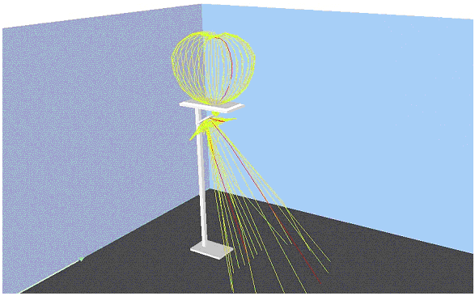

The _IfcLightSourceGoniometric_ defines a light source for which exact lighting data is available. It specifies the type of a light emitter, defines the position and orientation of a light distribution curve and the data concerning lamp and photometric information.

**Illustration:**

Example of a light emitter having two light sources (of type _IfcLightSourceGoniometric_).

>  HISTORY: New entity in Release IFC2x
		  Edition 2. 
>
