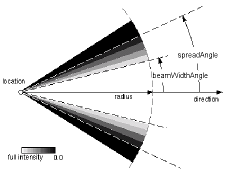

**Definition from ISO/CD 10303-46:1992**: The light source spot entity is a subtype of light source. Spot light source entities have a light source colour, position, direction, attenuation coefficients, concentration exponent, and spread angle. If a point lies outside the cone of influence of a light source of this type as determined by the light source position, direction and spread angle its colour is not affected by that light source.

> NOTE: The <i>IfcLightSourceSpot</i> adds the
		  <i>BeamWidthAngle</i> which defines the inner cone in which the light source
		  emits light at uniform full intensity. The light source's emission intensity
		  drops off from the inner solid angle (<i>BeamWidthAngle</i>) to the outer solid
		  angle (<i>SpreadAngle</i>).
>

**Definition from ISO/IEC 14772-1:1997**: The Spot light node defines a light source that emits light from a specific point along a specific direction vector and constrained within a solid angle. Spot lights may illuminate geometry nodes that respond to light sources and intersect the solid angle defined by the Spot light. Spot light nodes are specified in the local coordinate system and are affected by ancestors' transformations.

_Figure (from VRML97): Definition of spot
		light_

> NOTE: Corresponding STEP entity:
		  light_source_spot. Please refer to ISO/IS 10303-46:1994, p. 33 for the final
		  definition of the formal standard. 
>

> NOTE: In addition to the
		attributes as defined in ISO10303-46 the additional property from ISO/IEC
		14772-1:1997 (VRML) <i>Radius</i>, <i>BeamWidth</i>, and
		<i>QuadricAttenuation</i> are added to this subtype and the
		<i>AmbientIntensity</i> and <i>Intensity</i> are inherited from the
		supertype.

> HISTORY: This is a new entity
		in IFC 2x, renamed and enhanced in IFC2x Edition2.