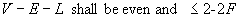

**Definition from ISO/CD 10303-42:1992**: A closed shell is a shell of the dimensionality 2 which typically serves as a bound for a region in R3. A closed shell has no boundary, and has non-zero finite extent. If the shell has a domain with coordinate space R3, it divides that space into two connected regions, one finite and the other infinite. In this case, the topological normal of the shell is defined as being directed from the finite to the infinite region.

The shell is represented by a collection of faces. The domain of the shell, if present, contains all those faces, together with their bounds. Associated with each face in the shell is a logical value which indicates whether the face normal agrees with (TRUE) or is opposed to (FALSE) the shell normal. The logical value can be applied directly as a BOOLEAN attribute of an oriented face, or be defaulted to TRUE if the shell boundary attribute member is a face without the orientation attribute.

The combinatorial restrictions on closed shells and geometrical restrictions on their domains are designed to ensure that any domain associated with a closed shell is a closed, orientable manifold. The domain of a closed shell, if present, is a connected, closed, oriented 2-manifold. It is always topologically equivalent to an _H_-fold torus for some _H_&sup3; 0. The number _H_ is referred to as the surface genus of the shell. If a shell of genus _H_ has a domain within coordinate space _R^3^_, then the finite region of space inside it is topologically equivalent to a solid ball with _H_ tunnels drilled through it.

The Euler equation (7) applies with _B_=0, because in this case there are no holes. As in the case of open shells, the surface genus _H_ may not be known a priori, but shall be an integer &sup3; 0. Thus a necessary, but not sufficient, condition for a well-formed closed shell is the following:

> 
>> 
>>

> 
In the current IFC Release only poly loops (_IfcPolyLoop_) are defined for bounds of face bound (_IfcFaceBound_). This will allow for faceted B-rep only.

>  NOTE: Corresponding STEP entity:
		  closed_shell, please refer to ISO/IS 10303-42:1994, p.149 for the final
		  definition of the formal standard. 
> 
> HISTORY: New class in IFC Release 1.0
		  
>

**Informal propositions**:

1. Every edge shall be referenced exactly twice by the loops of the face. 
2. Each oriented edge shall be unique. 
3. No edge shall be referenced by more than two faces. 
4. Distinct faces of the shell do not intersect, but may share edges or vertices. 
5. Distinct edges do not intersect but may share vertices. 
6. Each face reference shall be unique. 
7. The loops of the shell shall not be a mixture of poly loop and other loop types. Note: this is given, since only poly loop is defined as face bound definition. 
8. The closed shell shall be an oriented arcwise connected 2-manifold. 
9. The Euler equation shall be satisfied. Note: Please refer to ISO/IS 10303-42:1994, p.149 for the equation.
