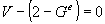

**Definition from ISO/CD 10303-42:1992**: An edge is the topological construct corresponding to the connection of two vertices. More abstractly, it may stand for a logical relationship between two vertices. The domain of an edge, if present, is a finite, non-self-intersecting open curve in _R^M^_, that is, a connected 1-dimensional manifold. The bounds of an edge are two vertices, which need not be distinct. The edge is oriented by choosing its traversal direction to run from the first to the second vertex. If the two vertices are the same, the edge is a self loop. The domain of the edge does not include its bounds, and 0 &le; &Xi; &le; &infin;. Associated with an edge may be a geometric curve to locate the edge in a coordinate space; this is represented by the edge curve (_IfcEdgeCurve_) subtype. The curve shall be finite and non-self-intersecting within the domain of the edge. An edge is a graph, so its multiplicity M and graph genus _G^e^_ may be determined by the graph traversal algorithm. Since _M_ = _E_ = 1, the Euler equation (1) reduces in the case to

> 
>

where _V_ = 1 or 2, and _G^e^_ = 1 or 0. Specifically, the topological edge defining data shall satisfy:

<dl> 
		<dd>- an edge has two vertices 
		  <dl> 
			 <dd></dd>
			 
		  </dl></dd> 
		<dd>- the vertices need not be distinct 
		  <dl> 
			 <dd></dd>
			 
		  </dl></dd> 
		<dd>- Equation (2) shall hold. 
		  <dl> 
			 <dd></dd> 
		  </dl></dd> 
	 </dl>
> NOTE
		  Corresponding STEP entity: edge. Please refer to ISO/IS 10303-42:1994, p. 130
		  for the final definition of the formal standard. 
> 
> HISTORY New Entity in IFC Release 2.0
		  
> 

**Informal propositions:**

1. The edge has dimensionality 1.
2. The extend of an edge shall be finite and nonzero
