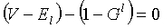

**Definition from ISO/CD 10303-42:1992:** A loop is a topological entity constructed from a single vertex, or by stringing together connected (oriented) edges, or linear segments beginning and ending at the same vertex. It is typically used to bound a face lying on a surface. A loop has dimensionality of 0 or 1. The domain of a 0-dimensional loop is a single point. The domain of a 1-dimensional loop is a connected, oriented curve, but need not to be manifold. As the loop is a circle, the location of its beginning/ending point is arbitrary. The domain of the loop includes its bounds, an 0 &le; &Xi; &lt; &infin;.

A loop is represented by a single vertex, or by an ordered collection of oriented edges, or by an ordered collection of points. A loop is a graph, so _M_ and the graph genus _G^l^_ may be determined by the graph traversal algorithm. Since _M_= 1, the Euler equation (1) reduces in this case to

> 

where _V_ and _E~l~_ are the number of unique vertices and oriented edges in the loop and _G^l^_ is the genus of the loop.

> NOTE: Corresponding STEP
		entity: loop, the following subtypes have been incorporated into IFC: poly_loop
		as <i>IfcPolyLoop</i>, vertex_loop as <i>IfcVertexLoop</i>, edge_loop as
		<i>IfcEdgeLoop</i>. Please refer to ISO/IS 10303-42:1994, p. 136 for the final
		definition of the formal standard.

> HISTORY: New Entity in IFC Release
		  2.x. 
>

Informal propositions:

1. A loop has a finite extent.
2. A loop describes a closed (topological) curve with coincident start and end vertices.