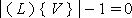

**Definition from ISO/CD 10303-42:1992**: A vertex_loop is a loop of zero genus consisting of a single vertex. A vertex can exist independently of a vertex loop. The topological data shall satisfy the following constraint:

> 

Informal propositions:

1. A vertex loop has zero extent and dimensionality.
2. The vertex loop has genus 0.

> NOTE: Corresponding STEP entity:
		  vertex_loop. Please refer to ISO/IS 10303-42:1994, p. 121 for the final
		  definition of the formal standard. 
> 
>  HISTORY: New Entity in Release IFC 2x
		  Edition 2. 
>
