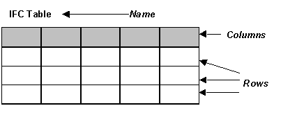

A data structure for the provision of information in the form of rows and columns. Each instance may have a heading row with titles or descriptions for each column. The rows of information are stored as a list of _IfcTableRow_ objects.

Limitation: In this release of IFC the rows of an _IfcTable_ object are constrained to have the same number of cells. The first Row of the table provides the number of cells. All other rows are forced to include the same number of cells. This is enforced by the WR2.

>  HISTORY: New entity in IFC R1.5. 
		  
>
