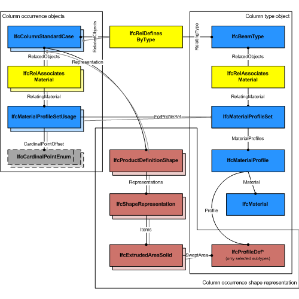
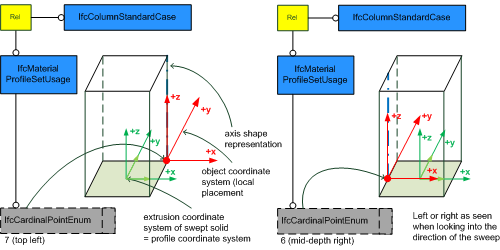
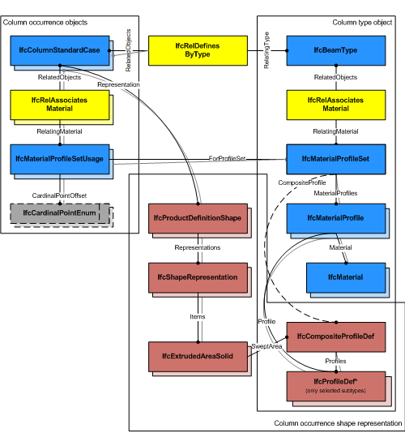
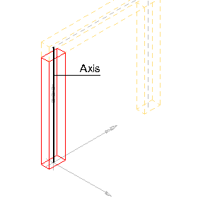
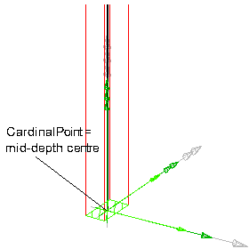
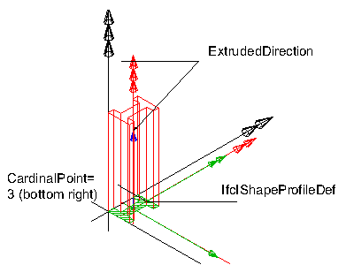
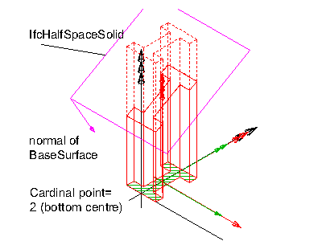

The standard column, _IfcColumnStandardCase_, defines a column with certain constraints for the provision of material usage, parameters and with certain constraints for the geometric representation. The _IfcColumnStandardCase_ handles all cases of columns, that:

<ul>
<li>have a reference to the <em>IfcMaterialProfileSetUsage</em>
defining the material profile association of the column with the
cardinal point of its insertion relative to the local
placement.</li>
<li>are based on a sweep of a planar profile, or set of profiles,
as defined by the <em>IfcMaterialProfileSet</em></li>
<li>have an 'Axis' shape representation with constraints provided
below in the geometry use definition</li>
<li>have a 'Body' shape representation with constraints provided
below in the geometry use definition</li>
<li>have a start profile, or set of profiles, that is swept along
the directrix and might be changed uniformly by a taper
definition</li>
<li>are consistent in using the correct cardinal point offset of
the profile as compared to the 'Axis' and 'Body' shape
representation</li>
<li>are extruded perpendicular to the profile definition
plane</li>
<li style="list-style-type:none">
<blockquote class="note"><small>NOTE&nbsp; View definitions and implementer
agreements may further constrain the applicable geometry types,
e.g. by excluding tapering from an <em>IfcBeamStandardCase</em>
implementation.</small></blockquote>
</li>
</ul>
> HISTORY&nbsp; New entity in IFC4.

**_Geometric Representations_**

The geometric representation of _IfcColumnStandardCase_ is defined using the following multiple shape representations for its definition:

* **Axis**: A three-dimensional open curve (subtype of _IfcBoundedCurve_) defining the axis for the standard column. The cardinal point is determined by the column axis.
* **Body**: A Swept Solid Representation or a CSG representation defining the 3D shape of the standard column.

> NOTE&nbsp; It is invalid to exchange a 'SurfaceModel', 'Brep', or 'MappedRepresentation' representation for the 'Body' shape representation of an _IfcColumnStandardCase_.

___
## Common Use Definitions
The following concepts are inherited at supertypes:

* _IfcRoot_: [Identity](../../templates/identity.htm), [Revision Control](../../templates/revision-control.htm)
* _IfcElement_: [Box Geometry](../../templates/box-geometry.htm), [FootPrint Geometry](../../templates/footprint-geometry.htm), [Body SurfaceOrSolidModel Geometry](../../templates/body-surfaceorsolidmodel-geometry.htm), [Body SurfaceModel Geometry](../../templates/body-surfacemodel-geometry.htm), [Body Tessellation Geometry](../../templates/body-tessellation-geometry.htm), [Body Brep Geometry](../../templates/body-brep-geometry.htm), [Body AdvancedBrep Geometry](../../templates/body-advancedbrep-geometry.htm), [Body CSG Geometry](../../templates/body-csg-geometry.htm), [Mapped Geometry](../../templates/mapped-geometry.htm)
* _IfcBuildingElement_: [Surface 3D Geometry](../../templates/surface-3d-geometry.htm)
* _IfcColumn_: [Object Typing](../../templates/object-typing.htm), [Property Sets for Objects](../../templates/property-sets-for-objects.htm), [Quantity Sets](../../templates/quantity-sets.htm), [Material Profile Set](../../templates/material-profile-set.htm), [Spatial Containment](../../templates/spatial-containment.htm), [Product Assignment](../../templates/product-assignment.htm)

[&nbsp;Instance diagram](../../../annex/annex-d/common-use-definitions/ifccolumnstandardcase.htm)

{ .use-head}
Material Profile Set Usage

The [Material Profile Set Usage](../../templates/material-profile-set-usage.htm) concept applies to this entity.

The _IfcColumnStandardCase_ defines in addition that the _IfcColumnType_ should have a unique _IfcMaterialProfileSet_, that is referenced by the _IfcMaterialProfileSetUsage_ assigned to all occurrences of this _IfcColumnType_. Composite profile columns can be represented by refering to several _IfcMaterialProfile_'s within the _IfcMaterialProfileSet_ that is referenced from the _IfcMaterialProfileSetUsage_.

Figure 1 illustrates assignment of _IfcMaterialProfileSetUsage_ and _IfcMaterialProfileSet_ to the _IfcColumnStandardCase_ as the column occurrence and to the _IfcColumnType_. The same _IfcMaterialProfileSet_ shall be shared by many occurrences of _IfcMaterialProfileSetUsage_. This relationship shall be consistent to the relationship between the _IfcColumnType_ and the _IfcColumnStandardCase_.

Figure 2 illustrates cardinal point alignment.

> NOTE  It has to be guaranteed that the use of _IfcCardinalPointEnum_ is consistent to the placement of the extrusion body provided by _IfcExtrudedAreaSolid.Position_

> NOTE  The cardinal points **7** (top left), and **6** (mid-depth right) are assigned according to the definition at _IfcCardinalPointReference_

Figure 3 illustrates assignment of a composite profile by using _IfcCompositeProfile_ for geometric representation and several _IfcMaterialProfile_'s within the _IfcMaterialProfileSet_. The number of _IfcMaterialProfile_'s within the _IfcMaterialProfileSet_ is restricted to maximal 2 and requires the use of _IfcExtrudedAreaSolidTapered_, or _IfcRevolvedAreaSolidTapered_ for the correct 'Body' shape representation.

  
  
{ .use-head}
Product Placement

The [Product Placement](../../templates/product-placement.htm) concept applies to this entity as shown in Table 1.

<table>
<tr><td>
<table class="gridtable">
<tr><th><b>Type</b></th><th><b>Relative</b></th><th><b>Description</b></th></tr>
<tr><td><a href="../../ifcgeometricconstraintresource/lexical/ifclocalplacement.htm">IfcLocalPlacement</a></td><td><a href="../../ifcgeometricconstraintresource/lexical/ifclocalplacement.htm">IfcLocalPlacement</a></td><td>Relative placement according to position and rotation relative to container.</td></tr>
<tr><td><a href="../../ifcgeometricconstraintresource/lexical/ifclocalplacement.htm">IfcLocalPlacement</a></td><td>&nbsp;</td><td>Absolute placement according to position and rotation of world coordinate system.</td></tr>
<tr><td><a href="../../ifcgeometricconstraintresource/lexical/ifcgridplacement.htm">IfcGridPlacement</a></td><td>&nbsp;</td><td>Placement according to grid intersection.</td></tr>
</table>
</td></tr>
<tr><td>
Table 1 &mdash; IfcColumnStandardCase Product Placement
</td></tr></table>

The following restriction is imposed:

* The local placement shall provide the location and directions for the standard column, the x/y plane is the plane for the start profile, and the z-axis is the extrusion axis for the column body (in case of rotation, the tangent direction).

  
  
{ .use-head}
Axis 3D Geometry

The [Axis 3D Geometry](../../templates/axis-3d-geometry.htm) concept applies to this entity as shown in Table 2.

<table>
<tr><td>
<table class="gridtable">
<tr><th><b>Identifier</b></th><th><b>Type</b></th><th><b>Items</b></th><th><b>Description</b></th></tr>
<tr><td>Axis</td><td>Curve3D</td><td><a href="../../ifcgeometryresource/lexical/ifcboundedcurve.htm">IfcBoundedCurve</a></td><td>Three-dimensional reference curve for the column.</td></tr>
</table>
</td></tr>
<tr><td>
Table 2 &mdash; IfcColumnStandardCase Axis 3D Geometry
</td></tr></table>

The following additional constraints apply to the 'Axis' representation, if the 'Body' shape representation has the _RepresentationType_ : 'SweptSolid':

* _Axis_ 
    * _IfcPolyline_ having two _Points_, or _IfcTrimmedCurve_ with _BasisCurve_ of Type _IfcLine_ for 'SweptSolid' provided as _IfcExtrudedAreaSolid_. The axis curve lies on the z axis of the object coordinate system.
    * _IfcTrimmedCurve_ with _BasisCurve_ of Type _IfcCircle_ for 'SweptSolid' provided as _IfcRevolvedAreaSolid_. The axis curve lies on the x/z plane of the object coordinate system, the tangent at the start is along the positive z-axis. 

&nbsp;

<table border="0" cellpadding="2" cellspacing="2" summary="Axis">

 <tr>
  <td align="left" valign="top" width="300"></td>
  <td>
<blockquote class="example">EXAMPLE&nbsp; As shown in Figure 4, the axis shall be defined along the z axis of
the object coordinate system. The axis representation can be used to
represent the system length of a column that may extent the body
length of the column.</blockquote>

</td>
 </tr>
 
<tr>
  <td>
Figure 4 &mdash; Column axis representation
</td>
  <td>&nbsp;</td>
 </tr>

</table>

<table border="0" cellpadding="2" cellspacing="2" summary="Axis">
 
<tr>
  <td align="left" valign="top" width="300"></td>

  <td><blockquote class="example">EXAMPLE&nbsp; As shown in Figure 5, the axis representation shall be used to represent the cardinal point as the offset between the 'Axis' and the extrusion path of the column. The extrusion path is provided as <em>IfcExtrudedAreaSolid.ExtrudedDirection</em> and should be parallel to the 'Axis'. It has to be guaranteed that the value provided by <em>IfcMaterialProfileSetUsage.CardinalPoint</em> is consistent to the <em>IfcExtrudedAreaSolid.Position</em>.</blockquote>
 </td></tr>

 <tr>
  <td>
Figure 5 &mdash; Column axis cardinal point
</td>
  <td>&nbsp;</td>
 </tr>

</table>

  
  
{ .use-head}
Body SweptSolid Geometry

The [Body SweptSolid Geometry](../../templates/body-sweptsolid-geometry.htm) concept applies to this entity.

The following additional constraints apply to the 'SweptSolid' representation:

* **Solid**: _IfcExtrudedAreaSolid_, _IfcRevolvedAreaSolid_ shall be supported
* **Profile**: all subtypes of _IfcProfileDef_ (with exception of _IfcArbitraryOpenProfileDef_)
* **Profile Position** : For all single profiles, the _IfcParameterizedProfileDef.Position_ shall be NIL, or having _Location_ = 0.,0. and _RefDirection_ = 1.,0.
* **Extrusion**: perpendicular to the profile direction. The _IfcExtrudedAreaSolid.ExtrudedDirection_ shall be [0.,0.,1.].
* **Orientation**: The y-axis of the profile, as determined by _IfcSweptAreaSolid.Position.P[2]_ shall point to the Y-Axis. It indicates the "role" of the column, a role=0&deg; means y-axis of profile = Y-axis of reference coordinate system.

Figure 6 illustrates a standard geometric representation with cardinal point applied as **5** (mid-depth centre).

The following interpretation of dimension parameter applies for rectangular columns:

* _IfcRectangleProfileDef.YDim_ interpreted as column width
* _IfcRectangleProfileDef.XDim_ interpreted as column depth

The following interpretation of dimension parameter applies for circular columns:

* _IfcCircleProfileDef.Radius_ interpreted as column radius.

  
  
{ .use-head}
Body AdvancedSweptSolid Geometry

The [Body AdvancedSweptSolid Geometry](../../templates/body-advancedsweptsolid-geometry.htm) concept applies to this entity.

The following additional constraints apply to the 'AdvancedSweptSolid' representation type:

* **Solid**: _IfcSurfaceCurveSweptAreaSolid_, _IfcFixedReferenceSweptAreaSolid_, _IfcExtrudedAreaSolidTapered_, _IfcRevolvedAreaSolidTapered_ shall be supported. 
>> NOTE&nbsp; View definitions and implementer agreement can further constrain the allowed swept solid types. 
* **Profile**: see 'SweptSolid' geometric representation
* **Profile Position** : see 'SweptSolid' geometric representation
* **Extrusion**: not applicable

  
  
{ .use-head}
Body Clipping Geometry

The [Body Clipping Geometry](../../templates/body-clipping-geometry.htm) concept applies to this entity.

The following constraints apply to the 'Clipping' representation:

* **Solid**: see 'SweptSolid' geometric representation
* **Profile**: see 'SweptSolid' geometric representation
* **Profile Position** : see 'SweptSolid' geometric representation
* **Extrusion**: see 'SweptSolid' geometric representation
* **Orientation**: see 'SweptSolid' geometric representation
* **Boolean result**: The _IfcBooleanClippingResult_ shall be supported, allowing for Boolean differences between the swept solid (here _IfcExtrudedAreaSolid_) and one or several _IfcHalfSpaceSolid_ (or its subtypes).

Figure 7 illustrates a 'Clipping' geometric representation with use of _IfcBooleanClippingResult_ between an _IfcExtrudedAreaSolid_ and an _IfcHalfSpaceSolid_ to create a clipped body, with cardinal point applied as **2** (bottom centre).

