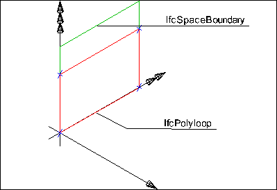
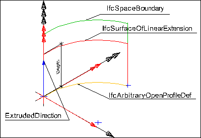
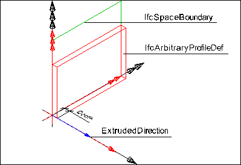
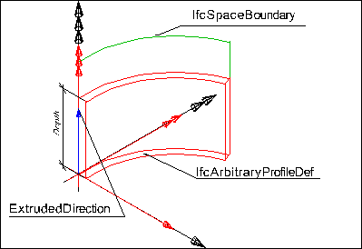

A covering is an element which covers some part of another element and is fully dependent on that other element. The _IfcCovering_ defines the occurrence of a covering type, that (if given) is expressed by the _IfcCoveringType_.

{ .extDef}
> NOTE&nbsp; Definition according to ISO ISO 6707-1: final coverings and treatments of surfaces and their intersections.

Coverings are elements with relationships to the covered element and the space on the other side, they may contain openings, assigned by _IfcRelVoidsElement_, material information, assigned by _IfcRelAssociatesMaterial_, and others.

> EXAMPLE&nbsp; Coverings include wall claddings, floorings, suspended ceilings, moldings and skirting boards.

> NOTE&nbsp; A more basic information about claddings, floorings, and ceilings of a space can be attached to _IfcSpace_'s using the Pset_SpaceCommon properties. Then only a name can be provided and the covering quantities would be interpreted from the space quantities.

Coverings can be assigned to

* a space represented by _IfcSpace_ 
    * using the inverse relationship _CoversSpaces_ pointing to _IfcRelCoversSpaces_. The space is then accessible via _IfcRelCoversSpaces.RelatedSpace_. It defines to which space a covering is facing towards. 
* a space boundary represented by _IfcRelSpaceBoundary_ 
    * using the inverse relationship _ProvidesBoundaries_ pointing to _IfcRelSpaceBoundary._ The space is then accessible via _IfcRelSpaceBoundary.RelatingSpace_. 
* a building element represented by _IfcBuildingElement_ 
    * using the inverse relationship _Covers_ pointing to _IfcRelCoversBldgElements_. The building element is then accessible via _IfcRelCoversBldgElements.RelatingBuildingElement_. 

> NOTE&nbsp; The mere containment relationship between an _IfcCovering_ and an _IfcSpace_ is created by using _IfcRelContainedInSpatialStructure_

The following guideline shall apply:

* (default) if the space has coverings that may not have their own shape representation and no defined relationships to the building elements they cover, then the _IfcCovering_ shall be assigned to _IfcSpace_ using the _IfcRelCoversSpaces_ relationship,
* if the space has coverings that have an own shape representation and the space has defined space boundaries, then the covering, which relates to that space, shall be contained in the space using _IfcRelContainedInSpatialStructure_. It may be assigned to the space boundaries using the _IfcRelSpaceBoundary_.
* if the covering does not relate to a space, then the covering should be assigned to the building element or a distribution element using the _IfcRelCoversBldgElements_ relationship.

> HISTORY&nbsp; New entity in IFC1.0.

{ .change-ifc2x}
> IFC2x CHANGE&nbsp; The attribute _PredefinedType_ is now optional and should only be inserted when no type information, given by _IfcCoveringType_, is assigned to the _IfcCovering_ occurrence by _IfcRelDefinesByType_.

___
## Common Use Definitions
The following concepts are inherited at supertypes:

* _IfcRoot_: [Identity](../../templates/identity.htm), [Revision Control](../../templates/revision-control.htm)
* _IfcElement_: [Product Placement](../../templates/product-placement.htm), [Box Geometry](../../templates/box-geometry.htm), [FootPrint Geometry](../../templates/footprint-geometry.htm), [Body SurfaceOrSolidModel Geometry](../../templates/body-surfaceorsolidmodel-geometry.htm), [Body SurfaceModel Geometry](../../templates/body-surfacemodel-geometry.htm), [Body Tessellation Geometry](../../templates/body-tessellation-geometry.htm), [Body Brep Geometry](../../templates/body-brep-geometry.htm), [Body AdvancedBrep Geometry](../../templates/body-advancedbrep-geometry.htm), [Body CSG Geometry](../../templates/body-csg-geometry.htm), [Mapped Geometry](../../templates/mapped-geometry.htm)
* _IfcBuildingElement_: [Product Assignment](../../templates/product-assignment.htm), [Surface 3D Geometry](../../templates/surface-3d-geometry.htm)

[&nbsp;Instance diagram](../../../annex/annex-d/common-use-definitions/ifccovering.htm)

{ .use-head}
Object Typing

The [Object Typing](../../templates/object-typing.htm) concept applies to this entity.

  
  
{ .use-head}
Property Sets for Objects

The [Property Sets for Objects](../../templates/property-sets-for-objects.htm) concept applies to this entity as shown in Table 1.

<table>
<tr><td>
<table class="gridtable">
<tr><th><b>PredefinedType</b></th><th><b>Name</b></th></tr>
<tr><td>&nbsp;</td><td><a href="../../psd/ifcsharedbldgelements/Pset_CoveringCeiling.xml">Pset_CoveringCeiling</a></td></tr>
<tr><td>&nbsp;</td><td><a href="../../psd/ifcsharedbldgelements/Pset_CoveringFlooring.xml">Pset_CoveringFlooring</a></td></tr>
<tr><td>&nbsp;</td><td><a href="../../psd/ifcstructuralelementsdomain/Pset_ConcreteElementGeneral.xml">Pset_ConcreteElementGeneral</a></td></tr>
<tr><td>&nbsp;</td><td><a href="../../psd/ifcstructuralelementsdomain/Pset_PrecastConcreteElementFabrication.xml">Pset_PrecastConcreteElementFabrication</a></td></tr>
<tr><td>&nbsp;</td><td><a href="../../psd/ifcstructuralelementsdomain/Pset_PrecastConcreteElementGeneral.xml">Pset_PrecastConcreteElementGeneral</a></td></tr>
<tr><td>&nbsp;</td><td><a href="../../psd/ifcsharedfacilitieselements/Pset_Condition.xml">Pset_Condition</a></td></tr>
<tr><td>&nbsp;</td><td><a href="../../psd/ifcproductextension/Pset_EnvironmentalImpactIndicators.xml">Pset_EnvironmentalImpactIndicators</a></td></tr>
<tr><td>&nbsp;</td><td><a href="../../psd/ifcproductextension/Pset_EnvironmentalImpactValues.xml">Pset_EnvironmentalImpactValues</a></td></tr>
<tr><td>&nbsp;</td><td><a href="../../psd/ifcsharedfacilitieselements/Pset_ManufacturerOccurrence.xml">Pset_ManufacturerOccurrence</a></td></tr>
<tr><td>&nbsp;</td><td><a href="../../psd/ifcsharedfacilitieselements/Pset_ManufacturerTypeInformation.xml">Pset_ManufacturerTypeInformation</a></td></tr>
<tr><td>&nbsp;</td><td><a href="../../psd/ifcsharedmgmtelements/Pset_PackingInstructions.xml">Pset_PackingInstructions</a></td></tr>
<tr><td>&nbsp;</td><td><a href="../../psd/ifcsharedfacilitieselements/Pset_ServiceLife.xml">Pset_ServiceLife</a></td></tr>
<tr><td>&nbsp;</td><td><a href="../../psd/ifcsharedfacilitieselements/Pset_Warranty.xml">Pset_Warranty</a></td></tr>
</table>
</td></tr>
<tr><td>
Table 1 &mdash; IfcCovering Property Sets for Objects
</td></tr></table>

  
  
{ .use-head}
Quantity Sets

The [Quantity Sets](../../templates/quantity-sets.htm) concept applies to this entity as shown in Table 2.

<table>
<tr><td>
<table class="gridtable">
<tr><th><b>Name</b></th></tr>
<tr><td><a href="../../qto/ifcsharedbldgelements/Qto_CoveringBaseQuantities.xml">Qto_CoveringBaseQuantities</a></td></tr>
</table>
</td></tr>
<tr><td>
Table 2 &mdash; IfcCovering Quantity Sets
</td></tr></table>

  
  
{ .use-head}
Spatial Containment

The [Spatial Containment](../../templates/spatial-containment.htm) concept applies to this entity as shown in Table 3.

<table>
<tr><td>
<table class="gridtable">
<tr><th><b>Structure</b></th></tr>
<tr><td><a href="../../ifcproductextension/lexical/ifcspace.htm">IfcSpace</a></td></tr>
<tr><td><a href="../../ifcproductextension/lexical/ifcbuildingstorey.htm">IfcBuildingStorey</a></td></tr>
<tr><td><a href="../../ifcproductextension/lexical/ifcbuilding.htm">IfcBuilding</a></td></tr>
<tr><td><a href="../../ifcproductextension/lexical/ifcsite.htm">IfcSite</a></td></tr>
</table>
</td></tr>
<tr><td>
Table 3 &mdash; IfcCovering Spatial Containment
</td></tr></table>

The _IfcCovering_ has a containment relationship within the hierarchical spatial structure.

* The _IfcCovering_ is places within the project spatial hierarchy using the objectified relationship _IfcRelContainedInSpatialStructure_, referring to it by its inverse attribute _SELF\IfcElement.ContainedInStructure_. Subtypes of _IfcSpatialStructureElement_ are valid spatial containers, with _IfcSpace_ being the default container.

  
  
{ .use-head}
Material Layer Set Usage

The [Material Layer Set Usage](../../templates/material-layer-set-usage.htm) concept applies to this entity as shown in Table 4.

<table>
<tr><td>
<table class="gridtable">
<tr><th><b>Name</b></th><th><b>Description</b></th></tr>
<tr><td>Front</td><td>Optional front-facing material of layer-based coverings such as drywall paper.</td></tr>
<tr><td>Fill</td><td>The solid material of layer-based coverings such as drywall gypsum.</td></tr>
<tr><td>Back</td><td>Optional back-facing material of layer-based coverings such as drywall paper.</td></tr>
</table>
</td></tr>
<tr><td>
Table 4 &mdash; IfcCovering Material Layer Set Usage
</td></tr></table>

Coverings for surfaces (CEILING, FLOORING, CLADDING, CEILING, ROOFING) may have materials defined according to layers.

  
  
{ .use-head}
Material Profile Set Usage

The [Material Profile Set Usage](../../templates/material-profile-set-usage.htm) concept applies to this entity as shown in Table 5.

<table>
<tr><td>
<table class="gridtable">
<tr><th><b>Name</b></th><th><b>Description</b></th></tr>
<tr><td>Trim</td><td>Profile of trim such as crown molding or base molding.</td></tr>
</table>
</td></tr>
<tr><td>
Table 5 &mdash; IfcCovering Material Profile Set Usage
</td></tr></table>

Coverings for edges (MOLDING, SKIRTINGBOARD) may have materials defined according to profiles.

  
  
{ .use-head}
Surface Geometry

The [Surface Geometry](../../templates/surface-geometry.htm) concept applies to this entity.

The following additional constraints apply to the 'GeometricSet' representation of _IfcCovering_:

* for planar base surfaces - bounded surface representation
* for cylindrical base surfaces - swept surface representation

&nbsp;

<table>

 <tr>

  <td></td>

  <td><blockquote class="example">EXAMPLE&nbsp; Figure 1 illustrates a planar surface representation where the
area of <em>IfcCovering</em> is given by an <em>IfcPolyLoop</em> for
planar base surfaces (here provided by the
<em>IfcRelSpaceBoundary</em>). The implicit planar surface of the <em>IfcPolyLoop</em> shall be
identical with the planar surface defined by the
<em>IfcRelSpaceBoundary</em>.</blockquote></td>
 </tr>

 <tr>

  <td>

Figure 1 &mdash; Covering surface planar

</td>

 </tr>

</table>

<table>

 <tr>

  <td></td>
  <td><blockquote class="example">EXAMPLE&nbsp; Figure 2 illustrates a cylindrical surface representation where
the area of the <em>IfcCovering</em> is given by an
<em>IfcSurfaceOfLinearExtrusion</em> for cylindrical base surfaces
(here given by the <em>IfcRelSpaceBoundary</em>, such as caused by a
round wall).</blockquote>
  <blockquote>

   <ul>
    
<li class="small">The geometry representation of the <em>IfcCovering</em> is given
by the <em>IfcTrimmedCurved</em> (the Curve parameter of the
<em>IfcArbitraryOpenProfileDef</em> - in cases of faceted
representation also an <em>IfcPolyline</em>). It is extruded within
the plane of the base surface using the <em>Depth</em> parameter of
the <em>IfcSurfaceOfLinearExtrusion</em>.</li>
</ul></blockquote>
</td>
 
</tr>
 
<tr>

  <td>

Figure 2 &mdash; Covering surface
cylindrical

</td>
  <td>&nbsp;</td>

</tr>

</table>

  
  
{ .use-head}
Body SweptSolid Geometry

The [Body SweptSolid Geometry](../../templates/body-sweptsolid-geometry.htm) concept applies to this entity.

The following additional constraints apply to the 'SweptSolid' representation of _IfcCovering_:

* for planar base surfaces - swept area representation
* for cylindrical base surfaces - swept area representation

&nbsp;

<table>
 
<tr>
  
<td></td>

  <td><blockquote class="example">EXAMPLE&nbsp; Figure 3 illustrates a body representation where the volume of
<em>IfcCovering</em> is given by an <em>IfcExtrudedAreaSolid</em> for
planar base surfaces (here given by the
<em>IfcRelSpaceBoundary</em>). The extruded area (<em>IfcArbitraryClosedProfileDef</em>) shall 
be coplanar to the surface defined by the
<em>IfcRelSpaceBoundary</em>.
</blockquote></td>
 </tr>

 <tr>
  
<td>

Figure 3 &mdash; Covering body planar

</td>

  <td>&nbsp;</td>
 </tr>

</table>

<table>
 
<tr>
  
<td></td>

  <td><blockquote class="example">EXAMPLE&nbsp; Figure 4 illustrates a body representation where the volume of
the <em>IfcCovering</em> is given by an <em>IfcExtrudedAreaSolid</em>
for cylindrical base surfaces (here given by the
<em>IfcRelSpaceBoundary</em> - such as caused by a round wall).</blockquote>
  <blockquote>
   
<ul>
<li class="small">The geometry representation of the <em>IfcCovering</em> is given
by the <em>IfcCompositeCurve</em> (the <em>OuterCurve</em> parameter of
the <em>IfcArbitraryClosedProfileDef</em> - in cases of faceted
representation also a closed <em>IfcPolyline</em>). It is extruded
along the plane of the base surface using the <em>Depth</em>
parameter of the <em>IfcSurfaceOfLinearExtrusion</em>.</li>
</ul></blockquote>
 </td>
 </tr>
 
<tr>
  
<td>

Figure 4 &mdash; Covering body circular

</td>

  <td>&nbsp;</td>
 </tr>

</table>
