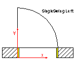
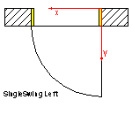
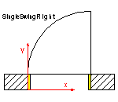
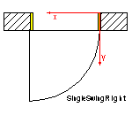
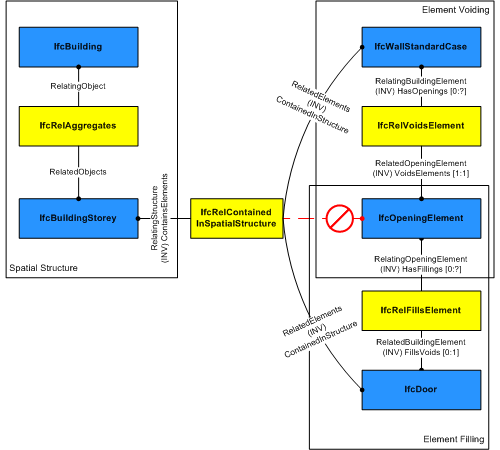

The door is a building element that is predominately used to provide controlled access for people and goods. It includes constructions with hinged, pivoted, sliding, and additionally revolving and folding operations. A door consists of a lining and one or several panels.

{ .extDef}
> NOTE&nbsp; Definition according to ISO 6707-1: construction for closing an opening, intended primarily for access with hinged, pivoted or sliding operation.

The _IfcDoor_ defines a particular occurrence of a door inserted in the spatial context of a project. A door can:

* be inserted as a filler in an opening using the _IfcRelFillsElement_ relationship, then the _IfcDoor_ has an inverse attribute _FillsVoids_ provided; 
>> NOTE&nbsp; View definitions or implementer agreements may restrict the relationship to only include one door into one opening 
* be part of an element assembly, in general an _IfcCurtainWall_, using the _IfcRelAggregates_ relationship, then the _IfcDoor_ has an inverse attribute _Decomposes_ is provided;
* be a "free standing" door, then the _IfcDoor_ has no inverse attributes _FillsVoids_ or _Decomposes_ provided.

The IFC specification provides two entities for door occurrences:

* _IfcDoorStandardCase_ used for all occurrences of doors, that have a 'Profile' shape representation defined to which a set of shape parameters for lining and framing properties apply. Additionally it requires the provision of an _IfcDoorType_ that references one _IfcDoorLiningProperties_ and on to many _IfcDoorPanelProperties_; 
>> NOTE&nbsp; see _IfcDoorStandardCase_ for all specific constraints imposed by this subtype. 
* _IfcDoor_ used for all other occurrences of doors, particularly for doors having only 'Brep', or 'SurfaceModel' geometry without applying shape parameters.

The actual parameters of the door and/or its shape are defined by the _IfcDoor_ as the occurrence definition (or project instance), or by the _IfcDoorType_ as the specific definition (or project type). The following parameters are given:

* at the _IfcDoor_ or _IfcDoorStandardCase_ for occurrence specific parameters. The _IfcDoor_ specifies:
*  
    * the door width and height
    * the door opening direction (by the y-axis of the _ObjectPlacement_)* at the _IfcDoorType_, to which the _IfcDoor_ is related by the inverse relationship _IsTypedBy_ pointing to _IfcRelDefinesByType_, for type parameters common to all occurrences of the same type.
*  
    * the operation type (single swing, double swing, revolving, etc.)
    * the door hinge side (by using two different styles for right and left opening doors)
    * the construction material type
    * the particular attributes for the lining by the _IfcDoorLiningProperties_
    * the particular attributes for the panels by the _IfcDoorPanelProperties_ 

> HISTORY&nbsp; New entity in IFC1.0.

{ .change-ifc2x4}
> IFC4 CHANGE&nbsp; The attributes _PredefinedType_ and _OperationType_ are added, the applicable type object has been changed to _IfcDoorType_.

The geometric representation of _IfcDoor_ is given by the _IfcProductDefinitionShape_, allowing multiple geometric representations. The _IfcDoor_ may get its parameter and shape from the _IfcDoorType_. If an _IfcRepresentationMap_ (a block definition) is defined for the _IfcDoorType_, then the _IfcDoor_ inserts it through the _IfcMappedItem_.

The&nbsp;geometric representation of _IfcDoor_ is defined using the following (potentially&nbsp;multiple) _IfcShapeRepresentation_'s for its _IfcProductDefinitionShape_:

* **Profile**: A&nbsp;'Curve3D' consisting of a single losed curve defining the outer boundary of the door (lining). The door parametric representation uses this profile in order to apply the door lining and panel parameter. If not provided, the profile of the _IfcOpeningElement_ is taken.
* **FootPrint**: A 'GeometricCurveSet', or 'Annotation2D' representation defining the 2D shape of the door
* **Body**: A 'SweptSolid', 'SurfaceModel', or 'Brep' representation defining the 3D shape of the door.

In addition the parametric representation of a (limited) door shape is available by applying the parameters from _IfcDoorType_ referencing _IfcDoorLiningProperties_ and _IfcDoorPanelProperties_. The purpose of the parameter is described at those entities and below (door opening operation by door type).

{ .use-head}
Parameteric Representation using parameters at _IfcDoorType_

The parameters that defines the shape of the _IfcDoor_, are given at the _IfcDoorType_ and the property sets, which are included in the _IfcDoorType_. The _IfcDoor_ only defines the local placement which determines the opening direction of the door. The overall size of the _IfcDoor_ to be used to apply the lining or panel parameter provided by the _IfcDoorType_ is determined by the IfcShapeRepresentation with the RepresentationIdentifier = 'Profile'.

> NOTE&nbsp; The _OverallWidth_ and _OverallHeight_ parameters are for informational purpose only.

The opening direction is determined by the local placement of _IfcDoor_ and the _OperationType_ of the door style as shown in Figure 1.

> NOTE&nbsp; There are different definitions in various countries on what a left opening or left hung or left swing door is (same for right). Therefore the IFC definition may derivate from the local standard and need to be mapped appropriately.

<table>
<tr>
<td>
<table border="1" cellpadding="2" cellspacing="2" style=" width:90%;">
<thead>
<tr>
<td align="left" valign="top"><small><b>Opening
directions</b></small></td>
<td align="left" valign="top">
<small><b>Definitions</b></small></td>
<td align="left" valign="top"><small><b>Reference to other
standards</b></small></td>
</tr>
</thead>
<tbody>
<tr valign="top">
<td><small> </small></td>
<td align="left"><small>The door panel (for swinging doors) opens
always into the direction of the positive Y axis of the local
placement. The determination of whether the door opens to the left
or to the right is done at the level of the <em>IfcDoorType</em>.
Here it is a left side opening door given
by&nbsp;<em>IfcDoorType.OperationType</em> =
SingleSwingLeft</small></td>
<td align="left"><small>refered to as LEFT HAND (LH) in US * 
 
refered to as DIN-R (right hung) in Germany</small></td>
</tr>
<tr valign="top">
<td><small> </small></td>
<td align="left"><small>If the door should open to the other side,
then the local placement has to be changed. It is still a left side
opening door, given by <em>IfcDoorType.OperationType</em> =
SingleSwingLeft</small></td>
<td align="left"><small>refered to as RIGHT HAND REVERSE (RHR) in
US * 
 
refered to as DIN-R (right hung) in Germany</small></td>
</tr>
<tr valign="top">
<td></td>
<td align="left"><small>If the door panel (for swinging doors)
opens to the right, a separate door style needs to be used (here
<em>IfcDoorTypee.OperationType</em> = SingleSwingRight) and it always
opens into the direction of the positive Y axis of the local
placement.&nbsp;</small></td>
<td align="left"><small>refered to as RIGHT HAND (RH) in US * 
 
refered to as DIN-L (left hung) in Germany</small></td>
</tr>
<tr valign="top">
<td align="left" valign="top"><small> </small></td>
<td align="left"><small>If the door panel (for swinging doors)
opens to the right, and into the opposite directions, the local
placement of the door need to change. The door style is given by
<em>IfcDoorType.OperationType</em> = SingleSwingRight.</small></td>
<td align="left"><small>refered to as LEFT HAND REVERSE (LHR) in US
* 
 
refered to as DIN-L (left hung) in Germany</small></td>
</tr>
</tbody>
<tfoot>
<tr valign="top">
<td align="right" colspan="3"><small>* it assumes that the
'inside/private/primary' space is above (top in the pictures) and
the 'outside/public/secondary' space is below (bottom in the
pictures).</small></td>
</tr>
</tfoot>
</table>
</td>
</tr>
<tr>
<td>

Figure 1 &mdash; Door swing

</td>
</tr>
</table>

___
## Common Use Definitions
The following concepts are inherited at supertypes:

* _IfcRoot_: [Identity](../../templates/identity.htm), [Revision Control](../../templates/revision-control.htm)
* _IfcElement_: [Box Geometry](../../templates/box-geometry.htm), [FootPrint Geometry](../../templates/footprint-geometry.htm), [Body SurfaceOrSolidModel Geometry](../../templates/body-surfaceorsolidmodel-geometry.htm), [Body SurfaceModel Geometry](../../templates/body-surfacemodel-geometry.htm), [Body Tessellation Geometry](../../templates/body-tessellation-geometry.htm), [Body Brep Geometry](../../templates/body-brep-geometry.htm), [Body AdvancedBrep Geometry](../../templates/body-advancedbrep-geometry.htm), [Body CSG Geometry](../../templates/body-csg-geometry.htm), [Mapped Geometry](../../templates/mapped-geometry.htm)
* _IfcBuildingElement_: [Product Assignment](../../templates/product-assignment.htm), [Surface 3D Geometry](../../templates/surface-3d-geometry.htm)

[&nbsp;Instance diagram](../../../annex/annex-d/common-use-definitions/ifcdoor.htm)

{ .use-head}
Object Typing

The [Object Typing](../../templates/object-typing.htm) concept applies to this entity as shown in Table 1.

<table>
<tr><td>
<table class="gridtable">
<tr><th><b>Type</b></th><th><b>Description</b></th></tr>
<tr><td><a href="../../ifcsharedbldgelements/lexical/ifcdoortype.htm">IfcDoorType</a></td><td>&nbsp;</td></tr>
<tr><td><a href="../../ifcarchitecturedomain/lexical/ifcdoorstyle.htm">IfcDoorStyle</a></td><td><blockquote class="note">NOTE&nbsp;This type is deprecated</blockquote></td></tr>
</table>
</td></tr>
<tr><td>
Table 1 &mdash; IfcDoor Object Typing
</td></tr></table>

  
  
{ .use-head}
Property Sets for Objects

The [Property Sets for Objects](../../templates/property-sets-for-objects.htm) concept applies to this entity as shown in Table 2.

<table>
<tr><td>
<table class="gridtable">
<tr><th><b>PredefinedType</b></th><th><b>Name</b></th></tr>
<tr><td>&nbsp;</td><td><a href="../../psd/ifcsharedbldgelements/Pset_DoorCommon.xml">Pset_DoorCommon</a></td></tr>
<tr><td>&nbsp;</td><td><a href="../../psd/ifcstructuralelementsdomain/Pset_ConcreteElementGeneral.xml">Pset_ConcreteElementGeneral</a></td></tr>
<tr><td>&nbsp;</td><td><a href="../../psd/ifcstructuralelementsdomain/Pset_PrecastConcreteElementFabrication.xml">Pset_PrecastConcreteElementFabrication</a></td></tr>
<tr><td>&nbsp;</td><td><a href="../../psd/ifcstructuralelementsdomain/Pset_PrecastConcreteElementGeneral.xml">Pset_PrecastConcreteElementGeneral</a></td></tr>
<tr><td>&nbsp;</td><td><a href="../../psd/ifcsharedfacilitieselements/Pset_Condition.xml">Pset_Condition</a></td></tr>
<tr><td>&nbsp;</td><td><a href="../../psd/ifcproductextension/Pset_EnvironmentalImpactIndicators.xml">Pset_EnvironmentalImpactIndicators</a></td></tr>
<tr><td>&nbsp;</td><td><a href="../../psd/ifcproductextension/Pset_EnvironmentalImpactValues.xml">Pset_EnvironmentalImpactValues</a></td></tr>
<tr><td>&nbsp;</td><td><a href="../../psd/ifcsharedfacilitieselements/Pset_ManufacturerOccurrence.xml">Pset_ManufacturerOccurrence</a></td></tr>
<tr><td>&nbsp;</td><td><a href="../../psd/ifcsharedfacilitieselements/Pset_ManufacturerTypeInformation.xml">Pset_ManufacturerTypeInformation</a></td></tr>
<tr><td>&nbsp;</td><td><a href="../../psd/ifcsharedmgmtelements/Pset_PackingInstructions.xml">Pset_PackingInstructions</a></td></tr>
<tr><td>&nbsp;</td><td><a href="../../psd/ifcsharedfacilitieselements/Pset_ServiceLife.xml">Pset_ServiceLife</a></td></tr>
<tr><td>&nbsp;</td><td><a href="../../psd/ifcsharedfacilitieselements/Pset_Warranty.xml">Pset_Warranty</a></td></tr>
</table>
</td></tr>
<tr><td>
Table 2 &mdash; IfcDoor Property Sets for Objects
</td></tr></table>

  
  
{ .use-head}
Quantity Sets

The [Quantity Sets](../../templates/quantity-sets.htm) concept applies to this entity as shown in Table 3.

<table>
<tr><td>
<table class="gridtable">
<tr><th><b>Name</b></th></tr>
<tr><td><a href="../../qto/ifcsharedbldgelements/Qto_DoorBaseQuantities.xml">Qto_DoorBaseQuantities</a></td></tr>
</table>
</td></tr>
<tr><td>
Table 3 &mdash; IfcDoor Quantity Sets
</td></tr></table>

  
  
{ .use-head}
Material Constituents

The [Material Constituents](../../templates/material-constituents.htm) concept applies to this entity as shown in Table 4.

<table>
<tr><td>
<table class="gridtable">
<tr><th><b>Name</b></th><th><b>Description</b></th></tr>
<tr><td>Lining</td><td>Indicates that the material constituent applies to the door lining.</td></tr>
<tr><td>Framing</td><td>Indicates that the material constituent applies to the door panel(s); if not provided, the 'Lining' material information applies to panel(s) as well.</td></tr>
<tr><td>Glazing</td><td>Indicates that the material constituent applies to the glazing part.</td></tr>
</table>
</td></tr>
<tr><td>
Table 4 &mdash; IfcDoor Material Constituents
</td></tr></table>

The material of the _IfcDoor_ is defined by the _IfcMaterialConstituentSet_ or as fall back by _IfcMaterial_ and attached by the _IfcRelAssociatesMaterial_._RelatingMaterial_. It is accessible by the inverse _HasAssociations_ relationship.

If the fall back single _IfcMaterial_ is referenced, it applies to the lining and framing of the door.

  
  
{ .use-head}
Spatial Containment

The [Spatial Containment](../../templates/spatial-containment.htm) concept applies to this entity as shown in Table 5.

<table>
<tr><td>
<table class="gridtable">
<tr><th><b>Structure</b></th><th><b>Description</b></th></tr>
<tr><td><a href="../../ifcproductextension/lexical/ifcbuildingstorey.htm">IfcBuildingStorey</a></td><td>Default spatial container </td></tr>
<tr><td><a href="../../ifcproductextension/lexical/ifcbuilding.htm">IfcBuilding</a></td><td>Spatial container for the element if it cannot be assigned to a building storey</td></tr>
<tr><td><a href="../../ifcproductextension/lexical/ifcsite.htm">IfcSite</a></td><td>Spatial container for the element in case that it is placed on site (outside of building)</td></tr>
<tr><td><a href="../../ifcproductextension/lexical/ifcspace.htm">IfcSpace</a></td><td>In particular use cases, a door maybe assigned directly to space</td></tr>
</table>
</td></tr>
<tr><td>
Table 5 &mdash; IfcDoor Spatial Containment
</td></tr></table>

The _IfcDoor_, as any subtype of _IfcBuildingElement_, may participate alternatively in one of the two different containment relationships:

* the _Spatial Containment_ (defined here), or
* the _Element Composition_.

The _IfcDoor_ may also be connected to the _IfcOpeningElement_ in which it is placed as a filler. In this case, the spatial containment relationship shall be provided, see Figure 2.

<table>
 
<tr valign="bottom">
  
<td></td>
  
<td>
<blockquote class="note">NOTE&nbsp; The containment shall be
defined independently of the filling relationship, that is, even if

   the <em>IfcDoor</em> is a filling of an opening established by
<em>IfcRelFillsElement</em>, it is also contained in the spatial
structure by
   <em>IfcRelContainedInSpatialStructure</em>.</blockquote>
</td>

 </tr>

 <tr>
  
<td>

Figure 2 &mdash; Door spatial containment

</td>

  <td>&nbsp;</td>
 
</tr>

</table>

  
  
{ .use-head}
Product Placement

The [Product Placement](../../templates/product-placement.htm) concept applies to this entity as shown in Table 6.

<table>
<tr><td>
<table class="gridtable">
<tr><th><b>Type</b></th><th><b>Relative</b></th><th><b>Description</b></th></tr>
<tr><td><a href="../../ifcgeometricconstraintresource/lexical/ifclocalplacement.htm">IfcLocalPlacement</a></td><td><a href="../../ifcgeometricconstraintresource/lexical/ifclocalplacement.htm">IfcLocalPlacement</a></td><td>Relative placement according to position and rotation relative to container.</td></tr>
<tr><td><a href="../../ifcgeometricconstraintresource/lexical/ifclocalplacement.htm">IfcLocalPlacement</a></td><td>&nbsp;</td><td>Absolute placement according to position and rotation of world coordinate system.</td></tr>
<tr><td><a href="../../ifcgeometricconstraintresource/lexical/ifcgridplacement.htm">IfcGridPlacement</a></td><td>&nbsp;</td><td>Placement according to grid intersection.</td></tr>
</table>
</td></tr>
<tr><td>
Table 6 &mdash; IfcDoor Product Placement
</td></tr></table>

The following restriction is imposed:

1. The _PlacementRelTo_ relationship of _IfcLocalPlacement_ shall point to the local placement of the same element (if given), in which the _IfcDoor_ is used as a filling (normally an _IfcOpeningElement_), as provided by the _IfcRelFillsElement_ relationship;
2. If the _IfcDoor_ is part of an assembly, e.g. an _IfcCurtainWall_, then the _PlacementRelTo_ relationship of _IfcLocalPlacement_ shall point (if given) to the local placement of that assembly;
3. If the _IfcDoor_ is not inserted into an _IfcOpeningElement_, then the _PlacementRelTo_ relationship of _IfcLocalPlacement_ shall point (if given) to the local placement of the same _IfcSpatialStructureElement_ that is used in the _ContainedInStructure_ inverse attribute or to a referenced spatial structure element at a higher level.

> NOTE&nbsp; The product placement is used to determine the opening direction of the door.

  
  
{ .use-head}
Profile 3D Geometry

The [Profile 3D Geometry](../../templates/profile-3d-geometry.htm) concept applies to this entity.

The door profile is represented by a three-dimensional closed curve within a particular shape representation. The profile is used to apply the parameter of the parametric door representation. Only a single closed curve shall be contained in the set of _IfcShapeRepresentation.Items_.

A 'Profile' representation has to be provided if a parametric representation is applied to the door.