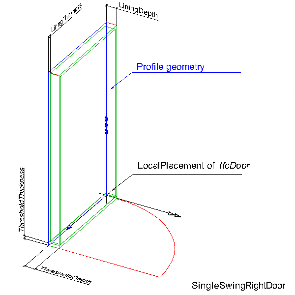

The standard door, _IfcDoorStandardCase_, defines a door with certain constraints for the provision of operation types, opening directions, frame and lining parameters, and with certain constraints for the geometric representation. The _IfcDoorStandardCase_ handles all cases of doors, that:

* are inserted into an opening, represented by _IfcOpeningElement_, using the _IfcRelFillsElement_ relationship;
* have a local placement relative to this opening, and with the y-axis of the placement pointing into the opening direction;
* have a profile geometry, represented by _IfcShapeRepresentation.RepresentationIdentifier_="Profile" as a closed curve to which the door parameters apply;
* have a reference to an _IfcDoorType_ to define the opening direction and the operation type (swinging, sliding, folding, etc.) of the door. The attribute _OperationType_ shall be provided and not being UNDEFINED, and the attribute _ParameterTakesPrecedence_ shall be "TRUE";
* have an _IfcDoorLiningProperties_ and _IfcDoorPanelProperties_ instances included in the set of _HasPropertySets_ at _IfcDoorType_.

> HISTORY&nbsp; New entity in IFC4.

**_Geometric Representations_**

The geometric representation of _IfcDoorStandardCase_ is defined using the following multiple shape representations for its definition:

* **Profile**: a three-dimensional closed curve within a particular shape representation. The profile is used to apply the parameter of the parametric door representation. The profile around the edges of the opening is used to apply the door lining and door panel shape parameter.
* **MappedRepresentation**: A SweptSolid, SurfaceModel, Brep or a CSG representation additionally defining the 3D shape of the standard door in addition to the parametric representation by applying the _IfcDoorLiningProperties_ and an the _IfcDoorPanelProperties_ to the 'Profile' representation.

___
## Common Use Definitions
The following concepts are inherited at supertypes:

* _IfcRoot_: [Identity](../../templates/identity.htm), [Revision Control](../../templates/revision-control.htm)
* _IfcElement_: [Box Geometry](../../templates/box-geometry.htm), [FootPrint Geometry](../../templates/footprint-geometry.htm), [Body SurfaceOrSolidModel Geometry](../../templates/body-surfaceorsolidmodel-geometry.htm), [Body SurfaceModel Geometry](../../templates/body-surfacemodel-geometry.htm), [Body Tessellation Geometry](../../templates/body-tessellation-geometry.htm), [Body Brep Geometry](../../templates/body-brep-geometry.htm), [Body AdvancedBrep Geometry](../../templates/body-advancedbrep-geometry.htm), [Body CSG Geometry](../../templates/body-csg-geometry.htm), [Mapped Geometry](../../templates/mapped-geometry.htm)
* _IfcBuildingElement_: [Product Assignment](../../templates/product-assignment.htm), [Surface 3D Geometry](../../templates/surface-3d-geometry.htm)
* _IfcDoor_: [Property Sets for Objects](../../templates/property-sets-for-objects.htm), [Quantity Sets](../../templates/quantity-sets.htm), [Material Constituents](../../templates/material-constituents.htm), [Spatial Containment](../../templates/spatial-containment.htm), [Product Placement](../../templates/product-placement.htm)

[&nbsp;Instance diagram](../../../annex/annex-d/common-use-definitions/ifcdoorstandardcase.htm)

{ .use-head}
Object Typing

The [Object Typing](../../templates/object-typing.htm) concept applies to this entity as shown in Table 1.

<table>
<tr><td>
<table class="gridtable">
<tr><th><b>Type</b></th><th><b>Description</b></th></tr>
<tr><td><a href="../../ifcsharedbldgelements/lexical/ifcdoortype.htm">IfcDoorType</a></td><td>&nbsp;</td></tr>
<tr><td><a href="../../ifcarchitecturedomain/lexical/ifcdoorstyle.htm">IfcDoorStyle</a></td><td><blockquote class="note">NOTE&nbsp;This type is deprecated</blockquote></td></tr>
</table>
</td></tr>
<tr><td>
Table 1 &mdash; IfcDoorStandardCase Object Typing
</td></tr></table>

  
  
{ .use-head}
Profile 3D Geometry

The [Profile 3D Geometry](../../templates/profile-3d-geometry.htm) concept applies to this entity.

The door profile is represented by a three-dimensional closed curve within a particular shape representation. The profile is used to apply the parameter of the parametric door representation. The following attribute values for the _IfcShapeRepresentation_ holding this geometric representation shall be used:

* _RepresentationIdentifier_ : 'Profile'
* _RepresentationType_ : 'Curve3D' or 'GeometricCurveSet', in case of 'GeometricCurveSet' only a single closed curve shall be contained in the set of _IfcShapeRepresentation.Items_.

The following additional constraints apply to the 'Profile' representation type:

* **Curve**: being an _IfcPolyline_ defining a rectangle.
* **Position**: The curve shall lie in the xz plane of the object placement coordinate (the y coordinate values of the _IfcCartesianPoint_'s shall be 0.).

&nbsp;

<table summary="">
 
<tr valign="top">

  <td></td>

  <td>
<blockquote class="example">EXAMPLE&nbsp; Figure 1 illustrates applying the door lining parameters to the
door profile shape representation. The profile defines the outer
boundary to which the door lining parameters relate as:</blockquote>
   <blockquote>
<ul>

    <li class="small"><em>IfcDoorLiningProperties.LiningDepth</em> starting at distance
defined by <em>LiningOffset</em> going into the positive y
direction.</li>

    <li class="small"><em>IfcDoorLiningProperties.LiningThickness</em> offset into the
inner side of the rectangle.</li>
    <li class="small"><em>IfcDoorLiningProperties.LiningOffset</em> distance along the
positive y direction to where the <em>LiningDepth</em> applies.</li>
    
<li class="small"><em>IfcDoorLiningProperties.ThresholdThickness</em> starting at
the bottom edge of the rectangle into the inner side of the
rectangle</li>

    <li class="small"><em>IfcDoorLiningProperties.ThresholdDepth</em> starting at
distance defined by <em>LiningOffset</em> going into the positive y
direction.</li>
  
    <li class="small"><em>IfcDoorLiningProperties.TransomOffset</em> starting at the 
bottom edge of the rectangle (along local x axis) into the inner
side of the rectangle, distance provided as percentage of overall
height. Distance to the centre line of the transom.</li>
   
</ul></blockquote>
  
</td>

 </tr>

 <tr valign="top">
  
<td>

Figure 1 &mdash; Door profile

</td>
  
<td>&nbsp;</td>

 </tr>

</table>
