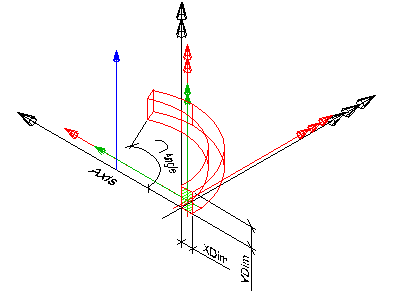
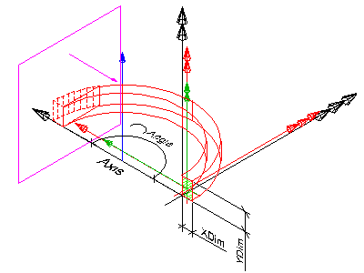

An _IfcMember_ is a structural member designed to carry loads between or beyond points of support. It is not required to be load bearing. The orientation of the member (being horizontal, vertical or sloped) is not relevant to its definition (in contrary to _IfcBeam_ and _IfcColumn_). An _IfcMember_ represents a linear structural element from an architectural or structural modeling point of view and shall be used if it cannot be expressed more specifically as either an _IfcBeam_ or an _IfcColumn_.

> NOTE&nbsp; The representation of a member in a structural analysis model is provided by _IfcStructuralCurveMember_ being part of an _IfcStructuralAnalysisModel_.

The IFC specification provides two entities for member occurrences:

* _IfcMemberStandardCase_ used for all occurrences of members, that have a profile defined that is swept along a directrix. The profile might be changed uniformly by a taper definition along the directrix. The profile parameter and its cardinal point of insertion can be fully described by the _IfcMaterialProfileSetUsage_. These beams are always represented geometricly by an 'Axis' and a 'SweptSolid' or 'AdvancedSweptSolid' shape representation (or by a 'Clipping' geometry based on the swept solid), if a 3D geometric representation is assigned. In addition they have to have a corresponding _IfcMaterialProfileSetUsage_ assigned. 
>> NOTE&nbsp; View definitions and implementer agreements may further constrain the applicable geometry types, such as by excluding tapering from an _IfcMemberStandardCase_ implementation. 
* _IfcMember_ used for all other occurrences of members, particularly for members with changing profile sizes along the extrusion, or members defined by non-linear extrusion, or members having only 'Brep', or 'SurfaceModel' geometry.

> HISTORY&nbsp; New entity in IFC2x2 Addendum 1.

___
## Common Use Definitions
The following concepts are inherited at supertypes:

* _IfcRoot_: [Identity](../../templates/identity.htm), [Revision Control](../../templates/revision-control.htm)
* _IfcElement_: [Product Placement](../../templates/product-placement.htm), [Box Geometry](../../templates/box-geometry.htm), [FootPrint Geometry](../../templates/footprint-geometry.htm), [Body SurfaceOrSolidModel Geometry](../../templates/body-surfaceorsolidmodel-geometry.htm), [Body SurfaceModel Geometry](../../templates/body-surfacemodel-geometry.htm), [Body Tessellation Geometry](../../templates/body-tessellation-geometry.htm), [Body Brep Geometry](../../templates/body-brep-geometry.htm), [Body AdvancedBrep Geometry](../../templates/body-advancedbrep-geometry.htm), [Body CSG Geometry](../../templates/body-csg-geometry.htm), [Mapped Geometry](../../templates/mapped-geometry.htm)
* _IfcBuildingElement_: [Surface 3D Geometry](../../templates/surface-3d-geometry.htm)

[&nbsp;Instance diagram](../../../annex/annex-d/common-use-definitions/ifcmember.htm)

{ .use-head}
Object Typing

The [Object Typing](../../templates/object-typing.htm) concept applies to this entity as shown in Table 1.

<table>
<tr><td>
<table class="gridtable">
<tr><th><b>Type</b></th></tr>
<tr><td><a href="../../ifcsharedbldgelements/lexical/ifcmembertype.htm">IfcMemberType</a></td></tr>
</table>
</td></tr>
<tr><td>
Table 1 &mdash; IfcMember Object Typing
</td></tr></table>

  
  
{ .use-head}
Property Sets for Objects

The [Property Sets for Objects](../../templates/property-sets-for-objects.htm) concept applies to this entity as shown in Table 2.

<table>
<tr><td>
<table class="gridtable">
<tr><th><b>PredefinedType</b></th><th><b>Name</b></th></tr>
<tr><td>&nbsp;</td><td><a href="../../psd/ifcsharedbldgelements/Pset_MemberCommon.xml">Pset_MemberCommon</a></td></tr>
<tr><td>&nbsp;</td><td><a href="../../psd/ifcstructuralelementsdomain/Pset_ConcreteElementGeneral.xml">Pset_ConcreteElementGeneral</a></td></tr>
<tr><td>&nbsp;</td><td><a href="../../psd/ifcstructuralelementsdomain/Pset_PrecastConcreteElementFabrication.xml">Pset_PrecastConcreteElementFabrication</a></td></tr>
<tr><td>&nbsp;</td><td><a href="../../psd/ifcstructuralelementsdomain/Pset_PrecastConcreteElementGeneral.xml">Pset_PrecastConcreteElementGeneral</a></td></tr>
<tr><td>&nbsp;</td><td><a href="../../psd/ifcsharedfacilitieselements/Pset_Condition.xml">Pset_Condition</a></td></tr>
<tr><td>&nbsp;</td><td><a href="../../psd/ifcproductextension/Pset_EnvironmentalImpactIndicators.xml">Pset_EnvironmentalImpactIndicators</a></td></tr>
<tr><td>&nbsp;</td><td><a href="../../psd/ifcproductextension/Pset_EnvironmentalImpactValues.xml">Pset_EnvironmentalImpactValues</a></td></tr>
<tr><td>&nbsp;</td><td><a href="../../psd/ifcsharedfacilitieselements/Pset_ManufacturerOccurrence.xml">Pset_ManufacturerOccurrence</a></td></tr>
<tr><td>&nbsp;</td><td><a href="../../psd/ifcsharedfacilitieselements/Pset_ManufacturerTypeInformation.xml">Pset_ManufacturerTypeInformation</a></td></tr>
<tr><td>&nbsp;</td><td><a href="../../psd/ifcsharedmgmtelements/Pset_PackingInstructions.xml">Pset_PackingInstructions</a></td></tr>
<tr><td>&nbsp;</td><td><a href="../../psd/ifcsharedfacilitieselements/Pset_ServiceLife.xml">Pset_ServiceLife</a></td></tr>
<tr><td>&nbsp;</td><td><a href="../../psd/ifcsharedfacilitieselements/Pset_Warranty.xml">Pset_Warranty</a></td></tr>
</table>
</td></tr>
<tr><td>
Table 2 &mdash; IfcMember Property Sets for Objects
</td></tr></table>

  
  
{ .use-head}
Quantity Sets

The [Quantity Sets](../../templates/quantity-sets.htm) concept applies to this entity as shown in Table 3.

<table>
<tr><td>
<table class="gridtable">
<tr><th><b>Name</b></th></tr>
<tr><td><a href="../../qto/ifcsharedbldgelements/Qto_MemberBaseQuantities.xml">Qto_MemberBaseQuantities</a></td></tr>
</table>
</td></tr>
<tr><td>
Table 3 &mdash; IfcMember Quantity Sets
</td></tr></table>

  
  
{ .use-head}
Material Profile Set

The [Material Profile Set](../../templates/material-profile-set.htm) concept applies to this entity.

The material of the _IfcMember_ is defined by the _IfcMaterialProfileSet_ or as fallback by _IfcMaterial_, and it is attached either directly or at the _IfcMemberType_.

> NOTE&nbsp; It is illegal to assign an _IfcMaterialProfileSetUsage_ to an _IfcMember_. Only the subtype _IfcMemberStandardCase_ supports this concept.

  
  
{ .use-head}
Spatial Containment

The [Spatial Containment](../../templates/spatial-containment.htm) concept applies to this entity as shown in Table 4.

<table>
<tr><td>
<table class="gridtable">
<tr><th><b>Structure</b></th><th><b>Description</b></th></tr>
<tr><td><a href="../../ifcproductextension/lexical/ifcbuildingstorey.htm">IfcBuildingStorey</a></td><td>Default spatial container</td></tr>
<tr><td><a href="../../ifcproductextension/lexical/ifcbuilding.htm">IfcBuilding</a></td><td>Spatial container for the element if it cannot be assigned to a building storey</td></tr>
<tr><td><a href="../../ifcproductextension/lexical/ifcsite.htm">IfcSite</a></td><td>Spatial container for the element in case that it is placed on site (outside of building)</td></tr>
</table>
</td></tr>
<tr><td>
Table 4 &mdash; IfcMember Spatial Containment
</td></tr></table>

The _IfcMember_, as any subtype of _IfcBuildingElement_, may participate alternatively in one of the two different containment relationships:

* the _Spatial Containment_ (defined here), or
* the _Element Composition_.

  
  
{ .use-head}
Axis 3D Geometry

The [Axis 3D Geometry](../../templates/axis-3d-geometry.htm) concept applies to this entity as shown in Table 5.

<table>
<tr><td>
<table class="gridtable">
<tr><th><b>Identifier</b></th><th><b>Type</b></th><th><b>Items</b></th><th><b>Description</b></th></tr>
<tr><td>Axis</td><td>Curve3D</td><td><a href="../../ifcgeometryresource/lexical/ifcboundedcurve.htm">IfcBoundedCurve</a></td><td>Three-dimensional reference curve for the member.</td></tr>
</table>
</td></tr>
<tr><td>
Table 5 &mdash; IfcMember Axis 3D Geometry
</td></tr></table>

The axis representation can be used to represent the system length of a member that may extent the body length of the member.

> NOTE&nbsp; The 'Axis' is not used to locate the material profile set, only the subtype _IfcMemberStandardCase_ provides this capability.

  
  
{ .use-head}
Body SweptSolid Geometry

The [Body SweptSolid Geometry](../../templates/body-sweptsolid-geometry.htm) concept applies to this entity.

The following additional constraints apply to the 'SweptSolid' representation:

* **Solid**: _IfcExtrudedAreaSolid_, _IfcRevolvedAreaSolid_ shall be supported
* **Profile**: all subtypes of _IfcProfileDef_ (with exception of _IfcArbitraryOpenProfileDef_) 
* **Extrusion**: All extrusion directions shall be supported.

Figure 1 illustrates a 'SweptSolid' geometric representation. There are no restrictions or conventions on how to use the local placement (black), solid of extrusion placement (red) and profile placement (green).

  
  
{ .use-head}
Body AdvancedSweptSolid Geometry

The [Body AdvancedSweptSolid Geometry](../../templates/body-advancedsweptsolid-geometry.htm) concept applies to this entity.

The following additional constraints apply to the 'AdvancedSweptSolid' representation type:

* **Solid**: _IfcSurfaceCurveSweptAreaSolid_, _IfcFixedReferenceSweptAreaSolid_, _IfcExtrudedAreaSolidTapered_, _IfcRevolvedAreaSolidTapered_ shall be supported. 
>> NOTE&nbsp; View definitions and implementer agreements can further constrain the allowed swept solid types. 
* **Profile**: see 'SweptSolid' geometric representation
* **Extrusion**: not applicable

_MappedRepresentation Representation Type_

  
  
{ .use-head}
Body Clipping Geometry

The [Body Clipping Geometry](../../templates/body-clipping-geometry.htm) concept applies to this entity.

The following constraints apply to the 'Clipping' representation:

* **Solid**: see 'SweptSolid' geometric representation
* **Profile**: see 'SweptSolid' geometric representation
* **Extrusion**: see 'SweptSolid' geometric representation
* **Boolean result**: The _IfcBooleanClippingResult_ shall be supported, allowing for Boolean differences between the swept solid (here _IfcExtrudedAreaSolid_) and one or several _IfcHalfSpaceSolid_ (or its subtypes).

Figure 2 illustrates a 'Clipping' geometric representation with use of _IfcBooleanClippingResult_ between an _IfcExtrudedAreaSolid_ and an _IfcHalfSpaceSolid_ to create a clipped body.

  
  
{ .use-head}
Product Assignment

The [Product Assignment](../../templates/product-assignment.htm) concept applies to this entity as shown in Table 6.

<table>
<tr><td>
<table class="gridtable">
<tr><th><b>Type</b></th><th><b>Description</b></th></tr>
<tr><td><a href="../../ifcstructuralanalysisdomain/lexical/ifcstructuralcurvemember.htm">IfcStructuralCurveMember</a></td><td>An idealized structural member corresponding to the member.</td></tr>
<tr><td><a href="../../ifcprocessextension/lexical/ifctask.htm">IfcTask</a></td><td>A task for operating on the member.</td></tr>
</table>
</td></tr>
<tr><td>
Table 6 &mdash; IfcMember Product Assignment
</td></tr></table>