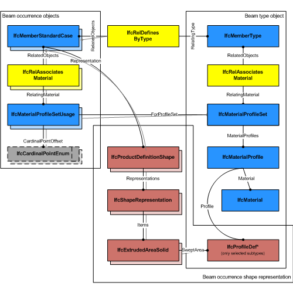
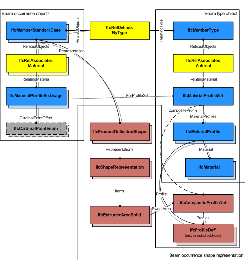
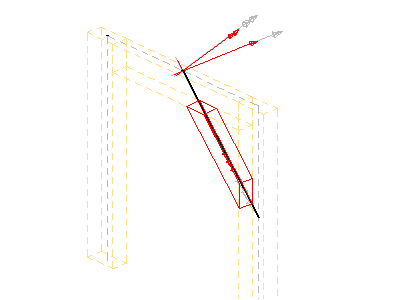
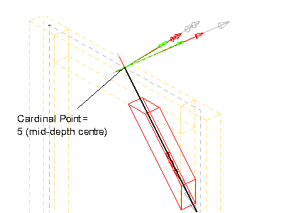
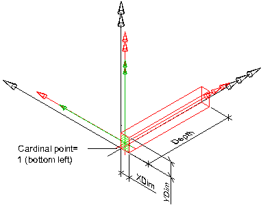
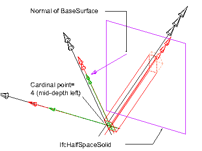

The standard member, _IfcMemberStandardCase_, defines a member with certain constraints for the provision of material usage, parameters and with certain constraints for the geometric representation. The _IfcMemberStandardCase_ handles all cases of members, that:

* have a reference to the _IfcMaterialProfileSetUsage_ defining the material profile association of the member with the cardinal point of its insertion relative to the local placement.
* are based on a sweep of a planar profile, or set of profiles, as defined by the _IfcMaterialProfileSet_
* have an 'Axis' shape representation with constraints provided below in the geometry use definition
* have a 'Body' shape representation with constraints provided below in the geometry use definition
* have a start profile, or set of profiles, that is swept along the directrix and might be changed uniformly by a taper definition
* are consistent in using the correct cardinal point offset of the profile as compared to the 'Axis' and 'Body' shape representation
* are extruded perpendicular to the profile definition plane

> NOTE&nbsp; View definitions and implementer agreements may further constrain the applicable geometry types, such as by excluding tapering from an _IfcMemberStandardCase_ implementation.

> HISTORY&nbsp; New entity in IFC4.

___
## Common Use Definitions
The following concepts are inherited at supertypes:

* _IfcRoot_: [Identity](../../templates/identity.htm), [Revision Control](../../templates/revision-control.htm)
* _IfcElement_: [Box Geometry](../../templates/box-geometry.htm), [FootPrint Geometry](../../templates/footprint-geometry.htm), [Body SurfaceOrSolidModel Geometry](../../templates/body-surfaceorsolidmodel-geometry.htm), [Body SurfaceModel Geometry](../../templates/body-surfacemodel-geometry.htm), [Body Tessellation Geometry](../../templates/body-tessellation-geometry.htm), [Body Brep Geometry](../../templates/body-brep-geometry.htm), [Body AdvancedBrep Geometry](../../templates/body-advancedbrep-geometry.htm), [Body CSG Geometry](../../templates/body-csg-geometry.htm), [Mapped Geometry](../../templates/mapped-geometry.htm)
* _IfcBuildingElement_: [Surface 3D Geometry](../../templates/surface-3d-geometry.htm)
* _IfcMember_: [Property Sets for Objects](../../templates/property-sets-for-objects.htm), [Quantity Sets](../../templates/quantity-sets.htm), [Material Profile Set](../../templates/material-profile-set.htm), [Spatial Containment](../../templates/spatial-containment.htm), [Product Assignment](../../templates/product-assignment.htm)

[&nbsp;Instance diagram](../../../annex/annex-d/common-use-definitions/ifcmemberstandardcase.htm)

{ .use-head}
Object Typing

The [Object Typing](../../templates/object-typing.htm) concept applies to this entity as shown in Table 1.

<table>
<tr><td>
<table class="gridtable">
<tr><th><b>Type</b></th></tr>
<tr><td><a href="../../ifcsharedbldgelements/lexical/ifcmembertype.htm">IfcMemberType</a></td></tr>
</table>
</td></tr>
<tr><td>
Table 1 &mdash; IfcMemberStandardCase Object Typing
</td></tr></table>

The _IfcMemberStandardCase_ defines in addition that the _IfcMemberType_ should have a unique _IfcMaterialProfileSet_, that is referenced by the _IfcMaterialProfileSetUsage_ assigned to all occurrences of this _IfcMemberType_.

  
  
{ .use-head}
Material Profile Set Usage

The [Material Profile Set Usage](../../templates/material-profile-set-usage.htm) concept applies to this entity.

Figure 1 illustrates assignment of _IfcMaterialProfileSetUsage_ and _IfcMaterialProfileSet_ to the _IfcMemberStandardCase_ as the member occurrence and to the _IfcMemberType_. The same _IfcMaterialProfileSet_ shall be shared by many occurrences of _IfcMaterialProfileSetUsage_. This relationship shall be consistent to the relationship between the _IfcMemberType_ and the _IfcMemberStandardCase_.

Figure 2 illustrates assignment of a composite profile by using _IfcCompositeProfile_ for geometric representation and several _IfcMaterialProfile_'s within the _IfcMaterialProfileSet_. The number of _IfcMaterialProfile_'s within the _IfcMaterialProfileSet_ is restricted to maximal 2 and requires the use of _IfcExtrudedAreaSolidTapered_, or _IfcRevolvedAreaSolidTapered_ for the correct 'Body' shape representation.

The material of the _IfcMemberStandardCase_ is defined by _IfcMaterialProfileSetUsage_ and attached by the _IfcRelAssociatesMaterial_._RelatingMaterial_. It is accessible by the inverse _HasAssociations_ relationship. Composite profile members can be represented by refering to several _IfcMaterialProfile_'s within the _IfcMaterialProfileSet_ that is referenced from the _IfcMaterialProfileSetUsage_.

Material information can also be given at the _IfcMemberType_, defining the common attribute data for all occurrences of the same type. It is then accessible by the inverse _IsDefinedBy_ relationship pointing to _IfcMemberType.HasAssociations_ and via _IfcRelAssociatesMaterial.RelatingMaterial_. See **Type Use
Definition** for additional agreements for standard members.

  
  
{ .use-head}
Product Placement

The [Product Placement](../../templates/product-placement.htm) concept applies to this entity as shown in Table 2.

<table>
<tr><td>
<table class="gridtable">
<tr><th><b>Type</b></th><th><b>Relative</b></th><th><b>Description</b></th></tr>
<tr><td><a href="../../ifcgeometricconstraintresource/lexical/ifclocalplacement.htm">IfcLocalPlacement</a></td><td><a href="../../ifcgeometricconstraintresource/lexical/ifclocalplacement.htm">IfcLocalPlacement</a></td><td>Relative placement according to position and rotation relative to container.</td></tr>
<tr><td><a href="../../ifcgeometricconstraintresource/lexical/ifclocalplacement.htm">IfcLocalPlacement</a></td><td>&nbsp;</td><td>Absolute placement according to position and rotation of world coordinate system.</td></tr>
<tr><td><a href="../../ifcgeometricconstraintresource/lexical/ifcgridplacement.htm">IfcGridPlacement</a></td><td>&nbsp;</td><td>Placement according to grid intersection.</td></tr>
</table>
</td></tr>
<tr><td>
Table 2 &mdash; IfcMemberStandardCase Product Placement
</td></tr></table>

The following restriction is imposed:

* The local placement shall provide the location and directions for the standard member, the x/y plane is the plane for the start profile, and the z-axis is the extrusion axis for the member body (in case of rotation, the tangent direction).

  
  
{ .use-head}
Axis 3D Geometry

The [Axis 3D Geometry](../../templates/axis-3d-geometry.htm) concept applies to this entity as shown in Table 3.

<table>
<tr><td>
<table class="gridtable">
<tr><th><b>Identifier</b></th><th><b>Type</b></th><th><b>Items</b></th><th><b>Description</b></th></tr>
<tr><td>Axis</td><td>Curve3D</td><td><a href="../../ifcgeometryresource/lexical/ifcboundedcurve.htm">IfcBoundedCurve</a></td><td>Three-dimensional reference curve for the member.</td></tr>
</table>
</td></tr>
<tr><td>
Table 3 &mdash; IfcMemberStandardCase Axis 3D Geometry
</td></tr></table>

The following additional constraints apply to the 'Axis' representation, if the 'Body' shape representation has the _RepresentationType_ : 'SweptSolid':

* _Axis_ 
    * _IfcPolyline_ having two _Points_, or _IfcTrimmedCurve_ with _BasisCurve_ of Type _IfcLine_ for 'SweptSolid' provided as _IfcExtrudedAreaSolid_. The axis curve lies on the z axis of the object coordinate system.
    * _IfcTrimmedCurve_ with _BasisCurve_ of Type _IfcCircle_ for 'SweptSolid' provided as _IfcRevolvedAreaSolid_. The axis curve lies on the x/z plane of the object coordinate system, the tangent at the start is along the positive z-axis. 

&nbsp;

<table border="0" cellpadding="2" cellspacing="2" summary="Axis">
 
<tr>
  <td align="left" valign="top" width="350"></td>
  <td>

<blockquote class="example">EXAMPLE&nbsp; As shown in Figure 101, the axis representation can be used to represent the system length of a member that may extent the body length of the member.</blockquote>

 </td>
 </tr>

 <tr>
  <td>
Figure 3 &mdash; Member axis representation
</td>
  <td>&nbsp;</td>
 </tr>

</table>

<table border="0" cellpadding="2" cellspacing="2" summary="Axis">
 
<tr>
  <td align="left" valign="top" width="350"></td>
  <td align="left" valign="top"><blockquote class="example">EXAMPLE&nbsp; As shown in Figure 102, the axis representation shall be used to represent the cardinal point as the offset between the 'Axis' and the extrusion path of the member. The extrusion path is provided as <em>IfcExtrudedAreaSolid.ExtrudedDirection</em> and should be parallel to the 'Axis'.  It has to be guaranteed that the value provided by <em>IfcMaterialProfileSetUsage.CardinalPoint</em> is consistent to the <em>IfcExtrudedAreaSolid.Position</em>.</blockquote>

</td>
 </tr>
 
<tr>
  <td>
Figure 4 &mdash; Member axis cardinal point
</td>
  <td>&nbsp;</td>
 </tr>

</table>

  
  
{ .use-head}
Body SweptSolid Geometry

The [Body SweptSolid Geometry](../../templates/body-sweptsolid-geometry.htm) concept applies to this entity.

The following additional constraints apply to the 'SweptSolid' representation:

* **Solid**: _IfcExtrudedAreaSolid_, _IfcRevolvedAreaSolid_ shall be supported
* **Profile**: all subtypes of _IfcProfileDef_ (with exception of _IfcArbitraryOpenProfileDef_)
* **Profile Position** : For all single profiles, the _IfcParameterizedProfileDef.Position_ shall be NIL, or having _Location_ = 0.,0. and _RefDirection_ = 1.,0.
* **Extrusion**: perpendicular to the profile direction.
* **Orientation**: The y-axis of the profile, as determined by _IfcSweptAreaSolid.Position.P[2]_ shall point to the Z-Axis. It indicates the "role" of the column, a role=0&deg; means y-axis of profile = Z-axis of reference coordinate system. In the exception of a vertical member, the y-axis shall point to the Y-axis.

Figure 5 illustrates a 'SweptSolid' geometric representation with cardinal point applied as **1** (bottom left).

The following interpretation of dimension parameter applies for rectangular members:

* <small><em>IfcRectangleProfileDef.YDim</em> interpreted as member width</small>
* <small><em>IfcRectangleProfileDef.XDim</em> interpreted as member depth</small>

The following interpretation of dimension parameter applies for circular members:

* <small><em>IfcCircleProfileDef.Radius</em> interpreted as beam radius.</small>

  
  
{ .use-head}
Body AdvancedSweptSolid Geometry

The [Body AdvancedSweptSolid Geometry](../../templates/body-advancedsweptsolid-geometry.htm) concept applies to this entity.

The following additional constraints apply to the 'AdvancedSweptSolid' representation type:

* **Solid**: _IfcSurfaceCurveSweptAreaSolid_, _IfcFixedReferenceSweptAreaSolid_, _IfcExtrudedAreaSolidTapered_, _IfcRevolvedAreaSolidTapered_ shall be supported. 
>> NOTE&nbsp; View definitions and implementer agreement can further constrain the allowed swept solid types. 
>> NOTE&nbsp; Using _IfcExtrudedAreaSolidTapered_, or _IfcRevolvedAreaSolidTapered_ requires the use of two _IfcMaterialProfile_'s within the _IfcMaterialProfileSet_ assinged to the _IfcBeamStandardCase_ 
* **Profile**: see 'SweptSolid' geometric representation
* **Profile Position** : see 'SweptSolid' geometric representation
* **Extrusion**: not applicable

  
  
{ .use-head}
Body Clipping Geometry

The [Body Clipping Geometry](../../templates/body-clipping-geometry.htm) concept applies to this entity.

The following constraints apply to the advanced representation:

* **Solid**: see 'SweptSolid' geometric representation
* **Profile**: see 'SweptSolid' geometric representation
* **Profile Position** : see 'SweptSolid' geometric representation
* **Extrusion**: see 'SweptSolid' geometric representation
* **Boolean result**: The _IfcBooleanClippingResult_ shall be supported, allowing for Boolean differences between the swept solid (here _IfcExtrudedAreaSolid_) and one or several _IfcHalfSpaceSolid_ (or its subtypes).

Figure 6 illustrates an advanced geometric representation with use of _IfcBooleanClippingResult_ between an _IfcExtrudedAreaSolid_ and an _IfcHalfSpaceSolid_ to create a clipped body, with cardinal point applied as **4** (mid-depth left).

