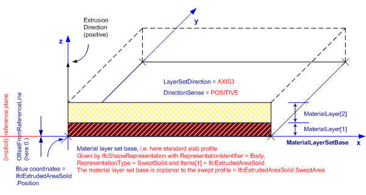
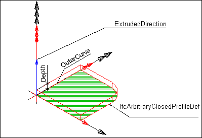
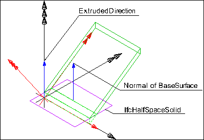

The standard plate, _IfcPlateStandardCase_, defines a plate with certain constraints for the provision of material usage, parameters and with certain constraints for the geometric representation. The _IfcPlateStandardCase_ handles all cases of plates, that:

* have a reference to the _IfcMaterialLayerSetUsage_ defining the material layers of the plate with thicknesses
* are based on an extrusion of a planar surface as defined by the plate profile
* have a constant thickness along the extrusion direction
* are consistent in using the correct material layer set offset to the base planar surface in regard to the shape representation
* are extruded perpendicular to the plane surface

The definitions of plate openings and niches are the same as given at the supertype _IfcPlate_. The same agreements to the special types of plates, as defined in the _PredefinedType_ attribute apply as well.

> HISTORY&nbsp; New entity in IFC4.

___
## Common Use Definitions
The following concepts are inherited at supertypes:

* _IfcRoot_: [Identity](../../templates/identity.htm), [Revision Control](../../templates/revision-control.htm)
* _IfcElement_: [Box Geometry](../../templates/box-geometry.htm), [FootPrint Geometry](../../templates/footprint-geometry.htm), [Body SurfaceOrSolidModel Geometry](../../templates/body-surfaceorsolidmodel-geometry.htm), [Body SurfaceModel Geometry](../../templates/body-surfacemodel-geometry.htm), [Body Tessellation Geometry](../../templates/body-tessellation-geometry.htm), [Body Brep Geometry](../../templates/body-brep-geometry.htm), [Body AdvancedBrep Geometry](../../templates/body-advancedbrep-geometry.htm), [Body CSG Geometry](../../templates/body-csg-geometry.htm), [Mapped Geometry](../../templates/mapped-geometry.htm)
* _IfcPlate_: [Object Typing](../../templates/object-typing.htm), [Property Sets for Objects](../../templates/property-sets-for-objects.htm), [Quantity Sets](../../templates/quantity-sets.htm), [Material Layer Set](../../templates/material-layer-set.htm), [Spatial Containment](../../templates/spatial-containment.htm), [Surface 3D Geometry](../../templates/surface-3d-geometry.htm), [Product Assignment](../../templates/product-assignment.htm)

[&nbsp;Instance diagram](../../../annex/annex-d/common-use-definitions/ifcplatestandardcase.htm)

{ .use-head}
Material Layer Set Usage

The [Material Layer Set Usage](../../templates/material-layer-set-usage.htm) concept applies to this entity.

The material of the _IfcPlateStandardCase_ is defined by _IfcMaterialLayerSetUsage_ and attached by the _IfcRelAssociatesMaterial_._RelatingMaterial_. It is accessible by the inverse _HasAssociations_ relationship. Multi-layer plates can be represented by refering to several _IfcMaterialLayer_'s within the _IfcMaterialLayerSet_ that is referenced from the _IfcMaterialLayerSetUsage_.&nbsp;

Material information can also be given at the _IfcPlateType_, defining the common attribute data for all occurrences of the same type.&nbsp;It is then accessible by the inverse _IsDefinedBy_ relationship pointing to _IfcPlateType.HasAssociations_ and via _IfcRelAssociatesMaterial.RelatingMaterial_.

The _IfcPlateStandardCase_ defines in addition that the _IfcPlateType_ should have a unique _IfcMaterialLayerSet_, that is referenced by the&nbsp;_IfcMaterialLayerSetUsage_ assigned to all occurrences of this _IfcPlateType_.

Figure 1 illustrates assignment of _IfcMaterialLayerSetUsage_ and _IfcMaterialLayerSet_ to the _IfcPlateStandardCase_ as the plate occurrence and to the _IfcPlateType_. The same _IfcMaterialLayerSet_ shall be shared by many occurrences of _IfcMaterialLayerSetUsage_. This relationship shall be consistent to the relationship between the _IfcPlateType_ and the _IfcPlateStandardCase_.

<table border="0" cellpadding="2" cellspacing="2">

<tr><td width="610" align="left" valign="top">

&nbsp;
</td></tr>

<tr><td>
Figure 1 &mdash; Plate type definition
</td></tr>

</table>

As shown in Figure 106, the following conventions shall be met:

* The reference coordinate system is the coordinate system established by the _IfcExtrudedAreaSolid.Position_.
* The reference plane is the plane defined by the extruded profile of _IfcExtrudedAreaSolid.SweptSolid_. The _IfcMaterialLayerSetUsage.OffsetFromReferenceLine_ is given as a distance from this plane.
* The _IfcMaterialLayerSetUsage.DirectionSense_ defines how the _IfcMaterialLayer_'s are assigned to the reference plane. POSITIVE means in direction to the positive z-axis of the reference coordinate system.
* The _IfcMaterialLayerSetUsage.OffsetFromReferenceLine_ is the distance parallel to the reference plane and always perpendicular to the base (XY) plane of the reference coordinate system. This is independent of a potential non-perpendicular extrusion given by _IfcExtrudedAreaSolid.ExtrudedDirection_ &lt;&gt; 0.,0.,1. A positive value of _IfcMaterialLayerSetUsage.OffsetFromReferenceLine_ would then point into the positive z-axis of the reference coordinate system.
* The _Thickness_ of each _IfcMaterialLayer_ shall be the parallel distance (measured perpendicular to the base plane). The _TotalThickness_ of the _IfcMaterialLayerSet_ is the sum of all layer thicknesses and in case of a perpendicular extrusion identical with _IfcExtrudedAreaSolid.Depth_
* The _IfcMaterialLayerSetUsage.LayerSetDirection_ i always AXIS3.

  
  
{ .use-head}
Product Placement

The [Product Placement](../../templates/product-placement.htm) concept applies to this entity as shown in Table 1.

<table>
<tr><td>
<table class="gridtable">
<tr><th><b>Type</b></th><th><b>Relative</b></th><th><b>Description</b></th></tr>
<tr><td><a href="../../ifcgeometricconstraintresource/lexical/ifclocalplacement.htm">IfcLocalPlacement</a></td><td><a href="../../ifcgeometricconstraintresource/lexical/ifclocalplacement.htm">IfcLocalPlacement</a></td><td>Relative placement according to position and rotation relative to container.</td></tr>
<tr><td><a href="../../ifcgeometricconstraintresource/lexical/ifclocalplacement.htm">IfcLocalPlacement</a></td><td>&nbsp;</td><td>Absolute placement according to position and rotation of world coordinate system.</td></tr>
<tr><td><a href="../../ifcgeometricconstraintresource/lexical/ifcgridplacement.htm">IfcGridPlacement</a></td><td>&nbsp;</td><td>Placement according to grid intersection.</td></tr>
</table>
</td></tr>
<tr><td>
Table 1 &mdash; IfcPlateStandardCase Product Placement
</td></tr></table>

The following restriction is imposed:

* The local placement shall provide the location and directions for the standard plate, the x/y plane is the plane for the profile, and the z-axis is the extrusion axis for the plate body.

  
  
{ .use-head}
Body SweptSolid Geometry

The [Body SweptSolid Geometry](../../templates/body-sweptsolid-geometry.htm) concept applies to this entity.

The following additional constraints apply to the swept solid representation:

* **Solid**: _IfcExtrudedAreaSolid_ is required,
* **Profile**: _IfcArbitraryClosedProfileDef, IfcRectangleProfileDef, IfcRoundedRectangleProfileDef, IfcCircleProfileDef, IfcEllipseProfileDef_ shall be supported.
* **Extrusion**: The profile can be extruded perpendicularly or non-perpendicularly to the plane of the swept profile.
* **Material**: The definition of the _IfcMaterialLayerSetUsage_, particularly of the _OffsetFromReferenceLine_ and the _ForLayerSet.TotalThickness_, has to be consistent to the 'SweptSolid' representation.

&nbsp;

<table>

 <tr>
  <td></td>
  <td>

<blockquote class="example">EXAMPLE&nbsp; Figure 3 illustrates a 'SweptSolid' geometric representation. The following interpretation of dimension parameter applies for polygonal plates (in ground floor view): <em>IfcArbitraryClosedProfileDef.OuterCurve</em> being a closed bounded curve is interpreted as area (or foot print) of the plate.</blockquote>

 </td>
 </tr>

 <tr>
  <td>
Figure 3 &mdash; Plate body extrusion
</td>
  <td>&nbsp;</td>
 </tr>

</table>

  
  
{ .use-head}
Body Clipping Geometry

The [Body Clipping Geometry](../../templates/body-clipping-geometry.htm) concept applies to this entity.

The following constraints apply to the 'Clipping' representation:

* **Solid**: see 'SweptSolid' shape representation,
* **Profile**:&nbsp;see 'SweptSolid' shape representation,
* **Extrusion**:&nbsp;see 'SweptSolid' shape representation,
* **Material**:&nbsp;see 'SweptSolid' shape representation,
* **Boolean result**: The _IfcBooleanClippingResult_ shall be supported, allowing for Boolean differences between the swept solid (here _IfcExtrudedAreaSolid_) and one or several _IfcHalfSpaceSolid_.

&nbsp;

<table>

 <tr>
  <td></td>
  <td><blockquote class="example">EXAMPLE&nbsp; Figure 4 illustrates a 'Clipping' geometric representation with definition of a plate using advanced geometric representation. The profile is extruded non-perpendicular and the plate body is clipped at the eave.</blockquote>

</td>
 </tr>

 <tr>
  <td>
Figure 4 &mdash; Plate body clipping
</td>
  <td>&nbsp;</td>
 </tr>

</table>
