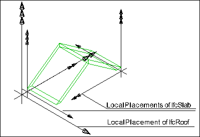

A roof is the covering of the top part of a building, it protects the building against the effects of wheather.

{ .extDef}
> NOTE&nbsp; Definition according to ISO 6707-1: construction enclosing the building from above.

The _IfcRoof_ is a description of the total roof. It acts as a container entity, that aggregates all components of the roof, it represents. The aggregation is handled via the _IfcRelAggregates_ relationship, relating an _IfcRoof_ with the related roof elements, like slabs (represented by _IfcSlab_), rafters and purlins (represented by _IfcBeam_), or other included roofs, such as dormers (represented by _IfcRoof_).

The geometric representation of _IfcRoof_ is given by the _IfcProductDefinitionShape_, allowing multiple geometric representations. Independent 'Body' geometric representations should only be used when the _IfcRoof_ is not defined as an aggregate. If defined as an aggregate, the 'Body' geometric representation is the sum of the representation of the components within the aggregate.

> NOTE&nbsp; View definitions and implementer agreements may restrict the _IfcRoof_ to not have an independent geometry, but to always require aggregated elements to represent the shape of the roof.

> NOTE&nbsp; If the _IfcRoof_ has aggregated elements to represent the shape of the roof, then only those elements shall have openings, not the _IfcRoof_ itself.

> HISTORY&nbsp; New entity in IFC2.0.

{ .change-ifc2x4}
> IFC4 CHANGE&nbsp; Attribute _ShapeType_ renamed to _PredefinedType_.

___
## Common Use Definitions
The following concepts are inherited at supertypes:

* _IfcRoot_: [Identity](../../templates/identity.htm), [Revision Control](../../templates/revision-control.htm)
* _IfcElement_: [Box Geometry](../../templates/box-geometry.htm), [FootPrint Geometry](../../templates/footprint-geometry.htm), [Body SurfaceOrSolidModel Geometry](../../templates/body-surfaceorsolidmodel-geometry.htm), [Body SurfaceModel Geometry](../../templates/body-surfacemodel-geometry.htm), [Body Tessellation Geometry](../../templates/body-tessellation-geometry.htm), [Body Brep Geometry](../../templates/body-brep-geometry.htm), [Body AdvancedBrep Geometry](../../templates/body-advancedbrep-geometry.htm), [Body CSG Geometry](../../templates/body-csg-geometry.htm), [Mapped Geometry](../../templates/mapped-geometry.htm)
* _IfcBuildingElement_: [Product Assignment](../../templates/product-assignment.htm), [Surface 3D Geometry](../../templates/surface-3d-geometry.htm)

[&nbsp;Instance diagram](../../../annex/annex-d/common-use-definitions/ifcroof.htm)

{ .use-head}
Object Typing

The [Object Typing](../../templates/object-typing.htm) concept applies to this entity as shown in Table 1.

<table>
<tr><td>
<table class="gridtable">
<tr><th><b>Type</b></th></tr>
<tr><td><a href="../../ifcsharedbldgelements/lexical/ifcrooftype.htm">IfcRoofType</a></td></tr>
</table>
</td></tr>
<tr><td>
Table 1 &mdash; IfcRoof Object Typing
</td></tr></table>

  
  
{ .use-head}
Property Sets for Objects

The [Property Sets for Objects](../../templates/property-sets-for-objects.htm) concept applies to this entity as shown in Table 2.

<table>
<tr><td>
<table class="gridtable">
<tr><th><b>PredefinedType</b></th><th><b>Name</b></th></tr>
<tr><td>&nbsp;</td><td><a href="../../psd/ifcsharedbldgelements/Pset_RoofCommon.xml">Pset_RoofCommon</a></td></tr>
<tr><td>&nbsp;</td><td><a href="../../psd/ifcstructuralelementsdomain/Pset_ConcreteElementGeneral.xml">Pset_ConcreteElementGeneral</a></td></tr>
<tr><td>&nbsp;</td><td><a href="../../psd/ifcstructuralelementsdomain/Pset_PrecastConcreteElementFabrication.xml">Pset_PrecastConcreteElementFabrication</a></td></tr>
<tr><td>&nbsp;</td><td><a href="../../psd/ifcstructuralelementsdomain/Pset_PrecastConcreteElementGeneral.xml">Pset_PrecastConcreteElementGeneral</a></td></tr>
<tr><td>&nbsp;</td><td><a href="../../psd/ifcsharedfacilitieselements/Pset_Condition.xml">Pset_Condition</a></td></tr>
<tr><td>&nbsp;</td><td><a href="../../psd/ifcproductextension/Pset_EnvironmentalImpactIndicators.xml">Pset_EnvironmentalImpactIndicators</a></td></tr>
<tr><td>&nbsp;</td><td><a href="../../psd/ifcproductextension/Pset_EnvironmentalImpactValues.xml">Pset_EnvironmentalImpactValues</a></td></tr>
<tr><td>&nbsp;</td><td><a href="../../psd/ifcsharedfacilitieselements/Pset_ManufacturerOccurrence.xml">Pset_ManufacturerOccurrence</a></td></tr>
<tr><td>&nbsp;</td><td><a href="../../psd/ifcsharedfacilitieselements/Pset_ManufacturerTypeInformation.xml">Pset_ManufacturerTypeInformation</a></td></tr>
<tr><td>&nbsp;</td><td><a href="../../psd/ifcsharedmgmtelements/Pset_PackingInstructions.xml">Pset_PackingInstructions</a></td></tr>
<tr><td>&nbsp;</td><td><a href="../../psd/ifcsharedfacilitieselements/Pset_ServiceLife.xml">Pset_ServiceLife</a></td></tr>
<tr><td>&nbsp;</td><td><a href="../../psd/ifcsharedfacilitieselements/Pset_Warranty.xml">Pset_Warranty</a></td></tr>
</table>
</td></tr>
<tr><td>
Table 2 &mdash; IfcRoof Property Sets for Objects
</td></tr></table>

  
  
{ .use-head}
Quantity Sets

The [Quantity Sets](../../templates/quantity-sets.htm) concept applies to this entity as shown in Table 3.

<table>
<tr><td>
<table class="gridtable">
<tr><th><b>Name</b></th></tr>
<tr><td><a href="../../qto/ifcsharedbldgelements/Qto_RoofBaseQuantities.xml">Qto_RoofBaseQuantities</a></td></tr>
</table>
</td></tr>
<tr><td>
Table 3 &mdash; IfcRoof Quantity Sets
</td></tr></table>

  
  
{ .use-head}
Spatial Containment

The [Spatial Containment](../../templates/spatial-containment.htm) concept applies to this entity as shown in Table 4.

<table>
<tr><td>
<table class="gridtable">
<tr><th><b>Structure</b></th><th><b>Description</b></th></tr>
<tr><td><a href="../../ifcproductextension/lexical/ifcbuildingstorey.htm">IfcBuildingStorey</a></td><td>Default spatial container </td></tr>
<tr><td><a href="../../ifcproductextension/lexical/ifcbuilding.htm">IfcBuilding</a></td><td>Spatial container for the element if it cannot be assigned to a building storey</td></tr>
<tr><td><a href="../../ifcproductextension/lexical/ifcsite.htm">IfcSite</a></td><td>Spatial container for the element in case that it is placed on site (outside of building)</td></tr>
</table>
</td></tr>
<tr><td>
Table 4 &mdash; IfcRoof Spatial Containment
</td></tr></table>

  
  
{ .use-head}
Element Decomposition

The [Element Decomposition](../../templates/element-decomposition.htm) concept applies to this entity as shown in Table 5.

<table>
<tr><td>
<table class="gridtable">
<tr><th><b>RelatedObjects</b></th><th><b>Description</b></th></tr>
<tr><td><a href="../../ifcsharedbldgelements/lexical/ifcslab.htm">IfcSlab</a></td><td>A roof may be aggregated into slabs for each face.</td></tr>
</table>
</td></tr>
<tr><td>
Table 5 &mdash; IfcRoof Element Decomposition
</td></tr></table>

_Geometric representation by aggregated elements_

If the _IfcRoof_ has components (referenced by _SELF\IfcObject.IsDecomposedBy_) then no independent geometric representation shall defined for the _IfcRoof_. The _IfcRoof_ is then geometrically represented by the geometric representation of its components. The components are accessed via _SELF\IfcObject.IsDecomposedBy[1].RelatedObjects_. The geometric representations that are supported for the aggregated elements are defined with each element. See geometric use definition for _IfcSlab_, _IfcBeam_, _IfcColumn_, _IfcBuildingElementPart_ and other subtypes of _IfcBuildingElement_.

Figure 1 illustrates roof placement, with an _IfcRoof_ defining the local placement for all aggregated elements.

  
  
{ .use-head}
Product Placement

The [Product Placement](../../templates/product-placement.htm) concept applies to this entity as shown in Table 6.

<table>
<tr><td>
<table class="gridtable">
<tr><th><b>Type</b></th><th><b>Relative</b></th><th><b>Description</b></th></tr>
<tr><td><a href="../../ifcgeometricconstraintresource/lexical/ifclocalplacement.htm">IfcLocalPlacement</a></td><td><a href="../../ifcgeometricconstraintresource/lexical/ifclocalplacement.htm">IfcLocalPlacement</a></td><td>Relative placement according to position and rotation relative to container.</td></tr>
<tr><td><a href="../../ifcgeometricconstraintresource/lexical/ifclocalplacement.htm">IfcLocalPlacement</a></td><td>&nbsp;</td><td>Absolute placement according to position and rotation of world coordinate system.</td></tr>
<tr><td><a href="../../ifcgeometricconstraintresource/lexical/ifcgridplacement.htm">IfcGridPlacement</a></td><td>&nbsp;</td><td>Placement according to grid intersection.</td></tr>
</table>
</td></tr>
<tr><td>
Table 6 &mdash; IfcRoof Product Placement
</td></tr></table>

The following restriction may be imposed by view definitions or implementer agreements:

* If the _IfcRoof_ establishes an aggregate, then all contained elements shall be placed relative to the _IfcRoof.ObjectPlacement_.
