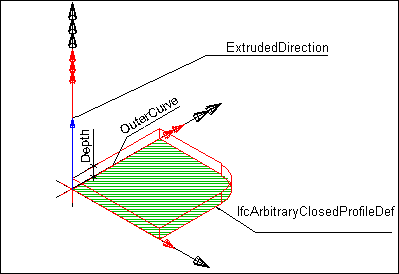
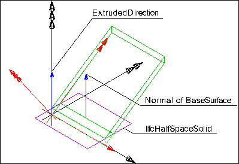

A slab is a component of the construction that normally encloses a space vertically. The slab may provide the lower support (floor) or upper construction (roof slab) in any space in a building.

{ .extDef}
> NOTE&nbsp; Definition according to ISO 6707-1  
> thick, flat or shaped component, usually larger than 300 mm square, used to form a covering or projecting from a building.

Only the core or constructional part of this construction is considered to be a slab. The upper finish (flooring, roofing) and the lower finish (ceiling, suspended ceiling) are considered to be coverings. A special type of slab is the landing, described as a floor section to which one or more stair flights or ramp flights connect.

> NOTE&nbsp; There is a representation of slabs for structural analysis provided by a proper subtype of _IfcStructuralMember_ being part of the _IfcStructuralAnalysisModel_.

> NOTE&nbsp; An arbitrary planar element to which this semantic information is not applicable or irrelevant shall be modeled as _IfcPlate_.

A slab may have openings, such as floor openings, or recesses. They are defined by an _IfcOpeningElement_ attached to the slab using the inverse relationship _HasOpenings_ pointing to _IfcRelVoidsElement_.

There are three entities for slab occurrences:

* _IfcSlabStandardCase_ used for all occurrences of slabs, that are prismatic and where the thickness parameter can be fully described by the _IfcMaterialLayerSetUsage_. These slabs are always represented geometrically by a 'SweptSolid' geometry (or by a 'Clipping' geometry based on 'SweptSolid'), if a 3D geometric representation is assigned. In addition they have to have a corresponding _IfcMaterialLayerSetUsage_ assigned.
* _IfcSlabElementedCase_ used for occurrences of slabs which are aggregated from subordinate elements, following specific decomposition rules expressed by the mandatory use of _IfcRelAggregates_ relationship.
* _IfcSlab_ used for all other occurrences of slabs, particularly for slabs with changing thickness, or slabs with non planar surfaces, and slabs having only 'SweptSolid' or 'Brep' geometry.

> HISTORY&nbsp; New entity in IFC2.0; it is a merger of the two previous entities IfcFloor, IfcRoofSlab, introduced in IFC1.0

___
## Common Use Definitions
The following concepts are inherited at supertypes:

* _IfcRoot_: [Identity](../../templates/identity.htm), [Revision Control](../../templates/revision-control.htm)
* _IfcElement_: [Product Placement](../../templates/product-placement.htm), [Box Geometry](../../templates/box-geometry.htm), [FootPrint Geometry](../../templates/footprint-geometry.htm), [Body SurfaceOrSolidModel Geometry](../../templates/body-surfaceorsolidmodel-geometry.htm), [Body SurfaceModel Geometry](../../templates/body-surfacemodel-geometry.htm), [Body Tessellation Geometry](../../templates/body-tessellation-geometry.htm), [Body Brep Geometry](../../templates/body-brep-geometry.htm), [Body AdvancedBrep Geometry](../../templates/body-advancedbrep-geometry.htm), [Body CSG Geometry](../../templates/body-csg-geometry.htm), [Mapped Geometry](../../templates/mapped-geometry.htm)
* _IfcBuildingElement_: [Surface 3D Geometry](../../templates/surface-3d-geometry.htm)

[&nbsp;Instance diagram](../../../annex/annex-d/common-use-definitions/ifcslab.htm)

{ .use-head}
Object Typing

The [Object Typing](../../templates/object-typing.htm) concept applies to this entity as shown in Table 1.

<table>
<tr><td>
<table class="gridtable">
<tr><th><b>Type</b></th></tr>
<tr><td><a href="../../ifcsharedbldgelements/lexical/ifcslabtype.htm">IfcSlabType</a></td></tr>
</table>
</td></tr>
<tr><td>
Table 1 &mdash; IfcSlab Object Typing
</td></tr></table>

  
  
{ .use-head}
Property Sets for Objects

The [Property Sets for Objects](../../templates/property-sets-for-objects.htm) concept applies to this entity as shown in Table 2.

<table>
<tr><td>
<table class="gridtable">
<tr><th><b>PredefinedType</b></th><th><b>Name</b></th></tr>
<tr><td>&nbsp;</td><td><a href="../../psd/ifcstructuralelementsdomain/Pset_PrecastSlab.xml">Pset_PrecastSlab</a></td></tr>
<tr><td>&nbsp;</td><td><a href="../../psd/ifcstructuralelementsdomain/Pset_ReinforcementBarPitchOfSlab.xml">Pset_ReinforcementBarPitchOfSlab</a></td></tr>
<tr><td>&nbsp;</td><td><a href="../../psd/ifcsharedbldgelements/Pset_SlabCommon.xml">Pset_SlabCommon</a></td></tr>
<tr><td>&nbsp;</td><td><a href="../../psd/ifcstructuralelementsdomain/Pset_ConcreteElementGeneral.xml">Pset_ConcreteElementGeneral</a></td></tr>
<tr><td>&nbsp;</td><td><a href="../../psd/ifcstructuralelementsdomain/Pset_PrecastConcreteElementFabrication.xml">Pset_PrecastConcreteElementFabrication</a></td></tr>
<tr><td>&nbsp;</td><td><a href="../../psd/ifcstructuralelementsdomain/Pset_PrecastConcreteElementGeneral.xml">Pset_PrecastConcreteElementGeneral</a></td></tr>
<tr><td>&nbsp;</td><td><a href="../../psd/ifcsharedfacilitieselements/Pset_Condition.xml">Pset_Condition</a></td></tr>
<tr><td>&nbsp;</td><td><a href="../../psd/ifcproductextension/Pset_EnvironmentalImpactIndicators.xml">Pset_EnvironmentalImpactIndicators</a></td></tr>
<tr><td>&nbsp;</td><td><a href="../../psd/ifcproductextension/Pset_EnvironmentalImpactValues.xml">Pset_EnvironmentalImpactValues</a></td></tr>
<tr><td>&nbsp;</td><td><a href="../../psd/ifcsharedfacilitieselements/Pset_ManufacturerOccurrence.xml">Pset_ManufacturerOccurrence</a></td></tr>
<tr><td>&nbsp;</td><td><a href="../../psd/ifcsharedfacilitieselements/Pset_ManufacturerTypeInformation.xml">Pset_ManufacturerTypeInformation</a></td></tr>
<tr><td>&nbsp;</td><td><a href="../../psd/ifcsharedmgmtelements/Pset_PackingInstructions.xml">Pset_PackingInstructions</a></td></tr>
<tr><td>&nbsp;</td><td><a href="../../psd/ifcsharedfacilitieselements/Pset_ServiceLife.xml">Pset_ServiceLife</a></td></tr>
<tr><td>&nbsp;</td><td><a href="../../psd/ifcsharedfacilitieselements/Pset_Warranty.xml">Pset_Warranty</a></td></tr>
</table>
</td></tr>
<tr><td>
Table 2 &mdash; IfcSlab Property Sets for Objects
</td></tr></table>

  
  
{ .use-head}
Quantity Sets

The [Quantity Sets](../../templates/quantity-sets.htm) concept applies to this entity as shown in Table 3.

<table>
<tr><td>
<table class="gridtable">
<tr><th><b>Name</b></th></tr>
<tr><td><a href="../../qto/ifcsharedbldgelements/Qto_SlabBaseQuantities.xml">Qto_SlabBaseQuantities</a></td></tr>
</table>
</td></tr>
<tr><td>
Table 3 &mdash; IfcSlab Quantity Sets
</td></tr></table>

  
  
{ .use-head}
Material Layer Set

The [Material Layer Set](../../templates/material-layer-set.htm) concept applies to this entity.

The material of the _IfcSlab_ is defined by _IfcMaterialLayerSet_, or as fallback by _IfcMaterial_, and it is attached either directly or at the _IfcSlabType_.

> NOTE&nbsp; It is illegal to assign an _IfcMaterialLayerSetUsage_ to an _IfcSlab_. Only the subtype _IfcSlabStandardCase_ supports this concept.

  
  
{ .use-head}
Spatial Containment

The [Spatial Containment](../../templates/spatial-containment.htm) concept applies to this entity as shown in Table 4.

<table>
<tr><td>
<table class="gridtable">
<tr><th><b>Structure</b></th><th><b>Description</b></th></tr>
<tr><td><a href="../../ifcproductextension/lexical/ifcbuildingstorey.htm">IfcBuildingStorey</a></td><td>Default spatial container</td></tr>
<tr><td><a href="../../ifcproductextension/lexical/ifcbuilding.htm">IfcBuilding</a></td><td>Spatial container for the element if it cannot be assigned to a building storey</td></tr>
<tr><td><a href="../../ifcproductextension/lexical/ifcsite.htm">IfcSite</a></td><td>Spatial container for the element in case that it is placed on site (outside of building)</td></tr>
</table>
</td></tr>
<tr><td>
Table 4 &mdash; IfcSlab Spatial Containment
</td></tr></table>

The _IfcSlab_, as any subtype of _IfcBuildingElement_, may participate alternatively in one of the two different containment relationships:

* the _Spatial Containment_ (defined here), or
* the _Element Composition_.

  
  
{ .use-head}
Surface Geometry

The [Surface Geometry](../../templates/surface-geometry.htm) concept applies to this entity.

> NOTE&nbsp; The 'Surface' can be used to define a surfacic model of the building (e.g. for analytical purposes, or for reduced Level of Detail representation).

  
  
{ .use-head}
Body SweptSolid Geometry

The [Body SweptSolid Geometry](../../templates/body-sweptsolid-geometry.htm) concept applies to this entity.

The following additional constraints apply to the swept solid representation:

* **Solid**: _IfcExtrudedAreaSolid_ is required,
* **Profile**: _IfcArbitraryClosedProfileDef, IfcRectangleProfileDef, IfcCircleProfileDef, IfcEllipseProfileDef_ shall be supported.
* **Extrusion**: The profile can be extruded perpendicularly or non-perpendicularly to the plane of the swept profile.

Figure 1 illustrates a 'SweptSolid' geometric representation.

> NOTE&nbsp; The following interpretation of dimension parameter applies for polygonal slabs (in ground floor view): > * _IfcArbitraryClosedProfileDef.OuterCurve_: closed bounded curve interpreted as area (or foot print) of the slab.

  
  
{ .use-head}
Body Clipping Geometry

The [Body Clipping Geometry](../../templates/body-clipping-geometry.htm) concept applies to this entity.

The following constraints apply to the 'Clipping' representation:

* **Solid**: see 'SweptSolid' shape representation,
* **Profile**: see 'SweptSolid' shape representation,
* **Extrusion**: see 'SweptSolid' shape representation,
* **Boolean result**: The _IfcBooleanClippingResult_ shall be supported, allowing for Boolean differences between the swept solid (here _IfcExtrudedAreaSolid_) and one or several _IfcHalfSpaceSolid_.

Figure 2 illustrates a 'Clipping' geometric representation with definition of a roof slab using advanced geometric representation. The profile is extruded non-perpendicular and the slab body is clipped at the eave.

  
  
{ .use-head}
Element Voiding

The [Element Voiding](../../templates/element-voiding.htm) concept applies to this entity as shown in Table 168.

{ .use-head}
Product Assignment

The [Product Assignment](../../templates/product-assignment.htm) concept applies to this entity as shown in Table 5.

<table>
<tr><td>
<table class="gridtable">
<tr><th><b>Type</b></th><th><b>Description</b></th></tr>
<tr><td><a href="../../ifcstructuralanalysisdomain/lexical/ifcstructuralsurfacemember.htm">IfcStructuralSurfaceMember</a></td><td>An idealized structural member corresponding to the slab.</td></tr>
<tr><td><a href="../../ifcprocessextension/lexical/ifctask.htm">IfcTask</a></td><td>A task for operating on the slab.</td></tr>
</table>
</td></tr>
<tr><td>
Table 5 &mdash; IfcSlab Product Assignment
</td></tr></table>
