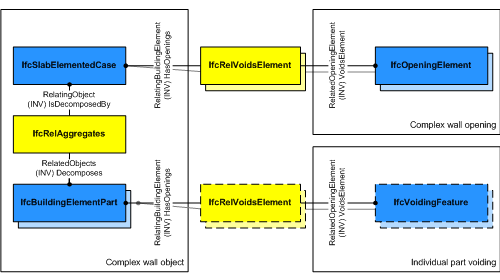

The _IfcSlabElementedCase_ defines a slab with certain constraints for the provision of its components. The _IfcSlabElementedCase_ handles all cases of slabs, that are decomposed into parts:

* having components being assigned to the _IfcSlabElementedCase_ using the _IfcRelAggregates_ relationship accessible by the inverse relationship _IsDecomposedBy_.
* applying the constraint that the parts within the decomposition shall be of type _IfcBeam_, _IfcMember_, _IfcPlate_, _IfcBuildingElementPart_ or _IfcBuildingElementProxy_.

> HISTORY&nbsp; New entity in IFC4.

{ .use-head}
Voiding Use Definition:

As shown in Figure 1, openings within the composite slab are directly assigned to _IfcSlabElementedCase_ using _IfcRelVoidsElement_ pointing to _IfcOpeningElement_ and apply to all aggregated parts. If individual parts have cutting and other voiding features, then the decomposed parts have a separate voiding relationship _IfcRelVoidsElement_ pointing to _IfcVoidingFeature_.

___
## Common Use Definitions
The following concepts are inherited at supertypes:

* _IfcRoot_: [Identity](../../templates/identity.htm), [Revision Control](../../templates/revision-control.htm)
* _IfcElement_: [Box Geometry](../../templates/box-geometry.htm), [FootPrint Geometry](../../templates/footprint-geometry.htm), [Body SurfaceOrSolidModel Geometry](../../templates/body-surfaceorsolidmodel-geometry.htm), [Body SurfaceModel Geometry](../../templates/body-surfacemodel-geometry.htm), [Body Tessellation Geometry](../../templates/body-tessellation-geometry.htm), [Body Brep Geometry](../../templates/body-brep-geometry.htm), [Body AdvancedBrep Geometry](../../templates/body-advancedbrep-geometry.htm), [Body CSG Geometry](../../templates/body-csg-geometry.htm), [Mapped Geometry](../../templates/mapped-geometry.htm)
* _IfcBuildingElement_: [Surface 3D Geometry](../../templates/surface-3d-geometry.htm)
* _IfcSlab_: [Object Typing](../../templates/object-typing.htm), [Property Sets for Objects](../../templates/property-sets-for-objects.htm), [Quantity Sets](../../templates/quantity-sets.htm), [Material Layer Set](../../templates/material-layer-set.htm), [Spatial Containment](../../templates/spatial-containment.htm), [Body SweptSolid Geometry](../../templates/body-sweptsolid-geometry.htm), [Body Clipping Geometry](../../templates/body-clipping-geometry.htm), [Element Voiding](../../templates/element-voiding.htm), [Product Assignment](../../templates/product-assignment.htm)

[&nbsp;Instance diagram](../../../annex/annex-d/common-use-definitions/ifcslabelementedcase.htm)

{ .use-head}
Object Aggregation

The [Object Aggregation](../../templates/object-aggregation.htm) concept applies to this entity as shown in Table 1.

<table>
<tr><td>
<table class="gridtable">
<tr><th><b>PredefinedType</b></th><th><b>RelatedObjects</b></th><th><b>Description</b></th></tr>
<tr><td>&nbsp;</td><td><a href="../../ifcsharedbldgelements/lexical/ifcbeam.htm">IfcBeam</a></td><td>Slabs may be aggregated into beams for joists.</td></tr>
<tr><td>&nbsp;</td><td><a href="../../ifcsharedbldgelements/lexical/ifcplate.htm">IfcPlate</a></td><td>Slabs may be aggregated into plates for decking.</td></tr>
<tr><td>&nbsp;</td><td><a href="../../ifcsharedcomponentelements/lexical/ifcbuildingelementpart.htm">IfcBuildingElementPart</a></td><td>Slabs may be aggregated into parts for other elements.</td></tr>
</table>
</td></tr>
<tr><td>
Table 1 &mdash; IfcSlabElementedCase Object Aggregation
</td></tr></table>

The following guidance is provided for the components of the _IfcSlabElementedCase_. The following component entity types should be used:

* Precast hollow core slabs 
    * double tee or plank components : _IfcBeam_
    * topping : _IfcBuildingElementPart_
    * others : _IfcBuildingElementPart_ 

  
  
{ .use-head}
Product Placement

The [Product Placement](../../templates/product-placement.htm) concept applies to this entity as shown in Table 2.

<table>
<tr><td>
<table class="gridtable">
<tr><th><b>Type</b></th><th><b>Relative</b></th><th><b>Description</b></th></tr>
<tr><td><a href="../../ifcgeometricconstraintresource/lexical/ifclocalplacement.htm">IfcLocalPlacement</a></td><td><a href="../../ifcgeometricconstraintresource/lexical/ifclocalplacement.htm">IfcLocalPlacement</a></td><td>Relative placement according to position and rotation relative to container.</td></tr>
<tr><td><a href="../../ifcgeometricconstraintresource/lexical/ifclocalplacement.htm">IfcLocalPlacement</a></td><td>&nbsp;</td><td>Absolute placement according to position and rotation of world coordinate system.</td></tr>
<tr><td><a href="../../ifcgeometricconstraintresource/lexical/ifcgridplacement.htm">IfcGridPlacement</a></td><td>&nbsp;</td><td>Placement according to grid intersection.</td></tr>
</table>
</td></tr>
<tr><td>
Table 2 &mdash; IfcSlabElementedCase Product Placement
</td></tr></table>

The use of local placement is defined at the supertype _IfcSlab_. The local placement of the _IfcSlabElementedCase_ defines the parent coordinate systems for the parts within the decomposition. All parts shall be positioned relative to the _IfcSlabElementedCase_.

  
  
{ .use-head}
Surface Geometry

The [Surface Geometry](../../templates/surface-geometry.htm) concept applies to this entity.

A three-dimensional surface being a subtype of _IfcBoundedSurface_ defining the reference surface for the elemented slab. It maybe used as a simplified representation directly at the elemented slab.

> NOTE&nbsp; It is invalid to exhange a 'Body' shape representation of an _IfcSlabElementedCase_. The body geometry is defined by the parts within the decomposition.

> NOTE&nbsp; The 'Surface' can be used to define a surfacic model of the building (e.g. for analytical purposes, or for reduced Level of Detail representation). It should suppress the geometric details of the parts in the decomposition.
