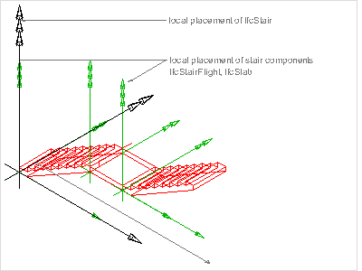

A stair is a vertical passageway allowing occupants to walk (step) from one floor level to another floor level at a different elevation. It may include a landing as an intermediate floor slab.

{ .extDef}
> NOTE&nbsp; Definition according to ISO 6707-1: Construction comprising a succession of horizontal stages (steps or landings) that make it possible to pass on foot to other levels.

The _IfcStair_ shall either be represented:

* as a stair assembly entity that aggregates all components (stair flight, landing, etc. with own representations), or
* as a single stair entity without decomposition including all representation directly at the stair entity.

> NOTE&nbsp; In case of an _IfcStair_ being the aggregate of all components of the stair the aggregation is handled by the _IfcRelAggregates_ relationship, relating an _IfcStair_ with the related _IfcStairFlight_ and landings, _IfcSlab_ with PredefinedType=LANDING. _IfcRailing_'s belonging to the stair may also be included into the aggregation.

> NOTE&nbsp; The 'Body' geometric representation shall only be provided if the _IfcStair_ has no components defined (empty set of _SELF\IfcObject.IsDecomposedBy_).

> HISTORY&nbsp; New entity in IFC2.0.

{ .change-ifc2x4}
> IFC4 CHANGE Attribute _ShapeType_ renamed to _PredefinedType_.

___
## Common Use Definitions
The following concepts are inherited at supertypes:

* _IfcRoot_: [Identity](../../templates/identity.htm), [Revision Control](../../templates/revision-control.htm)
* _IfcElement_: [Box Geometry](../../templates/box-geometry.htm), [FootPrint Geometry](../../templates/footprint-geometry.htm), [Body SurfaceOrSolidModel Geometry](../../templates/body-surfaceorsolidmodel-geometry.htm), [Body SurfaceModel Geometry](../../templates/body-surfacemodel-geometry.htm), [Body Tessellation Geometry](../../templates/body-tessellation-geometry.htm), [Body Brep Geometry](../../templates/body-brep-geometry.htm), [Body AdvancedBrep Geometry](../../templates/body-advancedbrep-geometry.htm), [Body CSG Geometry](../../templates/body-csg-geometry.htm), [Mapped Geometry](../../templates/mapped-geometry.htm)
* _IfcBuildingElement_: [Product Assignment](../../templates/product-assignment.htm), [Surface 3D Geometry](../../templates/surface-3d-geometry.htm)

[&nbsp;Instance diagram](../../../annex/annex-d/common-use-definitions/ifcstair.htm)

{ .use-head}
Object Typing

The [Object Typing](../../templates/object-typing.htm) concept applies to this entity as shown in Table 1.

<table>
<tr><td>
<table class="gridtable">
<tr><th><b>Type</b></th></tr>
<tr><td><a href="../../ifcsharedbldgelements/lexical/ifcstairtype.htm">IfcStairType</a></td></tr>
</table>
</td></tr>
<tr><td>
Table 1 &mdash; IfcStair Object Typing
</td></tr></table>

  
  
{ .use-head}
Property Sets for Objects

The [Property Sets for Objects](../../templates/property-sets-for-objects.htm) concept applies to this entity as shown in Table 2.

<table>
<tr><td>
<table class="gridtable">
<tr><th><b>PredefinedType</b></th><th><b>Name</b></th></tr>
<tr><td>&nbsp;</td><td><a href="../../psd/ifcsharedbldgelements/Pset_StairCommon.xml">Pset_StairCommon</a></td></tr>
<tr><td>&nbsp;</td><td><a href="../../psd/ifcstructuralelementsdomain/Pset_ConcreteElementGeneral.xml">Pset_ConcreteElementGeneral</a></td></tr>
<tr><td>&nbsp;</td><td><a href="../../psd/ifcstructuralelementsdomain/Pset_PrecastConcreteElementFabrication.xml">Pset_PrecastConcreteElementFabrication</a></td></tr>
<tr><td>&nbsp;</td><td><a href="../../psd/ifcstructuralelementsdomain/Pset_PrecastConcreteElementGeneral.xml">Pset_PrecastConcreteElementGeneral</a></td></tr>
<tr><td>&nbsp;</td><td><a href="../../psd/ifcsharedfacilitieselements/Pset_Condition.xml">Pset_Condition</a></td></tr>
<tr><td>&nbsp;</td><td><a href="../../psd/ifcproductextension/Pset_EnvironmentalImpactIndicators.xml">Pset_EnvironmentalImpactIndicators</a></td></tr>
<tr><td>&nbsp;</td><td><a href="../../psd/ifcproductextension/Pset_EnvironmentalImpactValues.xml">Pset_EnvironmentalImpactValues</a></td></tr>
<tr><td>&nbsp;</td><td><a href="../../psd/ifcsharedfacilitieselements/Pset_ManufacturerOccurrence.xml">Pset_ManufacturerOccurrence</a></td></tr>
<tr><td>&nbsp;</td><td><a href="../../psd/ifcsharedfacilitieselements/Pset_ManufacturerTypeInformation.xml">Pset_ManufacturerTypeInformation</a></td></tr>
<tr><td>&nbsp;</td><td><a href="../../psd/ifcsharedmgmtelements/Pset_PackingInstructions.xml">Pset_PackingInstructions</a></td></tr>
<tr><td>&nbsp;</td><td><a href="../../psd/ifcsharedfacilitieselements/Pset_ServiceLife.xml">Pset_ServiceLife</a></td></tr>
<tr><td>&nbsp;</td><td><a href="../../psd/ifcsharedfacilitieselements/Pset_Warranty.xml">Pset_Warranty</a></td></tr>
</table>
</td></tr>
<tr><td>
Table 2 &mdash; IfcStair Property Sets for Objects
</td></tr></table>

  
  
{ .use-head}
Material Single

The [Material Single](../../templates/material-single.htm) concept applies to this entity.

The material of the _IfcStair_ is defined by the _IfcMaterial_ and attached by the _IfcRelAssociatesMaterial_._RelatingMaterial_. It is accessible by the inverse _HasAssociations_ relationship.

Material information can also be given at the _IfcStairType_, defining the common attribute data for all occurrences of the same type. It is then accessible by the inverse _IsDefinedBy_ relationship pointing to _IfcStair.HasAssociations_ and via _IfcRelAssociatesMaterial.RelatingMaterial_ to _IfcMaterial_. If both are given, then the material directly assigned to _IfcStair_ overrides the material assigned to _IfcStairType_.

  
  
{ .use-head}
Spatial Containment

The [Spatial Containment](../../templates/spatial-containment.htm) concept applies to this entity as shown in Table 3.

<table>
<tr><td>
<table class="gridtable">
<tr><th><b>Structure</b></th><th><b>Description</b></th></tr>
<tr><td><a href="../../ifcproductextension/lexical/ifcbuildingstorey.htm">IfcBuildingStorey</a></td><td>Default spatial container</td></tr>
<tr><td><a href="../../ifcproductextension/lexical/ifcbuilding.htm">IfcBuilding</a></td><td>Spatial container for the element if it cannot be assigned to a building storey</td></tr>
<tr><td><a href="../../ifcproductextension/lexical/ifcsite.htm">IfcSite</a></td><td>Spatial container for the element in case that it is placed on site (outside of building)</td></tr>
</table>
</td></tr>
<tr><td>
Table 3 &mdash; IfcStair Spatial Containment
</td></tr></table>

The _IfcStair_, as any subtype of _IfcBuildingElement_, may participate alternatively in one of the two different containment relationships:

* the _Spatial Containment_ (defined here), or
* the _Element Composition_.

  
  
{ .use-head}
Element Decomposition

The [Element Decomposition](../../templates/element-decomposition.htm) concept applies to this entity as shown in Table 4.

<table>
<tr><td>
<table class="gridtable">
<tr><th><b>RelatedObjects</b></th><th><b>Description</b></th></tr>
<tr><td><a href="../../ifcsharedbldgelements/lexical/ifcstairflight.htm">IfcStairFlight</a></td><td>Stairs may be decomposed into stair flights.</td></tr>
<tr><td><a href="../../ifcsharedbldgelements/lexical/ifcslab.htm">IfcSlab</a></td><td>Stairs may be decomposed into stair landing, represented by IfcSlab.PredefinedType=LANDING</td></tr>
<tr><td><a href="../../ifcsharedbldgelements/lexical/ifcrailing.htm">IfcRailing</a></td><td>Stairs may be decomposed into railings for zero, one, or both sides.</td></tr>
</table>
</td></tr>
<tr><td>
Table 4 &mdash; IfcStair Element Decomposition
</td></tr></table>

_Geometric representation by aggregated elements_

If the _IfcStair_ has components (referenced by _SELF\IfcObject.IsDecomposedBy_) with own 'Body' representation, then no 'Body' representation shall defined for the _IfcStair_. The _IfcStair_ shape is then represented by the geometric representation of its components. The components are accessed via _SELF\IfcObject.IsDecomposedBy[1].RelatedObjects_.

Figure 1 illustrates stair placement, where the _IfcStair_ defines the local placement for all components and the common 'Axis' representation, and each component has its own 'Body' representation.

  
  
{ .use-head}
Product Placement

The [Product Placement](../../templates/product-placement.htm) concept applies to this entity as shown in Table 5.

<table>
<tr><td>
<table class="gridtable">
<tr><th><b>Type</b></th><th><b>Relative</b></th><th><b>Description</b></th></tr>
<tr><td><a href="../../ifcgeometricconstraintresource/lexical/ifclocalplacement.htm">IfcLocalPlacement</a></td><td><a href="../../ifcgeometricconstraintresource/lexical/ifclocalplacement.htm">IfcLocalPlacement</a></td><td>Relative placement according to position and rotation relative to container.</td></tr>
<tr><td><a href="../../ifcgeometricconstraintresource/lexical/ifclocalplacement.htm">IfcLocalPlacement</a></td><td>&nbsp;</td><td>Absolute placement according to position and rotation of world coordinate system.</td></tr>
<tr><td><a href="../../ifcgeometricconstraintresource/lexical/ifcgridplacement.htm">IfcGridPlacement</a></td><td>&nbsp;</td><td>Placement according to grid intersection.</td></tr>
</table>
</td></tr>
<tr><td>
Table 5 &mdash; IfcStair Product Placement
</td></tr></table>

The following restriction may be imposed by view definitions or implementer agreements:

* If the _IfcStair_ establishes an aggregate, then all contained elements shall be placed relative to the _IfcStair.ObjectPlacement_.

  
  
{ .use-head}
Axis 2D Geometry

The [Axis 2D Geometry](../../templates/axis-2d-geometry.htm) concept applies to this entity.

The walking line is represented by a two-dimensional open curve as the axis. The curve is directed into the upward direction (direction has to be interpreted as specified at the subtypes of _IfcCurve_).

> NOTE&nbsp; The 'Axis' representation of _IfcStair_ may be provided even if the _IfcStair_ has components with own shape representations.

  
  
{ .use-head}
Body SweptSolid Geometry

The [Body SweptSolid Geometry](../../templates/body-sweptsolid-geometry.htm) concept applies to this entity.