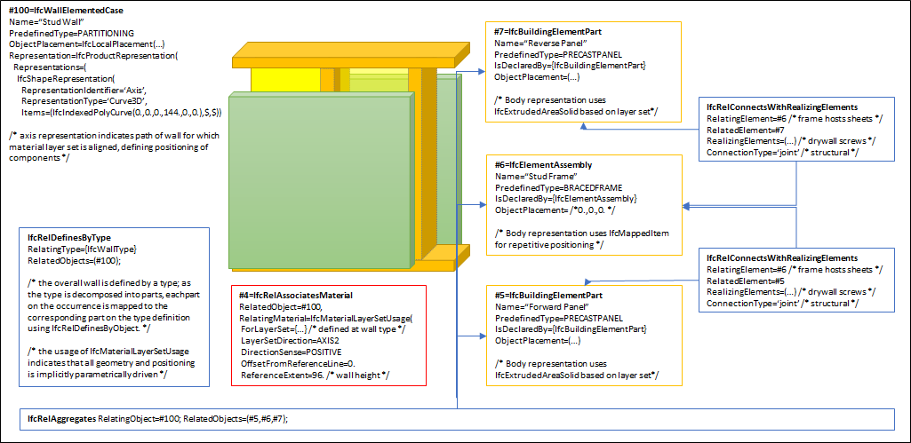
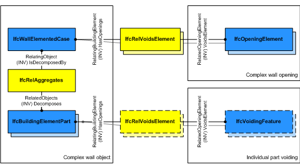

The _IfcWallElementedCase_ defines a wall with certain constraints for the provision of its components.

> HISTORY&nbsp; New entity in IFC4.

Elemented walls extend the concepts of standard walls with the following features, as shown in Figure 1.

* The wall has a type (_IfcWallType_) that indicates material layers and corresponding elements to be placed parametrically.
* The wall is decomposed into elements for part occurrences, each corresponding to parts defined at the wall type.
* The relationship _IfcRelConnectsWithRealizingElements_ indicates how parts are connected.

{ .use-head}
Voiding Use Definition:

As shown in Figure 2, openings within the composite wall are directly assigned to _IfcWallElementedCase_ using _IfcRelVoidsElement_ pointing to _IfcOpeningElement_ and apply to all aggregated parts. If individual parts have cutting and other voiding features, then the decomposed parts have a separate voiding relationship _IfcRelVoidsElement_ pointing to _IfcVoidingFeature_.

