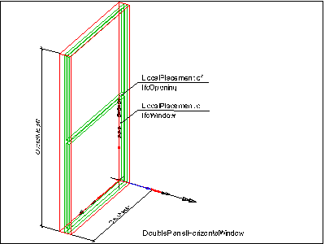
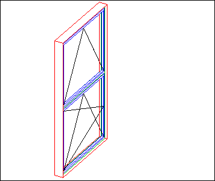
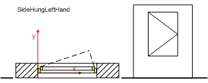
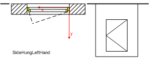
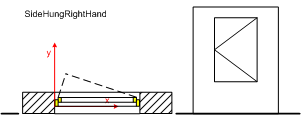
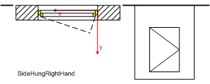
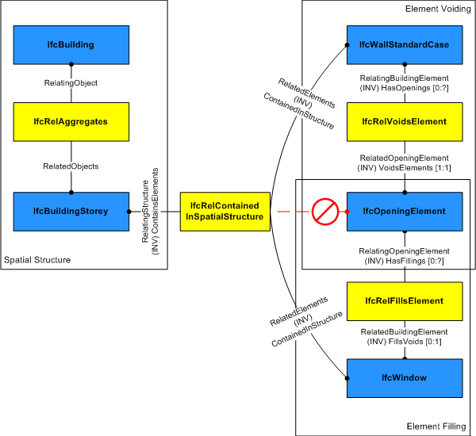

The window is a building element that is predominately used to provide natural light and fresh air. It includes vertical opening but also horizontal opening such as skylights or light domes. It includes constructions with swinging, pivoting, sliding, or revolving panels and fixed panels. A window consists of a lining and one or several panels.

{ .extDef}
> NOTE&nbsp; Definition according to ISO 6707-1  
> Construction for closing a vertical or near vertical opening in a wall or pitched roof that will admit light and may admit fresh air.

The _IfcWindow_ defines a particular occurrence of a window inserted in the spatial context of a project. A window can:

* be inserted into an _IfcOpeningElement_ using the _IfcRelFillsElement_ relationship, then the _IfcWindow_ has an inverse attribute _FillsVoids_ provided,
* be part of an element assembly, often an _IfcCurtainWall_, using the _IfcRelAggregates_ relationship, then the inverse attribute _Decomposes_ is provided.
* or be a "free standing" window, then the _IfcWindow_ has no inverse attributes _FillsVoids_ or _Decomposes_ provided.

> NOTE&nbsp; View definitions or implementer agreements may restrict the relationship to only include one window (or door) into one opening.

There are two entities for window occurrences:

* _IfcWindowStandardCase_ used for all occurrences of windows, that have a 'Profile' shape representation defined to which a set of shape parameters for lining and framing properties apply. Additionally it requires the provision of an _IfcWindowType_ that references one _IfcWindowLiningProperties_ and on to many _IfcWindowPanelProperties_. 
* _IfcWindow_ used for all other occurrences of windows, particularly for windows having only 'Brep', or 'SurfaceModel' geometry without applying shape parameters.

The actual parameter of the window and/or its shape is defined at the _IfcWindow_ as the occurrence definition (or project instance), or by the _IfcWindowType_ as the specific definition (or project type). The following parameters are given:

* at the _IfcWindow_ or _IfcWindowStandardCase_ for occurrence specific parameters. The _IfcWindow_ specifies:
*  
    * the window width and height
    * the window opening direction (by the y-axis of the _ObjectPlacement_) 
* at the _IfcWindowType_ to which the _IfcWindow_ is related by the inverse relationship _IsDefinedBy_ pointing to _IfcRelDefinesByType_, for type parameters common to all occurrences of the same type.
*  
    * the partitioning type (single panel, double panel, tripel panel, more panels)
    * the operation type (swing, tilt and turn, pivot revolve, fixed case ment, etc.)
    * the window panel hinge side (by using two different styles for right and left opening windows)
    * the construction material type
    * the particular attributes for the lining by the _IfcWindowLiningProperties_
    * the particular attributes for the panels by the  _IfcWindowPanelProperties_ 

> HISTORY&nbsp; New entity in IFC1.0.

{ .change-ifc2x4}
> IFC4 CHANGE&nbsp; The attributes _PredefinedType_ and _OperationType_ are added, the applicable type object has been changed to _IfcDoorType_.

{ .use-head}
Parameteric Representation using parameters at _IfcWindowType_

The parameters, which define the shape of the _IfcWindow_, are given at the _IfcWindowType_ and the property sets, which are included in the _IfcWindowType_. The _IfcWindow_ only defines the local placement. The overall size of the _IfcWindow_ to be used to apply the lining or panel parameter provided by the _IfcWindowType_ is determined by the IfcShapeRepresentation with the RepresentationIdentifier = 'Profile'. Only in case of an _IfcWindow_ inserted into an _IfcOpeningElement_ using the _IfcRelFillsElement_ relatioship, having a horizontal extrusion (along the y-axis of the _IfcDoor_), the overall size is determined by the extrusion profile of the _IfcOpeningElement_.

Figure 1 illustrates the insertion of a window into the _IfcOpeningElement_ by creating an instance of _IfcWindow_ with _PartitioningType = DoublePanelHorizontal_. The parameters _OverallHeight_ and _OverallWidth_ show the extent of the window in the positive Z and X axis of the local placement of the window. The lining and the transom are created by the given parameters.

Figure 2 illustrates the final window (DoublePanelHorizontal) with first panel having _PanelPosition = TOP_, _OperationType = BOTTOMHUNG_ and second panel having _PanelPosition = BOTTOM_ and _OperationType = TILTANDTURNLEFTHAND_.

{ .use-head}
Window opening operation by window type

The parameters that defines the shape of the _IfcWindow_, are given at the _IfcWindowType_ and the property sets, which are included in the _IfcWindowType_. The _IfcWindow_ only defines the local placement which determines the opening direction of the window. The overall layout of the _IfcWindow_ is determined by its _IfcWindowType.PartitioningType_. Each window panel has its own operation type, provided by _IfcWindowPanelProperties.OperationType_. All window panels are assumed to open into the same direction (if relevant for the particular window panel operation. The hindge side (whether a window opens to the left or to the right) is determined by the _IfcWindowPanelProperties_._OperationType_.

> NOTE&nbsp;  There are different conventions in different countries on how to show the symbolic presentation of the window panel operation (the "triangles"). Either as seen from the exterior, or from the interior side. The following figures show the symbolics from the exterior side (the convention as used predominately in Europe).

Figure 3 illustrates window operation types.

<table><tr><td><table border="1" cellpadding="2" cellspacing="2">
<tbody>
<tr valign="top">
<td align="left" valign="top"><small> </small></td>
<td align="left" valign="top">

<small>The window panel (for side hung windows) opens always
into the direction of the positive Y axis of the local placement.
The determination of whether the window opens to the left or to
the right is done at
<em>IfcWindowPanelProperties.OperationType</em>. Here it is a left
side opening window given by <em>OperationType</em> =
SideHungLeftHand.</small>

</td>
</tr>
<tr>
<td><small> </small></td>
<td valign="top">

<small>If the window should open to the other side, then the
local placement has to be changed. It is still a left hung
window, given by <em>IfcWindowPanelProperties.OperationType</em>
= SideHungLeftHand.</small>

</td>
</tr>
<tr>
<td></td>
<td valign="top">

<small>If the window panel (for side hung windows) opens to
the right, a separate window panel style needs to be used (here
<em>IfcWindowPanelProperties.OperationType</em>
= SideHungRightHand) and it always opens into the direction of
the positive Y axis of the local placement. </small>

</td>
</tr>
<tr valign="top">
<td align="left" valign="top"><small> </small></td>
<td align="left" valign="top">

<small>If the window should open to the other side, then the
local placement has to be changed. It is still a right hung
window, given by <em>IfcWindowPanelProperties.OperationType</em>
= </small><small>SideHungRightHand.</small>

<small>.</small></td>
</tr>
</tbody>
</table>

</td></tr>
<tr><td>
Figure 3 &mdash; Window operations
</td></tr>
</table>

___
## Common Use Definitions
The following concepts are inherited at supertypes:

* _IfcRoot_: [Identity](../../templates/identity.htm), [Revision Control](../../templates/revision-control.htm)
* _IfcElement_: [Box Geometry](../../templates/box-geometry.htm), [FootPrint Geometry](../../templates/footprint-geometry.htm), [Body SurfaceOrSolidModel Geometry](../../templates/body-surfaceorsolidmodel-geometry.htm), [Body SurfaceModel Geometry](../../templates/body-surfacemodel-geometry.htm), [Body Tessellation Geometry](../../templates/body-tessellation-geometry.htm), [Body Brep Geometry](../../templates/body-brep-geometry.htm), [Body AdvancedBrep Geometry](../../templates/body-advancedbrep-geometry.htm), [Body CSG Geometry](../../templates/body-csg-geometry.htm), [Mapped Geometry](../../templates/mapped-geometry.htm)
* _IfcBuildingElement_: [Product Assignment](../../templates/product-assignment.htm), [Surface 3D Geometry](../../templates/surface-3d-geometry.htm)

[&nbsp;Instance diagram](../../../annex/annex-d/common-use-definitions/ifcwindow.htm)

{ .use-head}
Object Typing

The [Object Typing](../../templates/object-typing.htm) concept applies to this entity as shown in Table 1.

<table>
<tr><td>
<table class="gridtable">
<tr><th><b>Type</b></th></tr>
<tr><td><a href="../../ifcsharedbldgelements/lexical/ifcwindowtype.htm">IfcWindowType</a></td></tr>
</table>
</td></tr>
<tr><td>
Table 1 &mdash; IfcWindow Object Typing
</td></tr></table>

  
  
{ .use-head}
Property Sets for Objects

The [Property Sets for Objects](../../templates/property-sets-for-objects.htm) concept applies to this entity as shown in Table 2.

<table>
<tr><td>
<table class="gridtable">
<tr><th><b>PredefinedType</b></th><th><b>Name</b></th></tr>
<tr><td>&nbsp;</td><td><a href="../../psd/ifcsharedbldgelements/Pset_WindowCommon.xml">Pset_WindowCommon</a></td></tr>
<tr><td>&nbsp;</td><td><a href="../../psd/ifcstructuralelementsdomain/Pset_ConcreteElementGeneral.xml">Pset_ConcreteElementGeneral</a></td></tr>
<tr><td>&nbsp;</td><td><a href="../../psd/ifcstructuralelementsdomain/Pset_PrecastConcreteElementFabrication.xml">Pset_PrecastConcreteElementFabrication</a></td></tr>
<tr><td>&nbsp;</td><td><a href="../../psd/ifcstructuralelementsdomain/Pset_PrecastConcreteElementGeneral.xml">Pset_PrecastConcreteElementGeneral</a></td></tr>
<tr><td>&nbsp;</td><td><a href="../../psd/ifcsharedfacilitieselements/Pset_Condition.xml">Pset_Condition</a></td></tr>
<tr><td>&nbsp;</td><td><a href="../../psd/ifcproductextension/Pset_EnvironmentalImpactIndicators.xml">Pset_EnvironmentalImpactIndicators</a></td></tr>
<tr><td>&nbsp;</td><td><a href="../../psd/ifcproductextension/Pset_EnvironmentalImpactValues.xml">Pset_EnvironmentalImpactValues</a></td></tr>
<tr><td>&nbsp;</td><td><a href="../../psd/ifcsharedfacilitieselements/Pset_ManufacturerOccurrence.xml">Pset_ManufacturerOccurrence</a></td></tr>
<tr><td>&nbsp;</td><td><a href="../../psd/ifcsharedfacilitieselements/Pset_ManufacturerTypeInformation.xml">Pset_ManufacturerTypeInformation</a></td></tr>
<tr><td>&nbsp;</td><td><a href="../../psd/ifcsharedmgmtelements/Pset_PackingInstructions.xml">Pset_PackingInstructions</a></td></tr>
<tr><td>&nbsp;</td><td><a href="../../psd/ifcsharedfacilitieselements/Pset_ServiceLife.xml">Pset_ServiceLife</a></td></tr>
<tr><td>&nbsp;</td><td><a href="../../psd/ifcsharedfacilitieselements/Pset_Warranty.xml">Pset_Warranty</a></td></tr>
</table>
</td></tr>
<tr><td>
Table 2 &mdash; IfcWindow Property Sets for Objects
</td></tr></table>

  
  
{ .use-head}
Quantity Sets

The [Quantity Sets](../../templates/quantity-sets.htm) concept applies to this entity as shown in Table 3.

<table>
<tr><td>
<table class="gridtable">
<tr><th><b>Name</b></th></tr>
<tr><td><a href="../../qto/ifcsharedbldgelements/Qto_WindowBaseQuantities.xml">Qto_WindowBaseQuantities</a></td></tr>
</table>
</td></tr>
<tr><td>
Table 3 &mdash; IfcWindow Quantity Sets
</td></tr></table>

  
  
{ .use-head}
Material Constituents

The [Material Constituents](../../templates/material-constituents.htm) concept applies to this entity as shown in Table 4.

<table>
<tr><td>
<table class="gridtable">
<tr><th><b>Name</b></th><th><b>Description</b></th></tr>
<tr><td>Lining</td><td>Indicates that the material constituent applies to the window lining.</td></tr>
<tr><td>Framing</td><td>Indicates that the material constituent applies to the windows panels(s); if not provided, the 'Lining' material information applies to panel(s) as well.</td></tr>
<tr><td>Glazing</td><td>Indicates that the material constituent applies to the glazing part.</td></tr>
</table>
</td></tr>
<tr><td>
Table 4 &mdash; IfcWindow Material Constituents
</td></tr></table>

The material of the _IfcWindow_ is defined by the _IfcMaterialConstituentSet_ or as fall back by _IfcMaterial_ and attached by the _IfcRelAssociatesMaterial_._RelatingMaterial_. It is accessible by the inverse _HasAssociations_ relationship.

If the fall back single _IfcMaterial_ is referenced, it applies to the lining and framing of the window.

  
  
{ .use-head}
Spatial Containment

The [Spatial Containment](../../templates/spatial-containment.htm) concept applies to this entity as shown in Table 5.

<table>
<tr><td>
<table class="gridtable">
<tr><th><b>Structure</b></th></tr>
<tr><td><a href="../../ifcproductextension/lexical/ifcbuildingstorey.htm">IfcBuildingStorey</a></td></tr>
<tr><td><a href="../../ifcproductextension/lexical/ifcbuilding.htm">IfcBuilding</a></td></tr>
<tr><td><a href="../../ifcproductextension/lexical/ifcsite.htm">IfcSite</a></td></tr>
</table>
</td></tr>
<tr><td>
Table 5 &mdash; IfcWindow Spatial Containment
</td></tr></table>

The _IfcWindow_, as any subtype of _IfcBuildingElement_, may participate alternatively in one of the two different containment relationships:

* the _Spatial Containment_ (defined here), or
* the _Element Composition_.

The _IfcWindow_ may also be connected to the _IfcOpeningElement_ in which it is placed as a filler. In this case, the spatial containment relationship shall be provided, see Figure 4.

<table>
 
<tr valign="bottom">
  <td></td>
  <td>
   <blockquote class="note">NOTE&nbsp; The containment shall be defined independently of the filling relationship, that is, even if the 
    <em>IfcWindow</em> is a filling of an opening established by <em>IfcRelFillsElement</em>, it is also contained in the spatial structure 
    by an <em>IfcRelContainedInSpatialStructure</em>.</blockquote>
  </td>
 </tr>
 
<tr>
  <td>
Figure 4 &mdash; Window spatial containment
</td>
  <td>&nbsp;</td>
 </tr>

</table>

  
  
{ .use-head}
Product Placement

The [Product Placement](../../templates/product-placement.htm) concept applies to this entity as shown in Table 6.

<table>
<tr><td>
<table class="gridtable">
<tr><th><b>Type</b></th><th><b>Relative</b></th><th><b>Description</b></th></tr>
<tr><td><a href="../../ifcgeometricconstraintresource/lexical/ifclocalplacement.htm">IfcLocalPlacement</a></td><td><a href="../../ifcgeometricconstraintresource/lexical/ifclocalplacement.htm">IfcLocalPlacement</a></td><td>Relative placement according to position and rotation relative to container.</td></tr>
<tr><td><a href="../../ifcgeometricconstraintresource/lexical/ifclocalplacement.htm">IfcLocalPlacement</a></td><td>&nbsp;</td><td>Absolute placement according to position and rotation of world coordinate system.</td></tr>
<tr><td><a href="../../ifcgeometricconstraintresource/lexical/ifcgridplacement.htm">IfcGridPlacement</a></td><td>&nbsp;</td><td>Placement according to grid intersection.</td></tr>
</table>
</td></tr>
<tr><td>
Table 6 &mdash; IfcWindow Product Placement
</td></tr></table>

The following restriction is imposed:

1. The _PlacementRelTo_ relationship of _IfcLocalPlacement_ shall point to the local placement of the same element (if given), in which the _IfcWindow_ is used as a filling (normally an _IfcOpeningElement_), as provided by the _IfcRelFillsElement_ relationship.
2. If the _IfcWindow_ is not inserted into an _IfcOpeningElement_, then the _PlacementRelTo_ relationship of _IfcLocalPlacement_ shall point (if given) to the local placement of the same _IfcSpatialStructureElement_ that is used in the _ContainedInStructure_ inverse attribute or to a referenced spatial structure element at a higher level.
3. If the relative placement is not used, the absolute placement is defined within the world coordinate system.

> NOTE&nbsp; The product placement is used to determine the opening direction of the window.

  
  
{ .use-head}
Profile Geometry

The [Profile Geometry](../../templates/profile-geometry.htm) concept applies to this entity as shown in Table 7.

<table>
<tr><td>
<table class="gridtable">
<tr><th><b>Identifier</b></th><th><b>Type</b></th><th><b>Items</b></th></tr>
<tr><td>&nbsp;</td><td>&nbsp;</td><td>&nbsp;</td></tr>
</table>
</td></tr>
<tr><td>
Table 7 &mdash; IfcWindow Profile Geometry
</td></tr></table>

The window profile is represented by a three-dimensional closed curve within a particular shape representation. The profile is used to apply the parameter of the parametric window representation. The following attribute values for the _IfcShapeRepresentation_ holding this geometric representation shall be used:

* _RepresentationIdentifier_ : 'Profile'
* _RepresentationType_ : 'Curve3D', only a single closed curve shall be contained in the set of _IfcShapeRepresentation.Items_.

A 'Profile' representation has to be provided if:

* a parametric representation shall be applied to the window AND
*  
    * the window is 'free standing', or
    * the opening into which the window is inserted is not extruded horizontally (i.e. where the opening profile does not match the window profile) 

  
  
{ .use-head}
Profile 3D Geometry

The [Profile 3D Geometry](../../templates/profile-3d-geometry.htm) concept applies to this entity.
