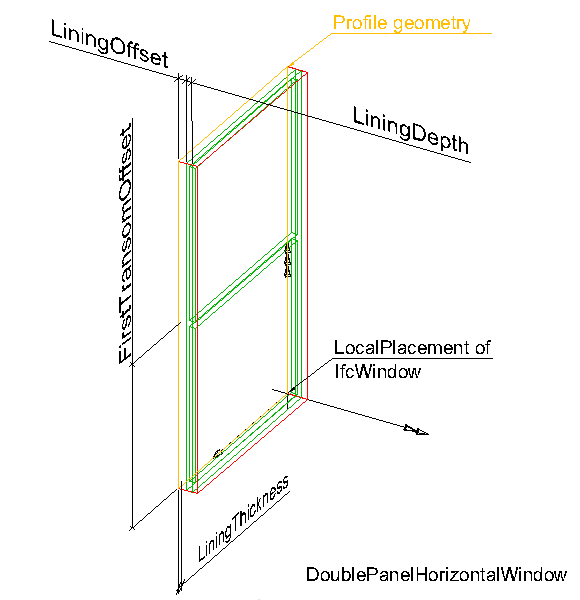

The standard window, _IfcWindowStandardCase_, defines a window with certain constraints for the provision of operation types, opening directions, frame and lining parameters, construction types and with certain constraints for the geometric representation. The _IfcWindowStandardCase_ handles all cases of windows, that:

* are inserted into an opening, represented by _IfcOpeningElement_, using the _IfcRelFillsElement_ relationship
* have a local placement relative to this opening, and with the y-axis of the placement pointing into the opening direction
* have a profile geometry, represented by _IfcShapeRepresentation.RepresentationIdentifier_="Profile" as a closed curve to which the window parameter apply. The profile represents a rectangle within the xz plane of the local placement
* have a reference to an _IfcWindowType_ to define the opening direction and the operation type (swinging, sliding, folding, etc.) of the window. The attribute _OperationType_ shall be provided and not being UNDEFINED, and the attribute _ParameterTakesPrecedence_ shall be "TRUE".
* have a single _IfcWindowLiningProperties_ and a set of _IfcWindowPanelProperties_ instances included in the set of _HasPropertySets_ at _IfcWindowType_

> HISTORY&nbsp; New entity in IFC4.

The geometric representation of _IfcWindowStandardCase_ is defined using the following multiple shape representations for its definition:

* **Profile**: a three-dimensional closed curve within a particular shape representation. The profile is used to apply the parameter of the parametric window representation. The profile around the edges of the opening is used to apply the window lining and window panel shape parameter.
* **Body**: A SweptSolid, SurfaceModel, or Brep Representation or a CSG additionally defining the 3D shape of the standard window in addition to the parametric representation by applying the _IfcWindowLiningProperties_ and an the _IfcWindowPanelProperties_ to the Profile representation.

___
## Common Use Definitions
The following concepts are inherited at supertypes:

* _IfcRoot_: [Identity](../../templates/identity.htm), [Revision Control](../../templates/revision-control.htm)
* _IfcElement_: [Box Geometry](../../templates/box-geometry.htm), [FootPrint Geometry](../../templates/footprint-geometry.htm), [Body SurfaceOrSolidModel Geometry](../../templates/body-surfaceorsolidmodel-geometry.htm), [Body SurfaceModel Geometry](../../templates/body-surfacemodel-geometry.htm), [Body Tessellation Geometry](../../templates/body-tessellation-geometry.htm), [Body Brep Geometry](../../templates/body-brep-geometry.htm), [Body AdvancedBrep Geometry](../../templates/body-advancedbrep-geometry.htm), [Body CSG Geometry](../../templates/body-csg-geometry.htm), [Mapped Geometry](../../templates/mapped-geometry.htm)
* _IfcBuildingElement_: [Product Assignment](../../templates/product-assignment.htm), [Surface 3D Geometry](../../templates/surface-3d-geometry.htm)
* _IfcWindow_: [Object Typing](../../templates/object-typing.htm), [Property Sets for Objects](../../templates/property-sets-for-objects.htm), [Quantity Sets](../../templates/quantity-sets.htm), [Material Constituents](../../templates/material-constituents.htm), [Spatial Containment](../../templates/spatial-containment.htm), [Product Placement](../../templates/product-placement.htm), [Profile 3D Geometry](../../templates/profile-3d-geometry.htm)

[&nbsp;Instance diagram](../../../annex/annex-d/common-use-definitions/ifcwindowstandardcase.htm)

{ .use-head}
Profile Geometry

The [Profile Geometry](../../templates/profile-geometry.htm) concept applies to this entity as shown in Table 1.

<table>
<tr><td>
<table class="gridtable">
<tr><th><b>Identifier</b></th><th><b>Type</b></th><th><b>Items</b></th></tr>
<tr><td>&nbsp;</td><td>&nbsp;</td><td>&nbsp;</td></tr>
</table>
</td></tr>
<tr><td>
Table 1 &mdash; IfcWindowStandardCase Profile Geometry
</td></tr></table>

The following additional constraints apply to the 'Profile' representation type:

* **Curve**: being an _IfcPolyline_ defining a rectangle.
* **Position**: The curve shall lie in the xz plane of the object placement coordinate (the y coordinate values of the _IfcCartesianPoint_'s shall be 0.).

As shown in Figure 1, the profile defines the outer boundary to which the window lining parameters relate as:

* _IfcWindowLiningProperties.LiningDepth_ starting at distance defined by _LiningOffset_ going into the positive y direction.
* _IfcWindowLiningProperties.LiningThickness_ offset into the inner side of the rectangle.
* _IfcWindowLiningProperties.LiningOffset_ distance along the positive y direction to where the _LiningDepth_ applies.
* _IfcWindowLiningProperties.FirstTransomOffset_ starting at the bottom edge of the rectangle (along local x axis) into the inner side of the rectangle, distance provided as percentage of overall height. Distance to the centre line of the transom. _SecondTransomOffset_ defined accordingly.
* _IfcWindowLiningProperties.FirstMullionOffset_ starting at the left edge of the rectangle (along local z-axis) into the inner side of the rectangle, distance provided as percentage of overall width. Distance to the centre line of the mullion. _SecondMullionOffset_ defined accordingly.

