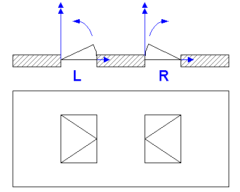

This enumeration defines the basic ways to describe how window panels operate.

> HISTORY New Enumeration in IFC
		Release 2.0 

**Illustration**

<table border="1"> 
		<tr valign="TOP"> 
		  <td width="30%" valign="TOP" align="LEFT"><i>Enumerator</i></td> 
		  <td width="50%" valign="TOP" align="LEFT"><i>Description</i></td> 
		  <td width="20%" valign="TOP" align="LEFT"><i>Figure</i></td> 
		</tr> 
		<tr valign="TOP"> 
		  <td width="30%" valign="TOP" align="LEFT">SideHungRightHand</td> 
		  <td width="50%" valign="TOP" align="LEFT">panel that opens to the right
			 when viewed from the outside</td> 
		  <td width="20%" valign="TOP" align="LEFT">&nbsp;</td> 
		</tr> 
		<tr valign="TOP"> 
		  <td width="30%" valign="TOP" align="LEFT">SideHungLeftHand</td> 
		  <td width="50%" valign="TOP" align="LEFT">panel that opens to the left
			 when viewed from the outside</td> 
		  <td width="20%" valign="TOP" align="LEFT">&nbsp;</td> 
		</tr> 
		<tr valign="TOP"> 
		  <td width="30%" valign="TOP" align="LEFT">TiltAndTurnRightHand</td> 
		  <td width="50%" valign="TOP" align="LEFT">panel that opens to the right
			 and is bottom hung</td> 
		  <td width="20%" valign="TOP" align="LEFT">&nbsp;</td> 
		</tr> 
		<tr valign="TOP"> 
		  <td width="30%" valign="TOP" align="LEFT">TiltAndTurnLeftHand</td> 
		  <td width="50%" valign="TOP" align="LEFT">panel that opens to the left
			 and is bottom hung</td> 
		  <td width="20%" valign="TOP" align="LEFT">&nbsp;</td> 
		</tr> 
		<tr valign="TOP"> 
		  <td width="30%" valign="TOP" align="LEFT"> TopHung</td> 
		  <td width="50%" valign="TOP" align="LEFT">panel is top hung</td> 
		  <td width="20%" valign="TOP" align="LEFT"> &nbsp;</td> 
		</tr> 
		<tr valign="TOP"> 
		  <td width="30%" valign="TOP" align="LEFT">BottomHung</td> 
		  <td width="50%" valign="TOP" align="LEFT">panel is bottom hung</td> 
		  <td width="20%" valign="TOP" align="LEFT">&nbsp;</td> 
		</tr> 
		<tr valign="TOP"> 
		  <td width="30%" valign="TOP" align="LEFT">PivotHorizontal</td> 
		  <td width="50%" valign="TOP" align="LEFT">panel is swinging
			 horizontally (hinges are in the middle)</td> 
		  <td width="20%" valign="TOP" align="LEFT">&nbsp;</td> 
		</tr> 
		<tr valign="TOP"> 
		  <td width="30%" valign="TOP" align="LEFT">PivotVertical</td> 
		  <td width="50%" valign="TOP" align="LEFT">panel is swinging vertically
			 (hinges are in the middle)</td> 
		  <td width="20%" valign="TOP" align="LEFT">&nbsp;</td> 
		</tr> 
		<tr valign="TOP"> 
		  <td width="30%" valign="TOP" align="LEFT"> SlidingHorizontal</td> 
		  <td width="50%" valign="TOP" align="LEFT">panel is sliding horizontally
			 </td> 
		  <td width="20%" valign="TOP" align="LEFT">&nbsp;</td> 
		</tr> 
		<tr valign="TOP"> 
		  <td width="30%" valign="TOP" align="LEFT">SlidingVertical</td> 
		  <td width="50%" valign="TOP" align="LEFT">panel is sliding
			 vertically</td> 
		  <td width="20%" valign="TOP" align="LEFT">&nbsp;</td> 
		</tr> 
		<tr valign="TOP"> 
		  <td width="30%" valign="TOP" align="LEFT">RemovableCasement</td> 
		  <td width="50%" valign="TOP" align="LEFT">panel is removable</td> 
		  <td width="20%" valign="TOP" align="LEFT">&nbsp;</td> 
		</tr> 
		<tr valign="TOP"> 
		  <td width="30%" valign="TOP" align="LEFT">FixedCasement</td> 
		  <td width="50%" valign="TOP" align="LEFT">panel is fixed</td> 
		  <td width="20%" valign="TOP" align="LEFT">&nbsp;</td> 
		</tr> 
		<tr valign="TOP"> 
		  <td width="30%" valign="TOP" align="LEFT"> OtherOperation</td> 
		  <td width="50%" valign="TOP" align="LEFT">user defined operation
			 type</td> 
		  <td width="20%" valign="TOP" align="LEFT">&nbsp;</td> 
		</tr> 
		<tr valign="TOP"> 
		  <td width="30%" valign="TOP" align="LEFT">NotDefined</td> 
		  <td width="50%" valign="TOP" align="LEFT">&nbsp;</td> 
		  <td width="20%" valign="TOP" align="LEFT">&nbsp;</td> 
		</tr> 
	 </table>

The opening direction of the window panels is given by the local placement of the _IfcWindow_. The positive y-axis determines the direction as shown in the figure.

NOTE

1. Figures are shown as viewed from the outside (in direction of the positive y-axis).
2. Figures (symbolic representation) depend on the national building code
3. These figures are only shown as illustrations
