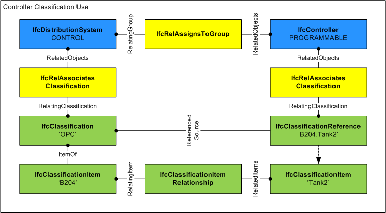

The distribution element _IfcDistributionControlElement_ defines occurrence elements of a building automation control system that are used to impart control over elements of a distribution system.

_IfcDistributionControlElement_ defines elements of a building automation control system. These are typically used to control distribution system elements to maintain variables such as temperature, humidity, pressure, flow, power, or lighting levels, through the modulation, staging or sequencing of mechanical or electrical devices. The three general functional categories of control elements are as follows:

* Impart control over flow control elements (_IfcFlowController_) in a distribution system such as dampers, valves, or relays, typically through the use of actuation (_IfcActuator_).
* Sensing elements (_IfcSensor_) that measure changes in the controlled variable such as temperature, humidity, pressure, or flow.
* Controllers (_IfcController_) typically classified according to the control action they seek to perform and generally responsible for making decisions about the elements under control.

Since _IfcDistributionControlElement_ and its subtypes typically relate to many different distribution flow elements (_IfcDistributionFlowElement_), the objectified relationship _IfcRelFlowControlElements_ has been provided to relate control and flow elements as required.

The key distinction between _IfcDistributionFlowElement_ and _IfcDistributionControlElement_ is whether it is internal or external to the flow system, respectively. For example, the distinction between _IfcFlowMeter_ (subtype of _IfcDistributionFlowElement_ measuring a flow quantity) and _IfcFlowInstrument_ (subtype of _IfcDistributionControlElement_ measuring a flow quality), is based on this principal. A physical device that connects within the flow system in which it measures (having inlet/outlet pipes for the measured substance) follows the _IfcDistributionFlowElement_ hierarchy (and therefore _IfcFlowMeter_ which measures the flow internally). Otherwise, if it monitors/controls but does not connect inline within the flow system (it is external or is a component of another device), then it follows the _IfcDistributionControlElement_ hierarchy (and therefore _IfcFlowInstrument_ which may display various attributes through connected sensors).

> HISTORY&nbsp; New entity in IFC2.0.

{ .change-ifc2x4}
> IFC4 CHANGE&nbsp; Attribute _ControlElementId_ attribute deleted; replaced by classification usage. Ports are now primarily defined using _IfcRelNests_ to enable definition of ports at type definitions (both forward and backward compatible), provide a logical order, and reduce the number of relationship objects needed. The relationship _IfcRelConnectsPortToElement_ is still supported, however is now specific to dynamically connected ports.

___
## Common Use Definitions
The following concepts are inherited at supertypes:

* _IfcRoot_: [Identity](../../templates/identity.htm), [Revision Control](../../templates/revision-control.htm)
* _IfcElement_: [Product Placement](../../templates/product-placement.htm), [Box Geometry](../../templates/box-geometry.htm), [FootPrint Geometry](../../templates/footprint-geometry.htm), [Body SurfaceOrSolidModel Geometry](../../templates/body-surfaceorsolidmodel-geometry.htm), [Body SurfaceModel Geometry](../../templates/body-surfacemodel-geometry.htm), [Body Tessellation Geometry](../../templates/body-tessellation-geometry.htm), [Body Brep Geometry](../../templates/body-brep-geometry.htm), [Body AdvancedBrep Geometry](../../templates/body-advancedbrep-geometry.htm), [Body CSG Geometry](../../templates/body-csg-geometry.htm), [Mapped Geometry](../../templates/mapped-geometry.htm)
* _IfcDistributionElement_: [Property Sets for Objects](../../templates/property-sets-for-objects.htm), [Quantity Sets](../../templates/quantity-sets.htm), [Spatial Containment](../../templates/spatial-containment.htm)

[&nbsp;Instance diagram](../../../annex/annex-d/common-use-definitions/ifcdistributioncontrolelement.htm)

{ .use-head}
Object Typing

The [Object Typing](../../templates/object-typing.htm) concept applies to this entity as shown in Table 1.

<table>
<tr><td>
<table class="gridtable">
<tr><th><b>Type</b></th></tr>
<tr><td><a href="../../ifcsharedbldgserviceelements/lexical/ifcdistributioncontrolelementtype.htm">IfcDistributionControlElementType</a></td></tr>
<tr><td><a href="../../ifcproductextension/lexical/ifcdistributionelementtype.htm">IfcDistributionElementType</a></td></tr>
</table>
</td></tr>
<tr><td>
Table 1 &mdash; IfcDistributionControlElement Object Typing
</td></tr></table>

  
  
{ .use-head}
Object Classification

The [Object Classification](../../templates/object-classification.htm) concept applies to this entity as shown in Table 2.

<table>
<tr><td>
<table class="gridtable">
<tr><th><b>Source</b></th><th><b>Name</b></th><th><b>Tokens</b></th><th><b>Description</b></th></tr>
<tr><td>ASHRAE</td><td>BACnet</td><td>('{D:0..65535},'.','{D:0..65535}')</td><td>32-bit decimal BACnetObjectIdentifier indicating type ID and instance ID (e.g.'12.15' for Digital Input #15).</td></tr>
<tr><td>IETF</td><td>IPv4</td><td>(‘{D:0..255}’,’.’,’{D:0..255}’,’.’, ’{D:0..255}’,’.’, ’{D:0..255}’)</td><td>32-bit decimal address for an IPv4 network (e.g.'192.168.1.1').</td></tr>
<tr><td>IETF</td><td>IPv6</td><td>('{X:0000..FFFF}',':',{X:0000..FFFF}',':',{X:0000..FFFF}',':',{X:0000..FFFF}',':',{X:0000..FFFF}',':',{X:0000..FFFF}',':',{X:0000..FFFF}',':',{X:0000..FFFF}')</td><td>128-bit hexadecimal address for an IPv6 network.</td></tr>
<tr><td>IETF</td><td>MAC</td><td>(‘{X:00..FF}’,’-‘,{X:00-FF}’, ’-‘,{X:00-FF}’, ’-‘,{X:00-FF}’, ’-‘,{X:00-FF}’, ’-‘,{X:00-FF}’)</td><td>48-bit hexadecimal form of MAC address.</td></tr>
<tr><td>OPC Foundation</td><td>OPC</td><td>(’.’,’{S}’,’{*}’)</td><td>Hierarchical ItemID in alphanumeric form (i.e. 'B204.Tank2.Temperature)</td></tr>
<tr><td>SmartLabs</td><td>Insteon</td><td>('{X:00..FF}','.','{X:00..FF}','.','{X:00..FF}')</td><td>24-bit hexadecimal instance address.</td></tr>
<tr><td>ISO/IEC</td><td>LonTalk</td><td>('{X:00..FF}',':','{X:00..FF}',':','{X:00..FF}',':','{X:00..FF}',':','{X:00..FF}',':','{X:00..FF}',':','{X:00..FF}')</td><td>48-bit hexadecimal neuron ID.</td></tr>
</table>
</td></tr>
<tr><td>
Table 2 &mdash; IfcDistributionControlElement Object Classification
</td></tr></table>

In addition to general product and project classification (UniFormat, etc.), classifications may also be applied to indicate a device address or addressing scheme according to system-based device instance classification.

Figure 1 illustrates classification usage.

  
  
{ .use-head}
Product Assignment

The [Product Assignment](../../templates/product-assignment.htm) concept applies to this entity as shown in Table 3.

<table>
<tr><td>
<table class="gridtable">
<tr><th><b>Type</b></th><th><b>Description</b></th></tr>
<tr><td><a href="../../ifcprocessextension/lexical/ifctask.htm">IfcTask</a></td><td>Indicates tasks used to purchase, install, renovate, demolish, operate, or otherwise act upon the element.  If the element has a type, available task types are assigned to the element type.</td></tr>
<tr><td><a href="../../ifcprocessextension/lexical/ifcprocedure.htm">IfcProcedure</a></td><td>Indicates procedures used to operate the element.  If the element has a type, available procedure types are assigned to the element type.</td></tr>
<tr><td><a href="../../ifcprocessextension/lexical/ifcevent.htm">IfcEvent</a></td><td>Indicates events to be handled by the element, sequenced by procedures to be followed.  If the element has a type, available event types are assigned to the element type.</td></tr>
</table>
</td></tr>
<tr><td>
Table 3 &mdash; IfcDistributionControlElement Product Assignment
</td></tr></table>

The **IfcDistributionControlElement** may be assigned to the following entities using relationships as indicated:

* [IfcDistributionSystem](../../ifcsharedbldgserviceelements/lexical/ifcdistributionsystem.htm) ([IfcRelAssignsToGroup](../../ifckernel/lexical/ifcrelassignstogroup.htm)): Indicates a system containing interconnected devices, where control elements are typically part of a control system having _PredefinedType=CONTROL_.
* [IfcPerformanceHistory](../../ifccontrolextension/lexical/ifcperformancehistory.htm) ([IfcRelAssignsToControl](../../ifckernel/lexical/ifcrelassignstocontrol.htm)): Indicates realtime or historical infomation captured for the device.