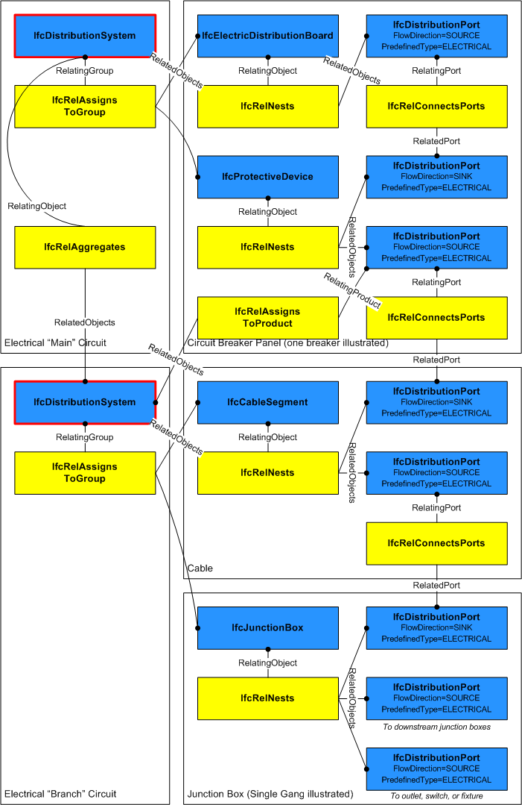

A distribution system is a network designed to receive, store, maintain, distribute, or control the flow of a distribution media. A common example is a heating hot water system that consists of a pump, a tank, and an interconnected piping system for distributing hot water to terminals.

The group _IfcDistributionSystem_ defines the occurrence of a specialized system for use within the context of building services.

Important functionalities for the description of a distribution system are derived from existing IFC entities:

* From _IfcSystem_ it inherits the ability to couple the distribution system via _IfcRelServicesBuildings_ to one or more _IfcSpatialElement_ subtypes as necessary.

* From _IfcGroup_ it inherits the inverse attribute _IsGroupedBy_, pointing to the relationship entity _IfcRelAssignsToGroup_. This allows to group distribution elements (instances of _IfcDistributionElement_ subtypes), and in special cases ports directly (instances of _IfcDistributionPort_).

* From _IfcObject_ it inherits the inverse attribute _IsDecomposedBy_ pointing to the relationship entity _IfcRelAggregates_. It provides the hierarchy between the separate (partial) distribution systems. For example, an electrical main circuit may be aggregated into branch circuits.

> HISTORY&nbsp; New entity in IFC4.

{ .change-ifc2x4}
> IFC4 CHANGE&nbsp; For electrical power systems, _IfcElectricalCircuit_ has been used for low-voltage (12-1000 V) power circuits and has been replaced by _IfcDistributionCircuit_ in IFC4; _IfcDistributionSystem_ with PredefinedType 'ELECTRICAL' should be used for overall power systems, and _IfcDistributionCircuit_ with PredefinedType 'ELECTRICAL' should be used for each switched circuit.

___
## Common Use Definitions
The following concepts are inherited at supertypes:

* _IfcRoot_: [Identity](../../templates/identity.htm), [Revision Control](../../templates/revision-control.htm)

[&nbsp;Instance diagram](../../../annex/annex-d/common-use-definitions/ifcdistributionsystem.htm)

{ .use-head}
Property Sets for Objects

The [Property Sets for Objects](../../templates/property-sets-for-objects.htm) concept applies to this entity as shown in Table 1.

<table>
<tr><td>
<table class="gridtable">
<tr><th><b>PredefinedType</b></th><th><b>Name</b></th></tr>
<tr><td>&nbsp;</td><td><a href="../../psd/ifcsharedbldgserviceelements/Pset_DistributionSystemCommon.xml">Pset_DistributionSystemCommon</a></td></tr>
<tr><td><a href="../../ifcsharedbldgserviceelements/lexical/ifcdistributionsystemenum.htm">ELECTRICAL</a></td><td><a href="../../psd/ifcsharedbldgserviceelements/Pset_DistributionSystemTypeElectrical.xml">Pset_DistributionSystemTypeElectrical</a></td></tr>
<tr><td><a href="../../ifcsharedbldgserviceelements/lexical/ifcdistributionsystemenum.htm">VENTILATION</a></td><td><a href="../../psd/ifcsharedbldgserviceelements/Pset_DistributionSystemTypeVentilation.xml">Pset_DistributionSystemTypeVentilation</a></td></tr>
<tr><td>&nbsp;</td><td><a href="../../psd/ifcsharedfacilitieselements/Pset_ServiceLifeFactors.xml">Pset_ServiceLifeFactors</a></td></tr>
</table>
</td></tr>
<tr><td>
Table 1 &mdash; IfcDistributionSystem Property Sets for Objects
</td></tr></table>

  
  
{ .use-head}
Object Aggregation

The [Object Aggregation](../../templates/object-aggregation.htm) concept applies to this entity as shown in Table 2.

<table>
<tr><td>
<table class="gridtable">
<tr><th><b>PredefinedType</b></th><th><b>RelatedObjects</b></th><th><b>Description</b></th></tr>
<tr><td><a href="../../ifcsharedbldgserviceelements/lexical/ifcdistributionsystemenum.htm">ELECTRICAL</a></td><td><a href="../../ifcsharedbldgserviceelements/lexical/ifcdistributionsystem.htm">IfcDistributionSystem</a></td><td>Indicates electrical subsystems within the system.</td></tr>
<tr><td><a href="../../ifcsharedbldgserviceelements/lexical/ifcdistributionsystemenum.htm">ELECTRICAL</a></td><td><a href="../../ifcsharedbldgserviceelements/lexical/ifcdistributioncircuit.htm">IfcDistributionCircuit</a></td><td>Indicates electrical circuits within the system.</td></tr>
</table>
</td></tr>
<tr><td>
Table 2 &mdash; IfcDistributionSystem Object Aggregation
</td></tr></table>

  
  
{ .use-head}
Group Assignment

The [Group Assignment](../../templates/group-assignment.htm) concept applies to this entity as shown in Table 3.

<table>
<tr><td>
<table class="gridtable">
<tr><th><b>Type</b></th><th><b>Description</b></th></tr>
<tr><td><a href="../../ifcproductextension/lexical/ifcdistributionelement.htm">IfcDistributionElement</a></td><td>Indicates devices that are part of the system, where any ports of the same PredefinedType are considered part of the system implicitly.</td></tr>
<tr><td><a href="../../ifcsharedbldgserviceelements/lexical/ifcdistributionport.htm">IfcDistributionPort</a></td><td>Indicates port that is explicitly part of the system, which overrides any system assignment of the containing device.</td></tr>
</table>
</td></tr>
<tr><td>
Table 3 &mdash; IfcDistributionSystem Group Assignment
</td></tr></table>

For the most common case of an _IfcDistributionElement_ subtype containing ports of a particular _PredefinedType_ that all belong to the same distribution system, the _IfcDistributionElement_ is assigned to the _IfcDistributionSystem_ via the _IfcRelAssignsToGroup_ relationship, where _IfcDistributionPort_'s are implied as part of the corresponding system based on their _PredefinedType_. An _IfcDistributionElement_ may belong to multiple systems, however only one _IfcDistributionSystem_ of a particular _PredefinedType_.

For rare cases where an _IfcDistributionElement_ subtype contains ports of the same _PredefinedType_ yet different ports belong to different systems, alternatively each _IfcDistributionPort_ may be directly assigned to a single _IfcDistributionSystem_ via the _IfcRelAssignsToGroup_ relationship, where the _PredefinedType_ must match. Such assignment indicates that the _IfcDistributionSystem_ assigned from the _IfcDistributionPort_ overrides any such system of the same _PredefinedType_ assigned from the containing _IfcDistributionElement_, if any.

Additionally, an _IfcDistributionSystem_ may in turn be assigned to an _IfcDistributionPort_ indicating the host or origination of the system using _IfcRelAssignsToProduct_.

> EXAMPLE&nbsp; A gas-powered hot water heater may have three ports: GAS, DOMESTICCOLDWATER, and DOMESTICHOTWATER. The heater is a member of two systems (GAS and DOMESTICCOLDWATER), and hosts one system (DOMESTICHOTWATER) at the corresponding port.

Figure 1 illustrates a distribution system for an electrical circuit.

