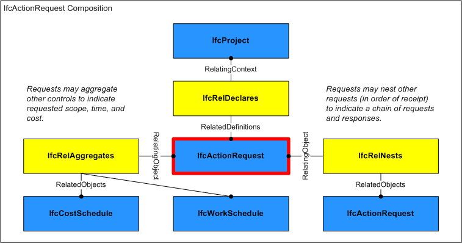
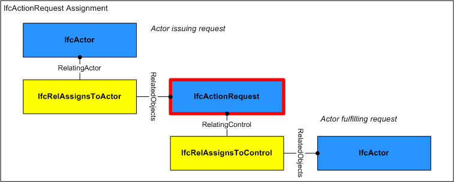

A request is the act or instance of asking for something, such as a request for information, bid submission, or performance of work.

Requests may take many forms depending on the need including fault reports for maintenance, requests for small works, and purchase requests (where these are to be made through a help desk or buying function).

> HISTORY&nbsp; New entity in IFC2x2.

{ .change-ifc2x4}
> IFC4 CHANGE&nbsp; Atribute _RequestID_ renamed to _Identification_ and promoted to supertype _IfcControl_, attributes _PredefinedType_, _Status_, and _LongDescription_ added.

___
## Common Use Definitions
The following concepts are inherited at supertypes:

* _IfcRoot_: [Identity](../../templates/identity.htm), [Revision Control](../../templates/revision-control.htm)

[&nbsp;Instance diagram](../../../annex/annex-d/common-use-definitions/ifcactionrequest.htm)

{ .use-head}
Property Sets for Objects

The [Property Sets for Objects](../../templates/property-sets-for-objects.htm) concept applies to this entity as shown in Table 1.

<table>
<tr><td>
<table class="gridtable">
<tr><th><b>PredefinedType</b></th><th><b>Name</b></th></tr>
<tr><td>&nbsp;</td><td><a href="../../psd/ifcsharedmgmtelements/Pset_ActionRequest.xml">Pset_ActionRequest</a></td></tr>
</table>
</td></tr>
<tr><td>
Table 1 &mdash; IfcActionRequest Property Sets for Objects
</td></tr></table>

  
  
{ .use-head}
Object Approval

The [Object Approval](../../templates/object-approval.htm) concept applies to this entity.

Approvals may be associated to indicate the status of acceptance or rejection using the [IfcRelAssociatesApproval](../../ifccontrolextension/lexical/ifcrelassociatesapproval.htm) relationship where _RelatingApproval_ refers to an [IfcApproval](../../ifcapprovalresource/lexical/ifcapproval.htm) and _RelatedObjects_ contains the **IfcActionRequest**. Approvals may be split into sub-approvals using [IfcApprovalRelationship](../../ifcapprovalresource/lexical/ifcapprovalrelationship.htm) to track approval status separately for each party where _RelatingApproval_ refers to the higher-level approval and _RelatedApprovals_ contains one or more lower-level approvals. The hierarchy of approvals implies sequencing such that a higher-level approval is not executed until all of its lower-level approvals have been accepted.

  
  
{ .use-head}
Object Aggregation

The [Object Aggregation](../../templates/object-aggregation.htm) concept applies to this entity as shown in Table 2.

<table>
<tr><td>
<table class="gridtable">
<tr><th><b>PredefinedType</b></th><th><b>RelatedObjects</b></th><th><b>Description</b></th></tr>
<tr><td>&nbsp;</td><td><a href="../../ifcsharedmgmtelements/lexical/ifccostschedule.htm">IfcCostSchedule</a></td><td>Cost schedules may indicate the costs projected or incurred for the request.</td></tr>
</table>
</td></tr>
<tr><td>
Table 2 &mdash; IfcActionRequest Object Aggregation
</td></tr></table>

As shown in Figure 1, an **IfcActionRequest** may be aggregated into components.

  
  
{ .use-head}
Object Nesting

The [Object Nesting](../../templates/object-nesting.htm) concept applies to this entity as shown in Table 3.

<table>
<tr><td>
<table class="gridtable">
<tr><th><b>Type</b></th><th><b>Description</b></th></tr>
<tr><td><a href="../../ifcsharedmgmtelements/lexical/ifcactionrequest.htm">IfcActionRequest</a></td><td>A request may be nested into follow-up requests, in order of issue</td></tr>
</table>
</td></tr>
<tr><td>
Table 3 &mdash; IfcActionRequest Object Nesting
</td></tr></table>

  
  
{ .use-head}
Control Assignment

The [Control Assignment](../../templates/control-assignment.htm) concept applies to this entity.

As shown in Figure 2, an **IfcActionRequest** may be assigned to the following entities using relationships as indicated:

* [IfcActor](../../ifckernel/lexical/ifcactor.htm) ([IfcRelAssignsToActor](../../ifckernel/lexical/ifcrelassignstoactor.htm)): Person or organization issuing the request such as a tenant or owner.

The **IfcActionRequest** may have assignments of its own using the [IfcRelAssignsToControl](../../ifckernel/lexical/ifcrelassignstocontrol.htm) relationship where _RelatingControl_ refers to the **IfcActionRequest** and _RelatedObjects_ contains one or more objects of the following types:

* [IfcActor](../../ifckernel/lexical/ifcactor.htm): Person or organization(s) fulfilling the request such as a facilities manager or contractor. 

