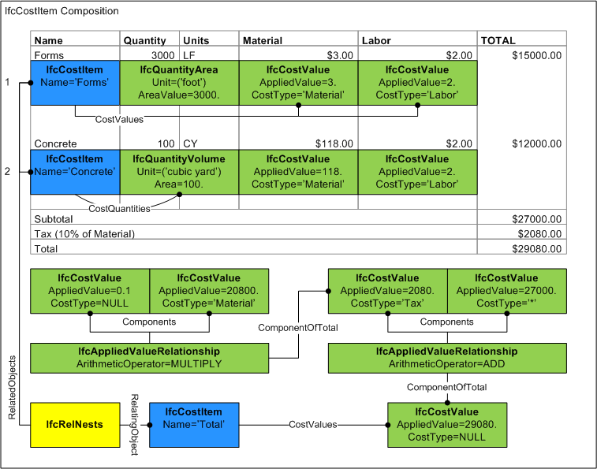
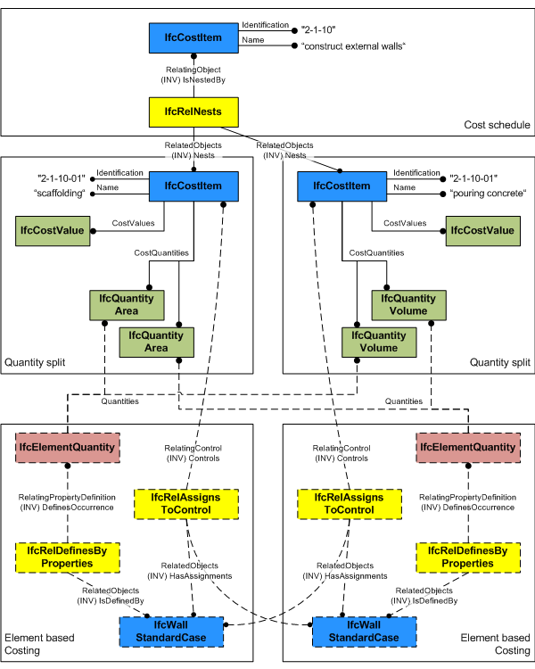

An _IfcCostItem_ describes a cost or financial value together with descriptive information that describes its context in a form that enables it to be used within a cost schedule. An _IfcCostItem_ can be used to represent the cost of goods and services, the execution of works by a process, lifecycle cost and more.

Each instance of _IfcCostItem_ may have a name and a description. Depending on the use for which the cost is intended, these values should be asserted on the basis of agreement. For instance, the _Name_ attribute could be used to provide a common value that enables distinct instances to be brought together in a nesting arrangement (see below) while the Description attribute may be used to provide text used for item description in a costing schedule.

An _IfcCostItem_ can link one or many _IfcCostValue_'s representing a unit cost, total cost, or a unit cost with one or many quantities used to generate the total cost. The quantities can be given as individual quantities, or those quantities are provided as element quantities by one or many building elements. The _IfcCostValue.CostType_ attribute indicates the category of cost, which may be used to present the value in a particular column. For nested cost items (having _IfcRelNests_ relationship), _IfcCostValue.CostType_ is significant such that _IfcCostValue.AppliedValue_ is calculated as the sum of all nested costs having the same _IfcCostValue.CostType_ or if set to an asterisk ('\*'), then the sum of all nested costs of all cost types. An _IfcCostValue_ may represent an original value or a value derived from formulas using _IfcAppliedValueRelationship_. For example, taxes may be calculated as a percentage of a subtotal.

> HISTORY&nbsp; New entity in IFC2.0.

{ .change-ifc2x4}
> IFC4 CHANGE&nbsp; Attribute _PredefinedType_, _CostValues_, and _CostQuantities_ added.

___
## Common Use Definitions
The following concepts are inherited at supertypes:

* _IfcRoot_: [Identity](../../templates/identity.htm), [Revision Control](../../templates/revision-control.htm)

[&nbsp;Instance diagram](../../../annex/annex-d/common-use-definitions/ifccostitem.htm)

{ .use-head}
Object Classification

The [Object Classification](../../templates/object-classification.htm) concept applies to this entity.

Instances of _IfcCostItem_ are used for cost estimates, budgets, and other forms, where a variety of identification codes are used extensively to identify the meaning of the cost. Examples include project phase codes, CSI codes, takeoff sequence numbers, and cost accounts. The model allows for all classes that are ultimately subtypes of _IfcObject_ to inherit the ability to have one or more instances of _IfcClassificationReference_ to be assigned. Where identification codes are required, the generic _IfcRelAssociatesClassification_ facility should be used.

  
  
{ .use-head}
Object Nesting

The [Object Nesting](../../templates/object-nesting.htm) concept applies to this entity as shown in Table 1.

<table>
<tr><td>
<table class="gridtable">
<tr><th><b>Type</b></th></tr>
<tr><td><a href="../../ifcsharedmgmtelements/lexical/ifccostitem.htm">IfcCostItem</a></td></tr>
</table>
</td></tr>
<tr><td>
Table 1 &mdash; IfcCostItem Object Nesting
</td></tr></table>

An _IfcCostItem_ can nest other instances of _IfcCostItem_ through its relationships to _IfcRelNests_. This can be used to enable the development of complex groups of costs as may be found in cost schedules through to pages, sections and complete cost schedules.

There is always a summary cost item as the root item of the tree representing the cost item nesting. Subsequent instances of _IfcCostItem_ are assigned to the summary cost item using _IfcRelNests_. The summary cost item itself is assigned to _IfcCostSchedule_ through the _IfcRelAssignsToControl_ relationship.

Figure 1 illustrates a cost item composition used for a cost schedule. Each line item has a quantity and separate unit costs where _IfcCostValue.CostType_ indicates the category of cost. The summary item has a hierarchy of costs calculated according to _IfcAppliedValueRelationship.ArithmeticOperator_, where _IfcCostValue.CostType_ identifies the category to be totalled. The Tax component has _IfcCostValue.CostType_ set to 'Material' which indicates it is the sum of all nested values of the 'Material' category ($3 x 3000 + $118 x 100 = $20800). The Subtotal component has _IfcCostValue.CostType_ set to an asterisk ('\*') which indicates it is the sum of all nested values of all categories.

  
  
{ .use-head}
Control Assignment

The [Control Assignment](../../templates/control-assignment.htm) concept applies to this entity as shown in Table 2.

<table>
<tr><td>
<table class="gridtable">
<tr><th><b>Type</b></th><th><b>Description</b></th></tr>
<tr><td><a href="../../ifckernel/lexical/ifcproduct.htm">IfcProduct</a></td><td>For quantity-based costs based on product occurrences, spatial structures, or other physical artifacts.</td></tr>
<tr><td><a href="../../ifckernel/lexical/ifcprocess.htm">IfcProcess</a></td><td>For quantity-based costs based on tasks, procedures, or events.</td></tr>
<tr><td><a href="../../ifckernel/lexical/ifcresource.htm">IfcResource</a></td><td>For quantity-based costs based on resource allocations.</td></tr>
<tr><td><a href="../../ifckernel/lexical/ifctypeproduct.htm">IfcTypeProduct</a></td><td>For cost rates based on product models.</td></tr>
<tr><td><a href="../../ifckernel/lexical/ifctypeprocess.htm">IfcTypeProcess</a></td><td>For cost rates based on process models of historical or projected duration.</td></tr>
<tr><td><a href="../../ifckernel/lexical/ifctyperesource.htm">IfcTypeResource</a></td><td>For cost rates based on resource models of historical or projected productivity.</td></tr>
</table>
</td></tr>
<tr><td>
Table 2 &mdash; IfcCostItem Control Assignment
</td></tr></table>

An _IfcCostItem_ can be calculated based on quantities from objects through its relationship to _IfcRelAssignsToControl_.

For quantity-based costing, _IfcElement_, _IfcTask_, or _IfcResource_ occurrence subtypes may be used. Multiple elements may be assigned of the same or different types, using _IfcPhysicalQuantity_ entities defined at each object. Each _IfcPhysicalQuantity_ type must be identical (for example, all values are _IfcAreaQuantity_) such that they can be added together.

For rate-based costing (specifically for _IfcCostScheduleTypeEnum.SCHEDULEOFRATES_), a single _IfcTypeProduct_, _IfcTypeProcess_, or _IfcTypeResource_ subtype may be used to reflect rates for occurrences of such types. This enables the possibility to generate a quantity-based cost schedule for occurrences based on types with rate-based cost schedules.

_IfcRelAssignsToControl_ is also used in the opposite direction to link the root _IfcCostItem_ to an _IfcCostSchedule_ where _RelatingControl_ is the _IfcCostSchedule_.

Figure 2 illustrates cost item assignment derived from building elements. The _IfcRelAssignsToControl_ relationship indicates building elements for which quantities are derived. Not shown, costs may also be derived from building elements by traversing assignment relationships from the assigned _IfcProduct_ to _IfcProcess_ to _IfcResource_, where all costs ultimately originate at resources. It is also possible for cost items to have assignments from processes or resources directly.

