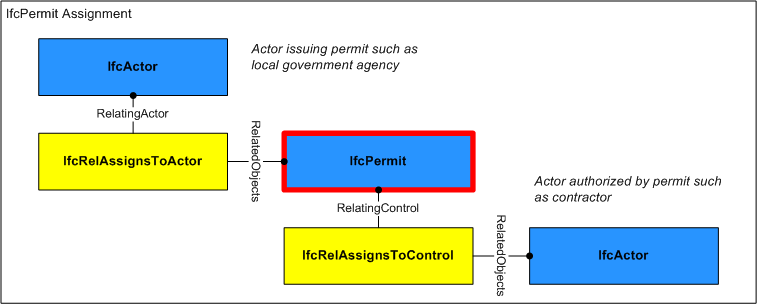

A permit is a permission to perform work in places and on artifacts where regulatory, security or other access restrictions apply.

> HISTORY&nbsp; New entity in IFC2x2.

{ .change-ifc2x4}
> IFC4 CHANGE&nbsp; Attribute _PermitID_ renamed to _Identification_ and promoted to supertype _IfcControl_, attributes _PredefinedType_, _Status_, and _LongDescription_ added.

___
## Common Use Definitions
The following concepts are inherited at supertypes:

* _IfcRoot_: [Identity](../../templates/identity.htm), [Revision Control](../../templates/revision-control.htm)

[&nbsp;Instance diagram](../../../annex/annex-d/common-use-definitions/ifcpermit.htm)

{ .use-head}
Object Approval

The [Object Approval](../../templates/object-approval.htm) concept applies to this entity.

Approvals may be associated to indicate the status of acceptance or rejection using the _IfcRelAssociatesApproval_ relationship where _RelatingApproval_ refers to an _IfcApproval_ and _RelatedObjects_ contains the _IfcPermit_. Approvals may be split into sub-approvals using _IfcApprovalRelationship_ to track approval status separately for each party where _RelatingApproval_ refers to the higher-level approval and _RelatedApprovals_ contains one or more lower-level approvals. The hierarchy of approvals implies sequencing such that a higher-level approval is not executed until all of its lower-level approvals have been accepted.

  
  
{ .use-head}
Property Sets for Objects

The [Property Sets for Objects](../../templates/property-sets-for-objects.htm) concept applies to this entity as shown in Table 1.

<table>
<tr><td>
<table class="gridtable">
<tr><th><b>PredefinedType</b></th><th><b>Name</b></th></tr>
<tr><td>&nbsp;</td><td><a href="../../psd/ifcsharedmgmtelements/Pset_Permit.xml">Pset_Permit</a></td></tr>
</table>
</td></tr>
<tr><td>
Table 1 &mdash; IfcPermit Property Sets for Objects
</td></tr></table>

  
  
{ .use-head}
Object Aggregation

The [Object Aggregation](../../templates/object-aggregation.htm) concept applies to this entity as shown in Table 2.

<table>
<tr><td>
<table class="gridtable">
<tr><th><b>PredefinedType</b></th><th><b>RelatedObjects</b></th><th><b>Description</b></th></tr>
<tr><td><a href="../../ifcsharedmgmtelements/lexical/ifcpermittypeenum.htm">ACCESS</a></td><td><a href="../../ifcprocessextension/lexical/ifcworkcalendar.htm">IfcWorkCalendar</a></td><td>A work calendar may indicate the time period of the permit and allowed times when work may be performed.  Such work calendar may have assigned resources indicating equipment or labor permitted at various times.</td></tr>
<tr><td><a href="../../ifcsharedmgmtelements/lexical/ifcpermittypeenum.htm">WORK</a></td><td><a href="../../ifcprocessextension/lexical/ifcworkschedule.htm">IfcWorkSchedule</a></td><td>A work schedule may indicate tasks and scheduled times where the work schedule type may designate whether tasks and/or times are planned or actual.  Such work schedule may have assigned tasks indicating detail, where tasks may be assigned to products and may have assigned resources.</td></tr>
</table>
</td></tr>
<tr><td>
Table 2 &mdash; IfcPermit Object Aggregation
</td></tr></table>

  
  
{ .use-head}
Object Nesting

The [Object Nesting](../../templates/object-nesting.htm) concept applies to this entity as shown in Table 3.

<table>
<tr><td>
<table class="gridtable">
<tr><th><b>Type</b></th><th><b>Description</b></th></tr>
<tr><td><a href="../../ifcsharedmgmtelements/lexical/ifcpermit.htm">IfcPermit</a></td><td>A permit may be nested to indicate permit amendments, in order of issue.</td></tr>
</table>
</td></tr>
<tr><td>
Table 3 &mdash; IfcPermit Object Nesting
</td></tr></table>

  
  
{ .use-head}
Control Assignment

The [Control Assignment](../../templates/control-assignment.htm) concept applies to this entity.

Figure 1 illustrates assignment relationships as indicated:

* [IfcActor](../../ifckernel/lexical/ifcactor.htm) ([IfcRelAssignsToActor](../../ifckernel/lexical/ifcrelassignstoactor.htm)): Organization issuing the permit such as a local government agency or security organization.

The **IfcPermit** may have assignments of its own using the [IfcRelAssignsToControl](../../ifckernel/lexical/ifcrelassignstocontrol.htm) relationship where _RelatingControl_ refers to the **IfcPermit** and _RelatedObjects_ contains one or more objects of the following types:

* [IfcActor](../../ifckernel/lexical/ifcactor.htm): Organization(s) bound to the permit, typically a single contractor. 

