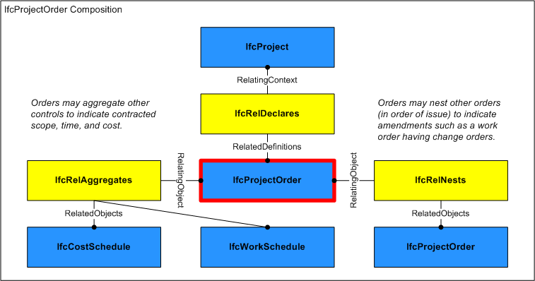
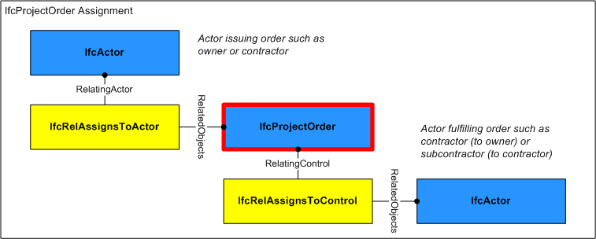

A project order is a directive to purchase products and/or perform work, such as for construction or facilities management.

Project orders are typically formal contracts between two organizations, where cost and time information may be rigid or flexible according to contained schedule types and constraints.

> HISTORY&nbsp; New entity in IFC2.0

{ .change-ifc2x4}
> IFC4 CHANGE&nbsp; Attribute _ID_ renamed to _Identification_ and promoted to supertype _IfcControl_. Attribute 'LongDescription' added.

___
## Common Use Definitions
The following concepts are inherited at supertypes:

* _IfcRoot_: [Identity](../../templates/identity.htm), [Revision Control](../../templates/revision-control.htm)

[&nbsp;Instance diagram](../../../annex/annex-d/common-use-definitions/ifcprojectorder.htm)

{ .use-head}
Object Approval

The [Object Approval](../../templates/object-approval.htm) concept applies to this entity.

Approvals may be associated to indicate the status of acceptance or rejection using the [IfcRelAssociatesApproval](../../ifccontrolextension/lexical/ifcrelassociatesapproval.htm) relationship where _RelatingApproval_ refers to an [IfcApproval](../../ifcapprovalresource/lexical/ifcapproval.htm) and _RelatedObjects_ contains the **IfcProjectOrder**. Approvals may be split into sub-approvals using [IfcApprovalRelationship](../../ifcapprovalresource/lexical/ifcapprovalrelationship.htm) to track approval status separately for each party where _RelatingApproval_ refers to the higher-level approval and _RelatedApprovals_ contains one or more lower-level approvals. The hierarchy of approvals implies sequencing such that a higher-level approval is not executed until all of its lower-level approvals have been accepted.

  
  
{ .use-head}
Property Sets for Objects

The [Property Sets for Objects](../../templates/property-sets-for-objects.htm) concept applies to this entity as shown in Table 1.

<table>
<tr><td>
<table class="gridtable">
<tr><th><b>PredefinedType</b></th><th><b>Name</b></th></tr>
<tr><td><a href="../../ifcsharedmgmtelements/lexical/ifcprojectordertypeenum.htm">CHANGEORDER</a></td><td><a href="../../psd/ifcsharedmgmtelements/Pset_ProjectOrderChangeOrder.xml">Pset_ProjectOrderChangeOrder</a></td></tr>
<tr><td><a href="../../ifcsharedmgmtelements/lexical/ifcprojectordertypeenum.htm">MAINTENANCEWORKORDER</a></td><td><a href="../../psd/ifcsharedmgmtelements/Pset_ProjectOrderMaintenanceWorkOrder.xml">Pset_ProjectOrderMaintenanceWorkOrder</a></td></tr>
<tr><td><a href="../../ifcsharedmgmtelements/lexical/ifcprojectordertypeenum.htm">MOVEORDER</a></td><td><a href="../../psd/ifcsharedmgmtelements/Pset_ProjectOrderMoveOrder.xml">Pset_ProjectOrderMoveOrder</a></td></tr>
<tr><td><a href="../../ifcsharedmgmtelements/lexical/ifcprojectordertypeenum.htm">PURCHASEORDER</a></td><td><a href="../../psd/ifcsharedmgmtelements/Pset_ProjectOrderPurchaseOrder.xml">Pset_ProjectOrderPurchaseOrder</a></td></tr>
<tr><td><a href="../../ifcsharedmgmtelements/lexical/ifcprojectordertypeenum.htm">WORKORDER</a></td><td><a href="../../psd/ifcsharedmgmtelements/Pset_ProjectOrderWorkOrder.xml">Pset_ProjectOrderWorkOrder</a></td></tr>
</table>
</td></tr>
<tr><td>
Table 1 &mdash; IfcProjectOrder Property Sets for Objects
</td></tr></table>

  
  
{ .use-head}
Object Aggregation

The [Object Aggregation](../../templates/object-aggregation.htm) concept applies to this entity as shown in Table 2.

<table>
<tr><td>
<table class="gridtable">
<tr><th><b>PredefinedType</b></th><th><b>RelatedObjects</b></th><th><b>Description</b></th></tr>
<tr><td>&nbsp;</td><td><a href="../../ifcsharedmgmtelements/lexical/ifccostschedule.htm">IfcCostSchedule</a></td><td> A cost schedule may indicate costs and quantities where the cost schedule type may designate whether rates and/or quantities are estimated or final.  Such cost schedule may have assigned cost items indicating detail, where each cost item may have assigned products, processes, or resources.</td></tr>
<tr><td><a href="../../ifcsharedmgmtelements/lexical/ifcprojectordertypeenum.htm">WORKORDER</a></td><td><a href="../../ifcprocessextension/lexical/ifcworkschedule.htm">IfcWorkSchedule</a></td><td>A work schedule may indicate tasks and scheduled times where the work schedule type may designate whether tasks and/or times are planned or actual.  Such work schedule may have assigned tasks indicating detail, where tasks may be assigned to products and may have assigned resources.</td></tr>
</table>
</td></tr>
<tr><td>
Table 2 &mdash; IfcProjectOrder Object Aggregation
</td></tr></table>

As shown in Figure 160, an **IfcProjectOrder** may be aggregated into components.

  
  
{ .use-head}
Object Nesting

The [Object Nesting](../../templates/object-nesting.htm) concept applies to this entity as shown in Table 3.

<table>
<tr><td>
<table class="gridtable">
<tr><th><b>Type</b></th><th><b>Description</b></th></tr>
<tr><td><a href="../../ifcsharedmgmtelements/lexical/ifcprojectorder.htm">IfcProjectOrder</a></td><td>May contain subordinate orders, particularly change orders indicating contract amendment in order of issue.</td></tr>
</table>
</td></tr>
<tr><td>
Table 3 &mdash; IfcProjectOrder Object Nesting
</td></tr></table>

  
  
{ .use-head}
Control Assignment

The [Control Assignment](../../templates/control-assignment.htm) concept applies to this entity.

Figure 2 illustrates **IfcProjectOrder** assignment relationships as indicated:

* _IfcActor_ (_IfcRelAssignsToActor_): Organization issuing the order such as an owner or contractor.

The **IfcProjectOrder** may have assignments of its own using the _IfcRelAssignsToControl_ relationship where _RelatingControl_ refers to the **IfcProjectOrder** and _RelatedObjects_ contains one or more objects of the following types:

* _IfcActor_: Organization(s) contracted to fulfill the order, typically a single contractor, subcontractor, or supplier. 

